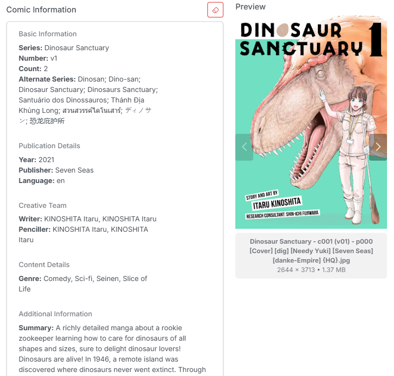
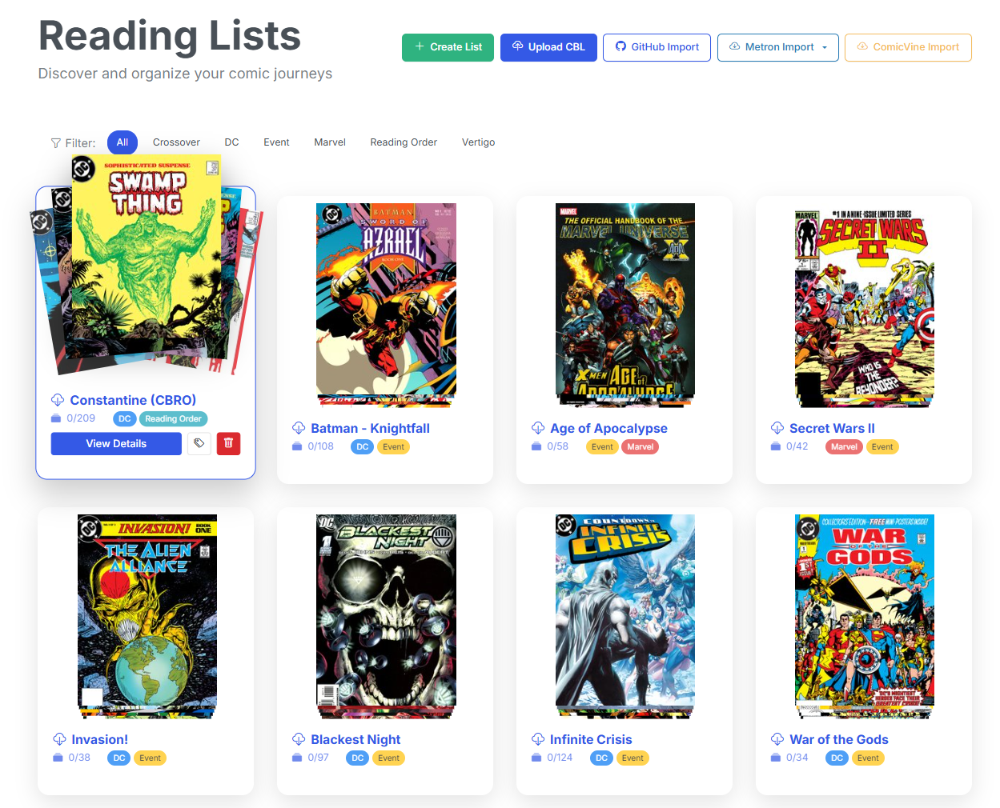
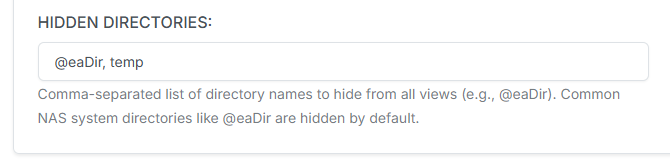

# v4.11 & 12 - Manga Metadata, Reading Lists, & More

These back-to-back releases bring a highly requested additions to CLU — Manga metadata support and an absolute overhaul of Reading Lists. Additionally, we've added another metadata provider with Grand Comics Database (GCD) API support and added the ability to hide directories from your library views.

Let's go over what's new in these releases.

<!-- more -->

## Major Highlights

### Manga Metadata Support

{: .center-image}

You can now pull metadata directly from **MangaDex** and **MangaUpdates**! Whether you're a long-time manga reader or just building out your collection, tagging your manga is now available in CLU. These providers are integrated right into the Metadata Providers settings, so you can test connections and manage everything in one place.

!!!info "Manga Metadata"
    I welcome any and all feedback on this feature, as I'm not as well versed in manga as I am with comics. Please let us know what you think on [Discord](https://discord.gg/ndDhpvrgBa) or [GitHub](https://github.com/allaboutduncan/clu-comics/issues)!

### Grand Comics Database (GCD) API Support

We've added support for the **Grand Comics Database (GCD) API** as a metadata provider! You can now pull metadata directly from GCD via their (very new) API. Functionally, this is the same as the other providers, but it's a great addition for multi-language and older comics. 

With three supported providers, you can now pull metadata from **ComicVine**, **Metron**, and **Grand Comics Database**.

This provider is integrated right into the Metadata Providers settings, so you can test connections and manage everything in one place.

### **The Reading List & Story Arc Overhaul**

{.center-image}

Reading lists have received multiple improvements! You can now **Create and Manage Reading Lists** directly within the UI. 

Need to pull in an established reading order? No problem. You can now **Import and Sync Reading Lists via the UI from Github**, or pull down reading lists and Story Arcs directly from **Metron** or **ComicVine**. 

Even better, if your reading list is missing an issue, you can search GetComics directly from the Reading List UI to track it down!

### **Hidden Directories**

{: .center-image}

Tired of seeing system folders cluttering up your views? You can now explicitly enter a comma-separated list of directories to hide from all views (File Manager, Collection, and the Source Wall). By default, we're hiding `@eaDir`, but you can customize this in your File Settings to keep your library looking clean.

---

## 🛠️ Features & Enhancements

* **Enhanced File Manager UI:** The File Manager now clearly displays nested moves and overwrites, ensuring you see what's happening in the UI when you are working with your collection.
* **GetComics Search Scoring Improvements:** Huge shoutout to new contributor **@trumblejoe** for dramatically improving the GetComics search scoring! It's now far better at matching variants, arcs, and series. 
* **Rename Pattern Metadata:** We've revised our metadata engine to use your defined `custom rename pattern` when identifying files.
* **Expanded Reader Controls:** Additional keyboard controls have been added to the Reader, making it more intuitive to flip through your comics without reaching for the mouse.

---

## 🐛 Bug Fixes & "Under the Hood"

* **CBR/RAR Conversions:** Fixed multiple edge cases dealing with CBR/RAR files, including a decode error in certain archives, a 2MB limit issue that was causing errors on the RAR library, a header value whitespace race condition, and a bug where a CBR conversion could mistakenly move your XML to a new location.
* **Source Wall & UI Fixes:** We squashed a bug where editing a field on the Source Wall would clear its value, and fixed an issue where the "Delete Downloads" button was incorrectly throwing errors.
* **Subscriptions:** Fixed a frustrating bug where the issue list was being cleared when adding a new subscription.
* **Operations & Stability:** Resolved a DB lock issue that could happen during a clean install on large libraries, ensuring a smooth first run for new users.
* **Downloads:** Disabled file redirects on final download URLs for better reliability.
