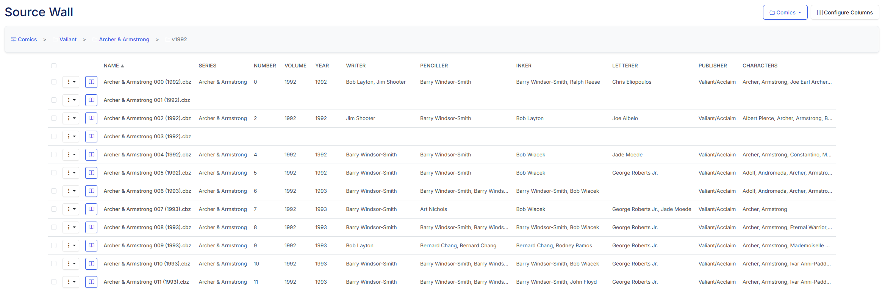

# Release Notes: The "Source Wall & Safety" Update

This release focuses on giving you better visibility and more control over your library’s metadata, improving the "quality of life" for file management, and ensuring that our external API integrations (thanks Metron) are running as lean as possible.

<!-- more -->

## Major Highlights

### **The Source Wall View**

{: .center-image}

Fine-tuning your comic metadata just got a lot easier. In v4.10, we've introduced the **Source Wall** view (naming inspired by [Metron](https://metron.cloud)) **. This view is a table-based view of your libray, that also includes the metadata. Whether you want a quick view of your directories or you need to address those metadata inconsistencies, you now have the visibility you need to keep your library organized.

### **Soft Delete & The Trash Can**

We’ve all had that "oh no" moment after a misclick. You can now enable a **Trash** folder for soft deletes. Instead of files vanishing into the digital void, they’ll be moved to a temporary staging area, giving you a safety net for your rare digital issues.

---

## 🛠️ Features & Enhancements

### **Metadata & Search Intelligence**

* **Smart Search Fallbacks:** If an exact metadata match isn't found, the system now automatically adjusts its search parameters to help find the next best fit—perfect for those tricky one-shots or indie titles.
* **Result Sorting:** You can now sort and filter your metadata selection results, making it much faster to tag your collection accurately.
* **CBL Metadata-First Logic:** Reading lists in the CBL format now prioritize existing metadata, ensuring your curated lists are more accurate and resilient to file name changes.

### **User Experience & Navigation**

* **Visual Progress:** Moving large folders or collections? We’ve updated the **Progress UI** so you can actually see the status of your file operations in real-time.
* **Refined Navigation:** Collection navigation has been revised for a smoother flow, making it easier to jump between series and individual issues.
* **Time Zone & Jitter Sync:** Settings now include time zone awareness and "Jitter" syncs. This helps spread out server load and ensures scheduled tasks happen exactly when you expect them to.

---

## 📦 Technical Maintenance & "Under the Hood"

* **Metron API Optimization:** We’ve significantly reduced the number of calls to the Metron API by optimizing series lookups and credential checks. This keeps us well within the new rate limits and speeds up the entire app.
* **Code Refactoring:** A major breakout of JavaScript functions for Comics and Folders makes the codebase much easier to maintain and faster to execute.
* **Dependency Updates:** Updated core GitHub Actions (Checkout and Setup-Python) to the latest versions for better security and build performance.
* **Contributor Spotlight:** Huge thanks to **@MikiiTakagi** for adding issue templates for bug reports and enhancements—making it easier for the community to help us grow!
