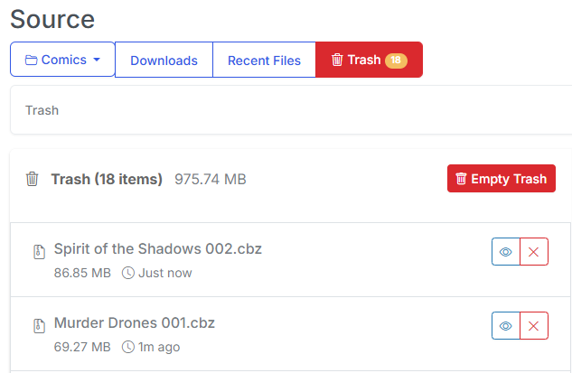
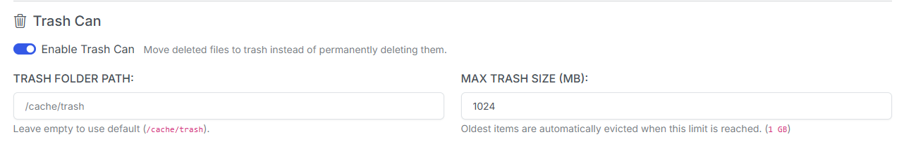
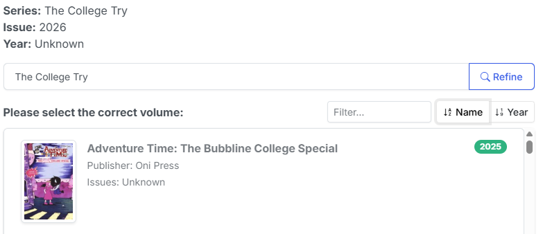
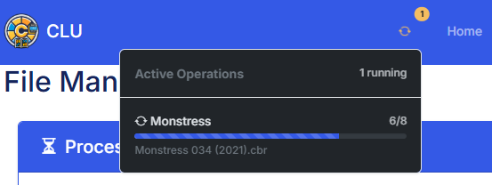
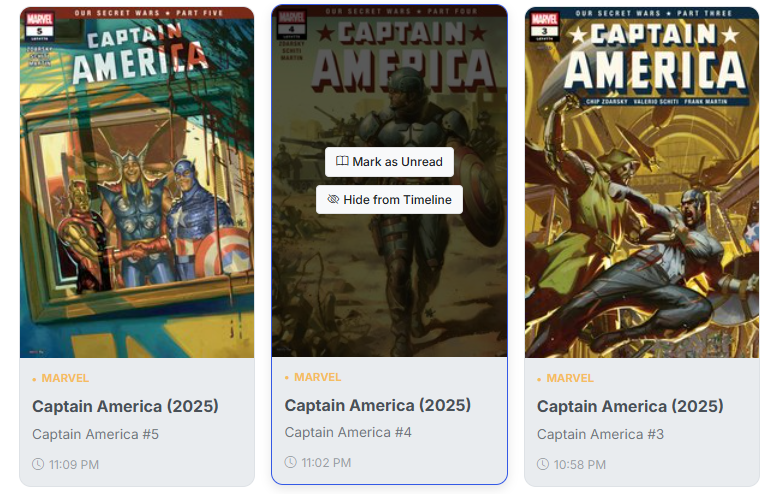

# v4.10 - The Source Wall & Safety Update

This release focuses on giving you better visibility and more control over your library’s metadata, improving the "quality of life" for file management, and ensuring that our external API integrations (thanks Metron) are running as lean as possible.

<!-- more -->

## Major Highlights

### **The Source Wall View**

{: .center-image}

Fine-tuning your comic metadata just got a lot easier. In v4.10, we've introduced the **Source Wall** view (naming inspired by [Metron](https://metron.cloud)) **. This view is a table-based view of your library, that also includes the metadata. Whether you want a quick view of your directories or you need to address those metadata inconsistencies, you now have the visibility you need to keep your library organized.

### **Soft Delete & The Trash Can**

{: .center-image}

We’ve all had that "oh no" moment after a misclick. You can now enable a **Trash** folder for soft deletes. Instead of files vanishing immediately, they’ll be moved to a temporary staging area, where you can review and restore them if needed. 

{: .center-image}

The default location for the Trash folder is `/cache/trash` and the default size is `1024MB | 1 GB`. You can adjust these settings in the settings menu. Once you reach the limit, the oldest files will be deleted to make room for new ones.

---

## 🛠️ Features & Enhancements

### **Metadata & Search Intelligence**

* **Smart Search Fallbacks:** If an exact metadata match isn't found, the system now automatically adjusts its search parameters to help find the next best fit—perfect for those tricky one-shots or indie titles. For example, `Batman: Legends of the Dark Knight` would be matched to `Batman: Legends of the Dark Knight`, `Batman Legends of the Dark Knight` or `Batman - Legends of the Dark Knight`

* **Result Sorting:** You can now sort and filter your metadata selection results if CLU cannot find a match, making it much faster to tag your collection accurately.

{: .center-image}

* **CBL Metadata-First Logic:** Reading lists in the CBL format now prioritize existing metadata, ensuring your curated lists are more accurate and resilient to file name changes. Additionally, progress updates are now displayed in the active operations UI, allowing you to navigate away from the operation and come back to it later, while still monitoring its progress.

### **User Experience & Navigation**

{: .center-image}

* **More Active Operations:** Moving large folders or collections? We’ve updated the *Active Operations* UI so you can navigate away from the operation and come back to it later, while still monitoring its progress.

{: .center-image}

* **Hide from Timeline:** You can now hide comics you have read from your timeline. Hidden comics will still count in your overall stats (issues read and pages read). Additional, you can also set an issue as Unread.

---

## 📦 Technical Maintenance & "Under the Hood"

* **Metron API Optimization:** We’ve significantly reduced the number of calls to the Metron API by optimizing series lookups and credential checks. This keeps us within the Metron's new rate limits and speeds up the series sync process.
* **Time Zone & Jitter Sync:** Settings now include time zone awareness and "Jitter" syncs. This helps spread out 3rd party provider load and ensures scheduled tasks happen within the timeframe you expect them to.
* **Code Refactoring:** A major breakout of JavaScript functions for Comics and Folders makes the codebase much easier to maintain and faster to execute. This enabled easier embeds of file and folder specific functions to all pages.
* **Dependency Updates:** Updated core GitHub Actions (Checkout and Setup-Python) to the latest versions for better security and build performance.
* **Contributor Spotlight:** Huge thanks to **@MikiiTakagi** for adding issue templates for bug reports and enhancements—making it easier for the community to help us grow!
