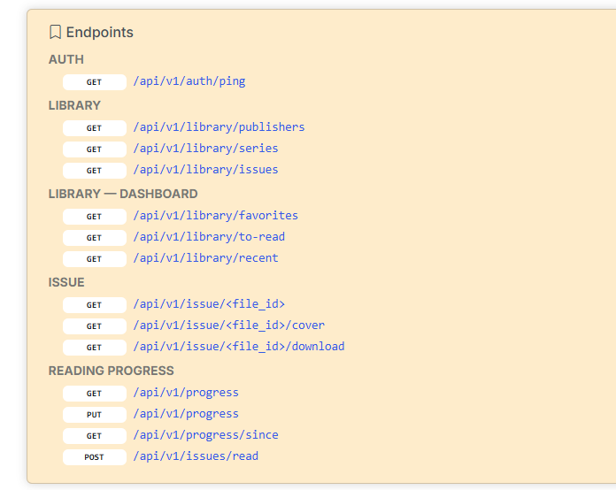
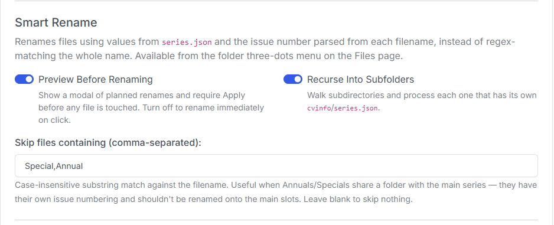
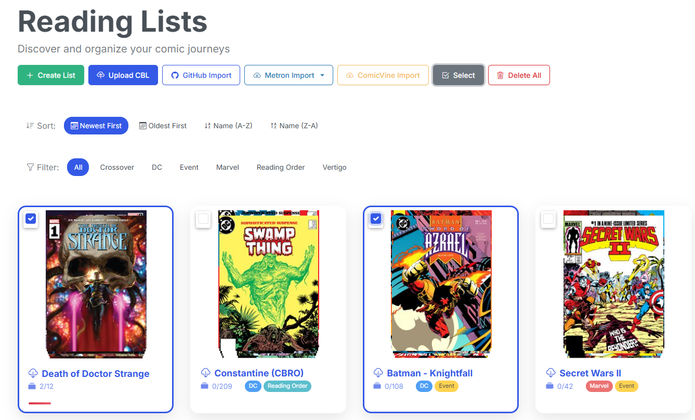

<!--
TODO — screenshots to capture before publishing:
  1. /api/v1/docs page (the live endpoint catalog)
  2. Smart Rename modal in File Manager, with the new "Exclude Terms" field visible
  3. File Manager → Trash tab showing original-path column and the Restore button
  4. Settings → Database tab with backup history list and the Restore button
  Optional extras:
  - All Books with the letter A–Z filter active
  - Reading List view with the new sort dropdown + per-item Crop Cover menu
-->

v4.14 turned out to be a much bigger release that I had planned. With no bugs surfacing, I was able to add little features here and there over the past few weeks. Combine that with a work trip that spurred development of the external API and great feedback from Discord users on a few things, and here we are. 

In this release I've started building out an external API, added a metadata-driven Smart Rename for the File Manager, updated the Trash to restore files directly to their previous location,, and a proper backup/restore flow for the database. Plus a long list of quality-of-life fixes and a faster, paginated All Books and Missing XML view.

<!-- more -->

### External API & Companion App Support

Ever wanted to build a reader, a phone app, or a quick dashboard against your library? Now you can. I did not have this feature planned but as a work trip was approaching and I traded in my old iPad for a Surface Pro - I wanted a way to read my books offline and have progress sync back to CLU when I got home. 

 v4.14 ships an official `/api/v1` REST API with bearer-token authentication. It lets external apps browse your collection, fetch covers, track reading progress, and pull series metadata — with pagination, filtering, and volume support throughout.

The API supports both **filesystem browse** (walk the disk as you'd see it in the UI) and **metadata browse** (query series, issues, and recents from the database). Reading progress can be read and written, so a companion reader can sync back where you left off.

A full reference is available in the **Settings** once you deploy the update — every endpoint, every parameter, every response shape. Tokens are generated and revoked from the new **API Configuration** page.

***

### Smart Rename for the File Manager

This was added after discussions on Discord called out that the current folder rename <i class="bi bi-input-cursor-text"></i> was really just a _filename cleaner_ and didn't abide by custom rename rules.  

The File Manager now has a **Smart Rename** option that pulls the series name, volume, and year directly from `series.json` metadata or retrieves it via `cvinfo` nstead of trying to parse the filename. The only thing read from the filename is the issue number — everything else comes from curated metadata, so your collection ends up consistent the first time.

It also supports **Exclude Terms** — a comma-separated list of words (like `Annual,Special,TPB`) that Smart Rename will leave alone. Defaults for `Annual,Special` are installed for you so that they don't get merged into the main series.

***

### Reading List Improvements

The Reading List page has seen a number of quality-of-life improvements. You can now sort reading lists by name or date created, and crop awkward covers without leaving the list. You can also enabled multi-select on Reading Lists, allowing you to delete multiple reading lists at once.

***

### Database Backup & Restore

Your CLU Comics database is now a first-class citizen. The new **Database** tab in Settings lets you create a backup with one click, browse a history of previous backups, and restore from any of them. Before any restore, a pre-restore safety snapshot is created automatically — so a bad restore is recoverable too.

As part of this work, the database has moved from `/cache` to `/config`. Existing installs are migrated automatically on first launch. **Docker users:** double-check that your `/config` volume is mounted so backups survive container rebuilds.

***

### Other Improvements

- **Server-side pagination for All Books** — the All Books view now uses the database directly, with letter filters (A–Z, #), full-text search, and a total count. No more long waits on large libraries.
- **Mylar-compatible `series.json`** — written automatically when you subscribe to or map a series, so Mylar3 and other comic apps can read your library cleanly.
- **Pull-list export/import** — export your subscribed series as JSON and import on a fresh install; publisher links are re-resolved on the way back in.
- **PDF uploads** — Drag and drop upload support for PDFs has been added in the File Manager, allowing you to easily add PDFs to you collection.
- **Watch/Target Processing Directory Validation** — Added validation to prevent the Watch/Target directory from being set to the same as the root `/data` directory and migrated settings to the DB.
- **Parallel bulk ComicInfo updater** — Source Wall and other batch metadata updates now process in parallel. Bulk edits of metadata should now complete up to 4x faster.
- **Missing-XML rescan** — a Rescan button finds files flagged as missing ComicInfo and tries again. `has_comicinfo` is only cleared on definitive failures, not transient read errors.
- **Schedules page** — all background-job schedules (metadata sync, auto-downloads, trash cleanup) moved out of Settings into their own dedicated Schedules page.
- **Source Wall Row Highlight** — selected rows now stand out so you don't lose your place mid-edit.
- **Folder thumbnail probe & metadata hardening** — no more cards stuck on "Loading…" when a folder hits a metadata error.

### Bug Fixes

- Home page refresh now preserves a deeply nested folder path instead of jumping back to the library root.
- The GetComics browser extension recognizes Pixeldrain's newer `/dls/` redirect (in addition to the legacy `/dlds/`). Extension bump required.
- Publisher info populates correctly when subscribing to a series across different providers.
- Opening an issue from a paginated stack jumps to the correct page first, so you don't lose your spot.
- Rescanning a missing-XML item now removes it from the view directly instead of reloading the whole directory.
- Quieter JS console — debug-only logging and guarded grid initialization.

***

That's v4.14. As always, feedback is welcome via Discord or GitHub — and if you build something against the new API, share it.

Previous release: [v4.11 & 12 — Manga Metadata, Reading Lists, & More](https://clucomics.org/blog/2026/03/25/v411--12---manga-metadata-reading-lists--more/)
