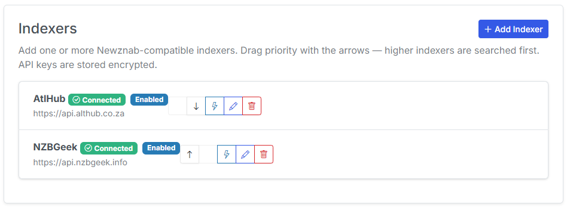
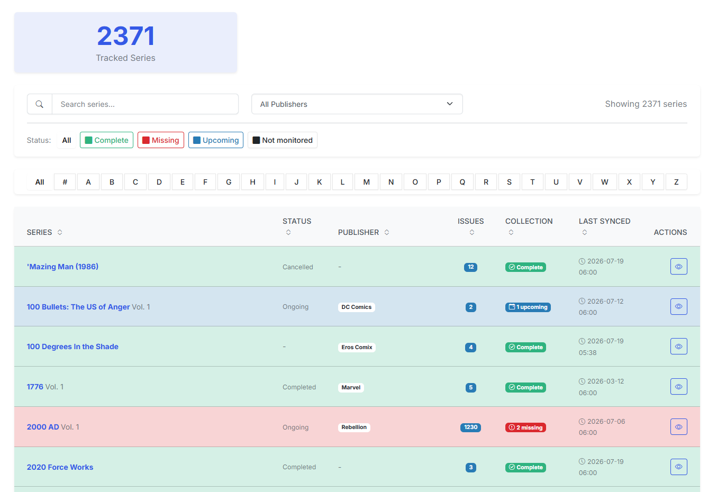
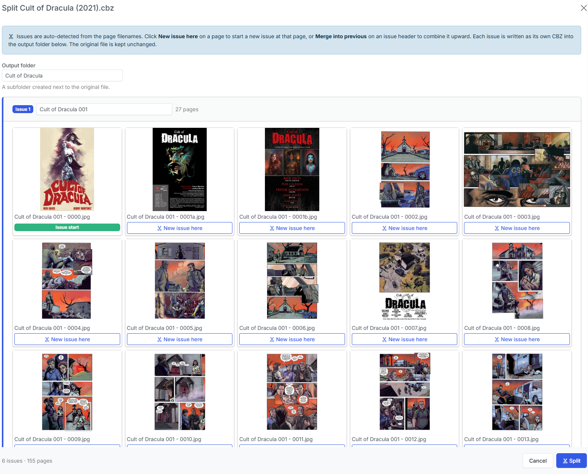
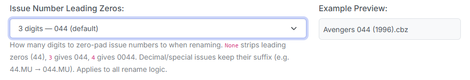

v6.0 is the biggest release CLU has shipped in a while, and most of it is about getting comics into your library and keeping that library organized. The headline feature is full **Usenet (newsgroup) download support** — SABnzbd/NZBGet clients, Usenet indexers, and end-to-end search, grab, and import that sits right alongside the existing Direct Download flow. 

On top of that, the **Pull List** received new features: monitoring flags, color-coded collection health, bulk actions, and a `series.json` and `.cvinfo` based Import that maps your existing library in one scan.

There's also a new **Split File** tool for breaking multi-issue CBZs apart, a smarter and more configurable rename engine, and a set of reliability fixes for folks running CLU on FUSE/mergerfs mounts and issue matching speed improvements for large libraries and pull-lists. Here's the tour.

<!-- more -->

### Usenet (Newsgroup) Download Support

This is the big one. CLU can now download comics from Usenet, not just the Direct Download site. The whole system mirrors the metadata-provider design you already know: you add a **download client** (SABnzbd or NZBGet) and one or more **Usenet indexers** from a new **Download Clients** tab in Settings, test each connection, and set a **Source Priority** that decides whether Usenet or Direct Download is tried first.

Once it's configured, Usenet is wired into everything:

- **Manual per-issue search** on the series page now queries the Direct Download site *and* your enabled indexers in priority order, with a grab button on every result and per-indexer error reporting when something's misconfigured.
- **The Wanted Issues page** does the same — both sources appear under labeled section headers, ordered by your Source Priority. Usenet stays hidden until you've added an indexer, and warns you if indexers exist but no download client is active.
- **Auto-download** honors Source Priority too: with Usenet first, a Usenet hit skips Direct Download entirely; otherwise Usenet acts as a fallback when Direct Download has nothing to queue.

Grabs are submitted to your client as real NZB content, tracked to completion by a background poller, and the finished comic is moved into your WATCH folder as `<series> <issue>.cbz` so the normal wanted-matching pipeline picks it up from there.

***

### Library Import and Automap

If you already have a large library and are migrating from another app, populating the **Pull List** manually can be a chore. The new **Scan Library** searches your library for `series.json` / `cvinfo` files, resolves each one to a Metron (or ComicVine) series, and classifies the results into **auto-mapped**, **needs review**, and **skipped** — with reasons shown for anything it couldn't place. You confirm the review items in a modal, and CLU applies the mappings, backfills the sidecars, and kicks off a background sync and collection match.

Any series imported with a **Status** of __Completed, Cancelled or Ended__ will default to **Not Monitored** if you have all issues of that series.

***

### Pull List: Monitoring, Health at a Glance & Bulk Actions

With the addition of Library Import, the Pull List page received multiple upgrades.

- **Monitoring** — when a series is set to *Not Monitored*, it's greyed out on the Pull List and excluded from the wanted-issues refresh and from DDL/Usenet auto-download. If you have all of the issues, know they're not available or don't care - this will stop CLU from searching for them on a nightly basis.
- **Collection health color-coding** — rows are now colored by status (complete / missing / upcoming), with a **status filter** and an on-page legend so you can filter for series that are missing issues.
- **Bulk monitored toggle** — you can select rows with checkboxes (SHIFT for a range, CTRL/CMD to toggle) and flip a whole batch to Monitored or Not Monitored in one action.
- **Smart defaults on import** — when Scan Library imports a series that is both fully owned *and* has an ended status (Cancelled/Completed), its Monitor flag defaults to off. A finished, fully-collected run won't waste searches. The gate is conservative: it only ever turns monitoring off, never back on, so it can't undo a choice you made.

{: .center-image}

***

### Split File: Break Multi-Issue CBZs Into Single Issues

Downloaded a "collected" CBZ that's really several issues bundled together or a fan-made TPB that you'd like to split into individual issues? The File Manager's per-file dropdown now has a **Split File** action for CBZs. 

It unpacks the archive, auto-detects issue boundaries from the page filenames (e.g. `Series 003 - 0001.jpg`), and shows you an editable, grouped page grid. You can adjust the boundaries, merge or add groups, and rename each issue before committing. CLU then writes one clean, image-only CBZ per issue into a new series subfolder — and your original file is left completely untouched (delete or keep, it's your choice).

{: .center-image}

***

### Smarter, More Configurable Renaming

The rename engine picked up one new setting and several correctness fixes:

- **Configurable leading zeros** — a new *Issue Number Leading Zeros* dropdown in Custom Naming Settings lets you choose how issue numbers are padded: **None** (`44`, `3`), **3** (`044`, `003`, the default), or **4** (`0044`, `0003`). Decimal and alpha suffixes are preserved at every width (`44.MU` → `0044.MU`).
- **Decimal & suffix issues preserved** — point issues like `001.1` and Marvel tags like `1.MU` / `.NOW` / `.INH` used to lose their suffix in renames and wanted-matching (`Avengers 001.1` became `Avengers 001`). That's fixed across renaming, scoring, sorting, and provider lookups.
- **DC "One Million" issues** — `#1,000,000` one-shots (like *Action Comics 1000000*) are no longer truncated to `1000`.
- **Batched bulk renames** — renaming 50+ files at once now runs as a single queued, coalesced background operation instead of one request per file, so it's dramatically faster and doesn't hammer the database. Progress shows in the nav operations indicator.

***

### Auto-Unwrap for Hybrid & Multipart Releases

Usenet releases don't always arrive as a ready-to-read comic. A lot of them show up as a folder of obfuscated, multi-part archives — a set of `.zip` parts that extract to a `.RAR` that finally extracts to the actual PDF, CBR, or CBZ. The old per-file monitor couldn't see that four zips were really one archive, so it shoveled each obfuscated part into your library as garbage.

CLU now recognizes these packaged releases and **unwraps them automatically**. A new folder-level pre-pass claims the release, waits for the parts to finish arriving, extracts the nested archives layer by layer in an isolated work area (your source files are never mutated), renames the emerged comic to a clean release name, converts PDFs to CBZ, and hands it off to the normal pipeline. On success the leftover parts and cruft are deleted; on a failure it leaves the source alone and retries later. The unwrap step is conservative by design — it never fires when a ready comic is already present — and it's gated behind the existing **AutoConvert / Auto-Unpack** setting, so there's nothing new to configure.

***

### Other Improvements

- **"Illegal seek" CBZ writes fixed on FUSE/mergerfs `/data` mounts** — every zip write destined for `/data` is now assembled on a local seekable volume and moved into place, so the "OSError: [Errno 29] Illegal seek" failures on mergerfs/network/FUSE mounts are gone. As a bonus, those writes now get consistent parent-folder permissions.
- **Faster wanted-issue scans** — the TARGET scan that matches wanted issues to files was rebuilt as a single-pass matcher. On a library with hundreds of wanted issues, archive opens drop from tens of thousands to at most one per file.
- **Metron rate limiting holds under load** — CLU now reuses one Metron session per credential pair and shares a process-wide throttle, so concurrent background jobs (bulk metadata, wanted-cache refresh, reading-list sync) stay under Metron's burst limit instead of tripping it.
- **Empty TARGET folders cleaned up** — the wrapping folders that Usenet downloads leave behind in `/downloads/processed` are now pruned automatically after files are moved out.
- **Wrong-issue Usenet matches rejected** — the auto-download scorer now penalizes a bare wrong issue number (e.g. `001` when you wanted `#002`), so a release that only matched on series + year can't sneak past the accept threshold. `Series 1 of 5` is also no longer misread as issue 5.
- **Per-page selection persists** — the Browse Library "Per page" choice is saved and restored across navigation instead of resetting each load.

### Bug Fixes

- Metron's "Script" (and "Plot") credit roles now map to **Writer**, so writers credited as "Script" (e.g. Jeff Lemire on *Black Hammer*) are no longer dropped from metadata.
- A doubled-extension bug (`Name.cbz.cbz`) surfaced by the unwrap flow is fixed, without affecting dotted issue suffixes like `1.MU`.

***

That's v6.0 — the release that brings Usenet into CLU and makes the Pull List much more functional. As always, feedback is welcome via [our Discord](https://discord.gg/ndDhpvrgBa) or [GitHub Issues](https://github.com/allaboutduncan/clu-comics/issues). Many of the bug-fixes and features for this release were user-requested, so please keep the feedback coming.

Previous release: [v4.14 — External API, Smart Rename, Trash Restore, & More](https://clucomics.org/blog/2026/05/21/v414---external-api-smart-rename-trash-restore--more/)
