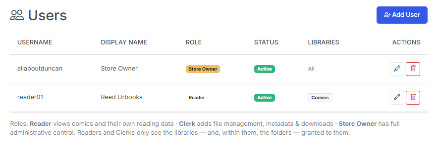
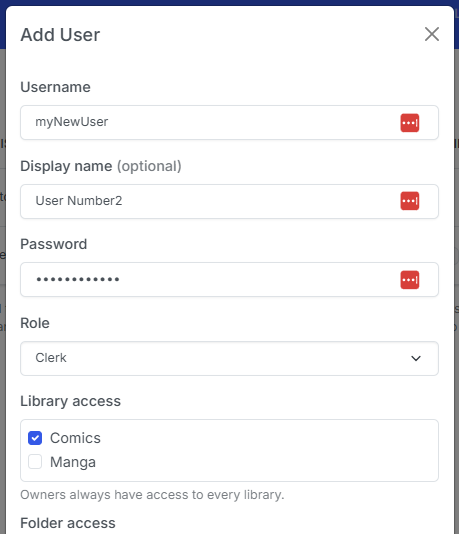
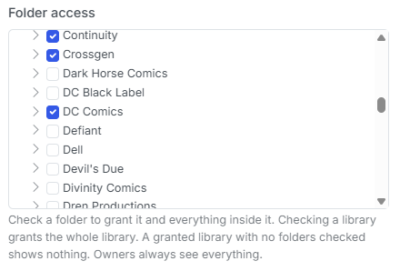
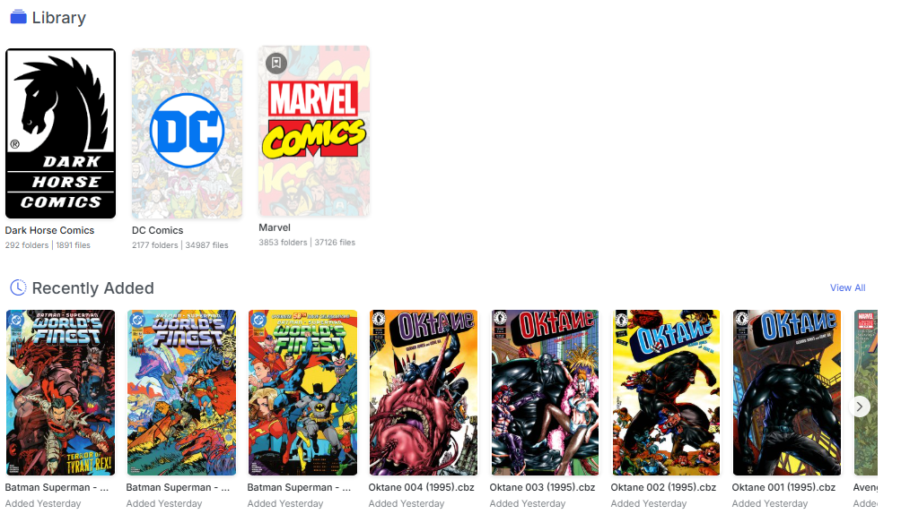
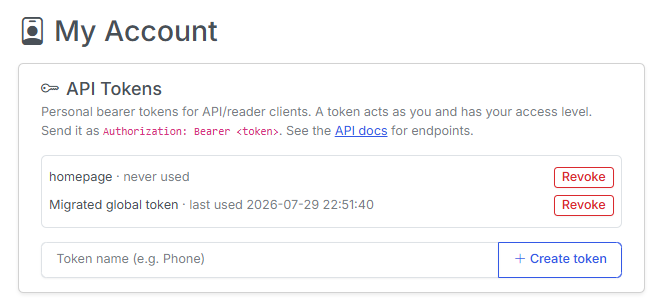
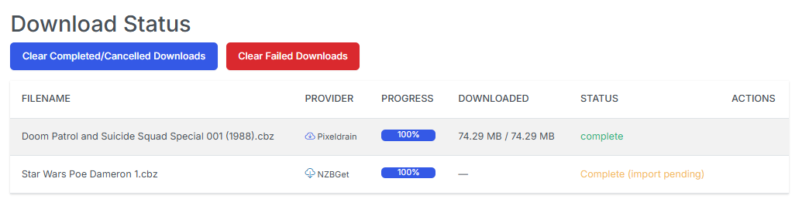
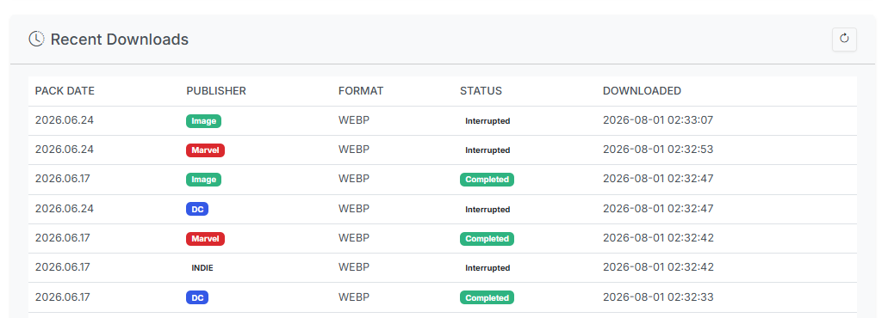
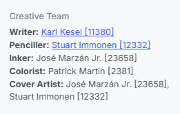
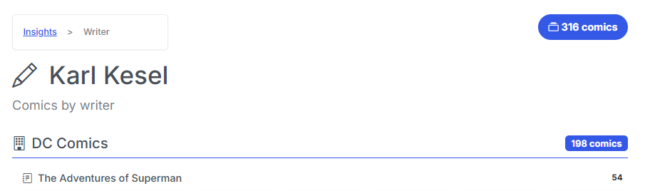

**v6.2 is the release where CLU stops assuming there's only one of you.**

The main highlight of this release is **multi-user support**: real accounts, three roles (**Reader**, **Clerk**, **Store Owner**), per-library *and* per-folder access grants, and per-user reading data so everyone's history, favorites, and stats are their own. Share your library with family or friends without handing over the keys to your settings, your file manager, or your downloads.

It's opt-in by design. If you're running CLU on your own, nothing changes — there's still no login, and every screen works exactly as it did before.

Apart from the multi-user work, there's a batch of practical fixes: 

* **Live Usenet download progress** on the Status page
* **Weekly Packs** overhaul that stops packs from getting stuck forever
* **Metadata cleanup** that merges *"Ron Lim"* and *"Ron Lim [3258]"* into one person
* **WebP output option** for PDF→CBZ
* **Support for Letter-suffixed issue numbers** — Gen 13 013A.cbz
* **Series Issue Mapping and Matching Improvements** - improvements added for series with punctuation in titles, Annuals in series folders and more

<!-- more -->

### Multi-User: Accounts & Roles

CLU now has real user accounts with a three-tier role hierarchy. Each role includes everything below it:

| Role | Can do |
|---|---|
| **Reader** | Browse and read comics, track their own reading history and reading position, keep their own favorites, To Read list, and stats, view reading lists, manage their own API tokens |
| **Clerk** | Everything a Reader can do, plus file management, renaming, metadata and scraping, downloads, the Pull List, Wanted Issues, Weekly Packs and Releases |
| **Store Owner** | Everything a Clerk can do, plus app settings, user management, library and folder grants, provider credentials, database tools, logs, and system actions |

!!! note "Clerk Role"
    Curretnly the Clerk role is active, but not widely tested. Improvements and refinements are planned in the v6.3 release.

{: .center-image}

***

### Turning It On (or Leaving It Off)

Multi-user is entirely optional, and CLU decides which mode to run in on its own:

- **Implicit-owner mode (the default).** When there's only one account and no `CLU_USERNAME`/`CLU_PASSWORD` env variable, there's **no login at all** and every request runs as the Store Owner. Library and folder scoping are skipped outright. Existing single-user installs are untouched.
- **Multi-user mode.** The moment you create a second account, login is required and enforcement activates everywhere.

On a fresh install you'll get a one-time **Store Owner Setup** screen to pick a username and password. 

If you were already using the `CLU_USERNAME` / `CLU_PASSWORD` environment gate, those credentials are migrated into a proper hashed owner account at startup and keep working through the normal login screen. Passwords are stored with werkzeug hashing, and the session secret is persisted so logins survive a restart.

Adding users lives in **Settings → Users** (Store Owner only): username, display name, password, role, active toggle, library and folder grants, and API tokens — all in one modal. The last active Store Owner is protected: CLU won't let you demote, deactivate, or delete it and lock yourself out.

{: .center-image}

***

### Library *and* Folder-Level Access

Access is granted in two layers, so you can be as broad or as precise as you like.

**Libraries** are the outer gate — check the libraries an account may see. **Folders** refine access *within* a granted library: check a folder and the user gets that folder and everything inside it, nested inheritance included. Check the library root and they get the whole library.

A few rules worth knowing:

- **New non-owner accounts see nothing** until you grant them something. Default-deny, deliberately.
- **A granted library with no folders checked shows nothing** — the library grant alone isn't access.
- **Ancestor folders stay navigable.** If you grant `/data/Comics/Marvel/Daredevil`, the user can walk down through `/data/Comics` and `/data/Comics/Marvel` to reach it — but the siblings they weren't granted stay hidden, and an ancestor folder is *not* enough to open a file.
- **Store Owners bypass all of it** and always see everything.

This isn't just a UI filter. Listings are filtered *and* path resolution is guarded, so a hand-typed URL into somebody else's library returns a 403 — across browsing, search, recent files, thumbnails, covers, the reader, downloads, the metadata browser, OPDS, and the token API.

{: .center-image}

***

### Everyone Gets Their Own Reading Data

Sharing a library shouldn't mean sharing a reading history. Every piece of personal data in CLU is now scoped per user:

- Read history and read/unread state
- Reading positions (where you left off in an issue)
- The **To Read** list and **On the Stack**
- Favorite series and favorite publishers
- Reading lists
- Insights, the reading timeline, and **CLU Wrapped** — including a per-user stats cache, so one user's numbers can't be served to another
- Rcently Added - is scoped to the folders the user has permission to see, so they won't accidentlally see something that you haven't granted them access to.

Long-running operations and toast notifications are scoped too: the progress indicator shows *your* jobs, not everyone's, while the Store Owner still sees the whole picture.

{: .center-image}

***

### Per-User API Tokens, OPDS Logins & Self-Service

The mobile/desktop API and OPDS readers now authenticate as a specific person.

- **`/api/v1`** resolves the bearer token to its user, so reading progress, favorites, and library scope all land on the right account. Reader and Clerk tokens are library-scoped — a token can't reach files outside its user's grants. Your existing global token still works and maps to the Store Owner, so current clients keep running.
- **OPDS** gained HTTP Basic Auth (which OPDS reader apps already support). `/opds/browse` and `/opds/to-read` filter to the authenticated user; wrong credentials get a 401. In implicit-owner mode OPDS stays auth-free exactly as before.
- **Self-service tokens.** A new **My Account** page lets *any* user view, create, and revoke their own API tokens without bothering the owner. A token only ever authenticates as its owner, so it grants no extra privilege. The Store Owner can still mint and revoke tokens for any account from the user modal. Tokens are stored hashed and shown in plaintext exactly once — copy it when you see it.

{: .center-image}

***

### Homepage Insights, Per User

`/api/insights` now accepts an optional `Authorization: Bearer <token>` header using the same per-user tokens. With a token, the reading counters reflect that user; without one they still reflect the Store Owner, so existing tokenless [gethomepage.dev](https://gethomepage.dev) widgets keep working untouched. A malformed or unknown token returns 401 rather than quietly serving the owner's numbers — so a household can each have their own widget.

***

### Usenet Downloads Show Live Progress

Usenet grabs were tracked internally but never surfaced, and the poller only checked client history — so a download appeared to vanish until it was finished. The **Download Status** page now renders Usenet jobs in the same table as direct downloads, with SABnzbd/NZBGet icons, a live percentage, byte counts, and the client's current stage (**Downloading / Verifying / Repairing / Extracting / Moving**), refreshed on a ~5-second cadence while anything is active.

{: .center-image}

***

### Weekly Packs: Accurate Status, No More Stuck Rows

Two long-standing Weekly Packs annoyances are fixed.

**Check Pack Status now tells the truth.** It only ever inspected the newest pack on the DDL Site homepage and ignored your configured Start Date, so it never reflected what the scheduler was actually backfilling. It now honors Start Date and reports the first (oldest) pack on or after it that hasn't been downloaded yet.

That work also killed an **endless retry loop**: the date generator emits both a Tuesday and a Wednesday every week, but only one pack exists — the non-existent day 404'd, which was misread as "links aren't ready yet" and retried forever. Pack availability is now tri-state (available / pending / missing / error), so 404 weeks are skipped instead of retried, and the scheduler backfills oldest-first.

**Recent Downloads no longer freezes.** Pack history status was only ever written from inside the download worker, so a restart, a cancellation, a cleared queue, or a crashed worker thread left rows stuck at *Queued* or *Downloading* forever — and because queued/downloading counted as "already downloaded," a frozen row permanently blocked re-downloading that pack. Each history row is now linked to its live download and reconciled against real state at three reliable points (app startup, the top of each scheduler run, and whenever the page or API is read). Vanished downloads are marked **Interrupted**, the table gained Interrupted / Cancelled / Failed badges and a live percentage on in-flight rows, and it refreshes every 10 seconds. A download worker crash can also no longer kill the queue thread for good.

{: .center-image}

***

### One Artist, One Name

External taggers like to append their own provider IDs to ComicInfo values:

```xml
<Penciller>Ron Lim [3258]</Penciller>
<Characters>Aquaman [2357]</Characters>
```

CLU stored those verbatim, so *"Ron Lim"* and *"Ron Lim [3258]"* behaved as two different artists — browse pages showed a partial library for either spelling, and Insights split one person's count across two rows. Provider IDs are now stripped at the database layer, with a one-time backfill over your existing index.

A few deliberate details: **your ComicInfo.xml files on disk are never rewritten**, so the raw value stays recoverable; only *numeric* brackets are stripped, so meaningful ones like `[uncredited]` and `[Bruce Wayne]` are preserved; and titles, series and issue numbers are left alone entirely. Browse now matches credits exactly (previously a `LIKE '%value%'` search, which meant "Ron Lim" also matched "Ron Limbaugh"), Insights counts fold case-insensitively so the number agrees with what clicking through actually shows, and the CBZ Info modal links **Characters** through to their browse page.

{: .center-image} {: .center-image}

***

### Other Improvements

- **WebP output for PDF→CBZ** — a new image-format dropdown in File Processing settings (JPEG default, or WebP for roughly 30–50% smaller files at similar quality). The same pass fixes large white margins on converted pages: many comic PDFs set a CropBox tighter than the page MediaBox, and CLU now renders the visible CropBox.
- **Letter-suffixed issue numbers** — `Gen 13 013A.cbz` used to fall through and search for issue #13 (grabbing the number out of the *title*), finding nothing. Suffixes like `13A` and `1AU` are now extracted properly in both metadata paths, with ordinals (`5th`, `100th`) guarded against false matches.
- **Issue pad width honored everywhere** — the `Series #N (YYYY)` filename shape ignored your configured leading-zeros setting and always padded to 3, so "None" still produced `001`. Fixed for both custom rename and Smart Rename.
- **Scan Library survives a bad sidecar** — one corrupt `series.json` used to abort an entire library scan and discard every series that had already been mapped. Failures are now collected per folder, the scan keeps going, and an "Errored" section reports what couldn't be read.

### Bug Fixes

- **Wanted matching for apostrophes and slashes** — apostrophes were deleted from the series name before the regex was built (so *World's Finest* compiled to `Worlds`), and `/` was compiled literally, a character no filename can contain. *"Batman / Superman: World's Finest"* #51 could therefore never match its own download, leaving files stranded in TARGET. Both are now normalized, which also fixes those series reporting every issue as missing on collection matching.
- **Browser extension downloads work under login** — the login gate redirected the cookieless "Send to CLU" request to `/login`; the extension followed the 302, saw a 200, and reported success while nothing was queued. The download endpoints are exempt again.
- **Recurring pollers can't freeze the browser** — background fetch pollers now have an overlap guard and abort handling, so a slow reverse proxy no longer stacks up requests until the tab locks.
- **DDL Site aliases are user-defined only** — scraping no longer auto-creates aliases, alongside eleven other issues found reviewing the DDL Site search work.

***

### Notes for Upgraders

Nothing to do. Single-user installs stay login-free and behave identically; multi-user activates only when you create a second account. 

Two pieces are intentionally still global and are on the list for a follow-up: **Komga sync** targets a single shared account (attributed to the Store Owner), and **preferences like the theme** are app-wide rather than per user.

That's **v6.2** — CLU with a front door, a set of keys, and a much better sense of whose comics are whose. Feedback is welcome via [Discord](https://discord.gg/6c83t3Qsvq) or [GitHub](https://github.com/allaboutduncan/clu-comics/issues). If you set up accounts for your household, I'd love to hear how the role split holds up.

Previous release: [v6.0 — Usenet Downloads, Pull List Monitoring, Split File, & More](https://clucomics.org/blog/2026/07/23/v60---usenet-downloads-library-import-split-file--more/)
