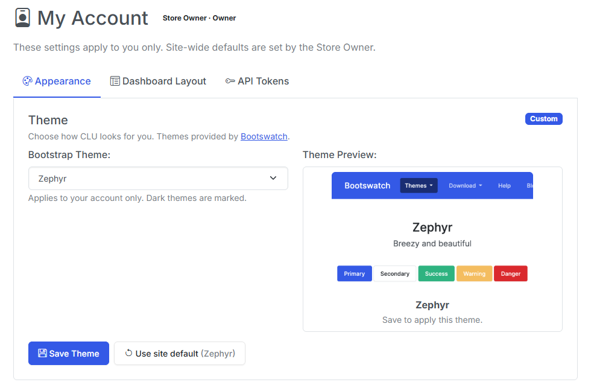
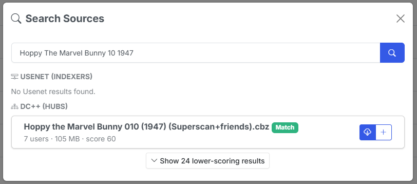
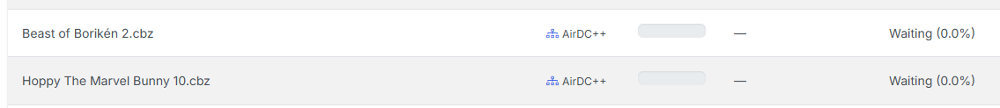
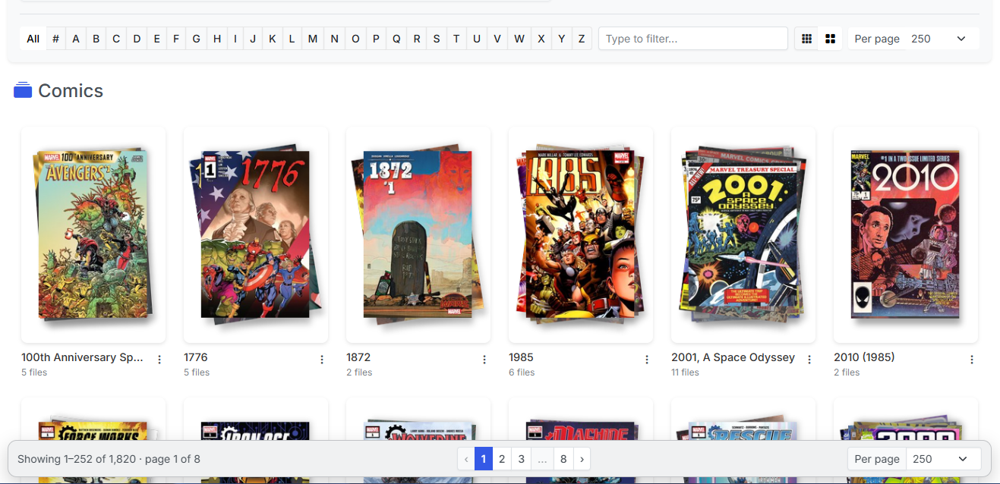
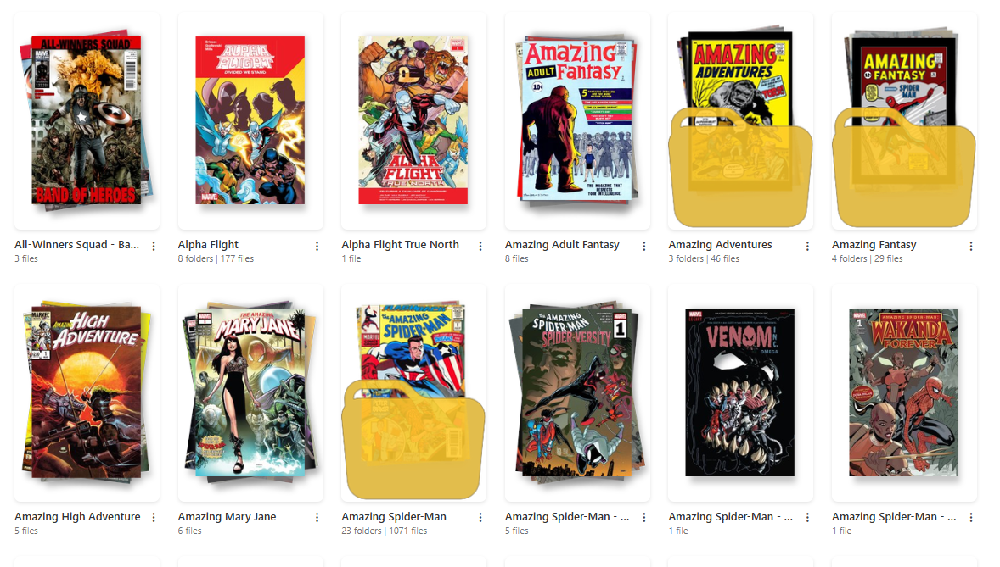
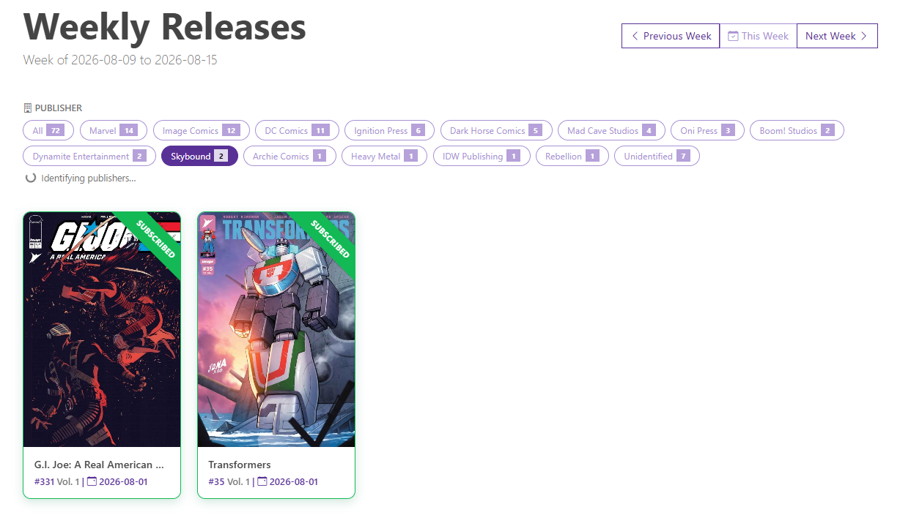
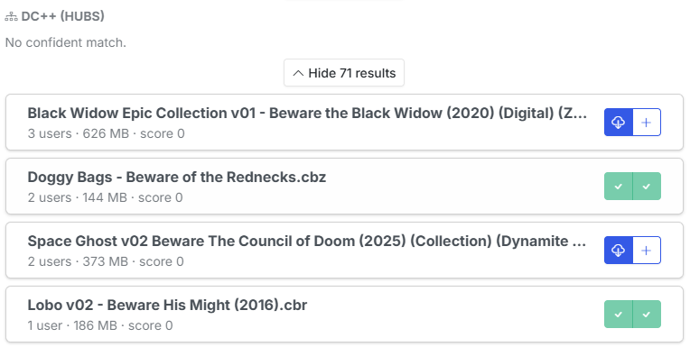

v6.2 adding User accounts and with v6.3 adds personalization for each user.

Themes and dashboard layouts are no longer app-wide, so a Reader can pick their own look without rearranging the owner's homepage. That was called out as a known gap in the v6.2 notes, and it's another piece of the multi-user functionality.

Alongside it, **DC++ arrives as a third download source** — CLU now talks to your own AirDC++ Web Client the same way it talks to SABnzbd and NZBGet — and **reading lists finally reach the dashboard**, so a list you've built or imported shows up in Want to Read and feeds On the Stack instead of only existing on its own page.

The rest of the release is a long run of *this should have just worked*: the Browse Library pager no longer requires scrolling past 250 covers, folder art generates itself, Cancel actually cancels, and the reader stops losing your place.

<!-- more -->

### Your Theme, Your Dashboard

Roles landed in v6.2 before per-user preferences did, which left two inherently personal settings — the Bootswatch theme and the dashboard section layout — global and editable only by the Store Owner. A Reader couldn't pick their own theme, and hiding "Discover" hid it for everybody.

There's now a `user_settings` override layer that sits on top of the existing global store. Resolution runs in three steps: **your personal override → the owner's site default → the hardcoded default**. A missing row *means* "follow the site default", so this shipped with no data migration and no install changes shape on upgrade.

`/account` expands into a proper **My Account** page with three panes — **Appearance**, **Dashboard Layout**, and **API Tokens** — each showing a *Custom* or *Following site default* badge and a reset button. The same controls stay on the settings page, recaptioned as site defaults, and saving a default now also clears the owner's own override, so setting one can't appear to do nothing.

Two details worth knowing:

- The header gains a person-icon dropdown (My Account / API Tokens / Logout), gated on there being a session — **single-user installs look exactly as they did**.
- **AI recommendations stay global.** That toggle gates an owner-configured service holding a shared API key; it's not a display preference.

A side effect of the cleanup: the "(Dark)" theme labels are now derived from the actual dark-theme list rather than maintained by hand, which fixes *quartz* being labelled dark while rendering light.

{: .center-image}

***

### DC++ Is a Third Download Source

CLU could already acquire issues from GetComics and Usenet. v6.3 adds **DC++**, connecting to your own **AirDC++ Web Client** through its REST API, with progress on the Download Status page and completed bundles landing in WATCH through the existing Usenet mover — one implementation of how files enter the pipeline.

Three structural changes made room for it:

- Download clients gained a **group** (`usenet` / `dcpp`), and "only one active client" is now scoped per group. **Activating AirDC++ no longer deactivates SABnzbd** — the two sources are independent, and existing rows backfill automatically.
- **Source Priority** became a general ranking rather than a single Usenet-vs-GetComics comparison, and both the real auto-download loop and the dry-run simulation now iterate the same ordered list.
- The search modal's source fan-out was extracted into one shared module instead of being copy-pasted across the Wanted and Series pages with a hardcoded two-source lookup.

One clarification on **Source Priority**, because it means two different things: it governs the order — and the membership — of the **auto-download** cascade, but the **manual search modal queries every configured source** whether or not you've ranked it. A configured client stays searchable by hand regardless of where it sits in the list.

DC++ needed real-world adaptation that the published API docs didn't cover:

- **Hub searches are genuinely slow.** AirDC++ *queues* searches and paces them per hub — measured against a live two-hub setup, the query wasn't even dispatched for ~17s, with results settling around ~30s. The wait is now driven by the instance's own progress counters rather than a flat timeout that gave up before dispatch.
- **Back-catalogue naming is its own dialect.** Comic hubs name older files `196103 Strange Tales v1 083.cbz` — a `YYYYMM` cover-date prefix and a `vN` volume token. The shared scorer expects scene-style `Series 083 (1961)`, so every date-prefixed file scored REJECT and the entire Golden/Silver Age catalogue was unreachable while modern releases matched fine. DC++ now normalizes those titles before scoring (and compares the declared volume separately, since dropping `vN` also drops the scorer's chance to catch a volume mismatch). Scored titles are normalized; **displayed titles stay the real filename**.

!!! warning "AirDC++ usually lives outside CLU's filesystem"
    AirDC++ typically runs natively on the host or in its own container, so the paths it reports aren't paths CLU can open. There's a **local target directory** setting for exactly this — the same folder as CLU sees it — and Test Connection verifies CLU can actually open it. Note that Test Connection tests **the values on screen**, not the last saved config, so you can validate a correction before committing it.

{: .center-image}

***

### DC++ Downloads Survive a Restart

DC++ bundles can sit in the AirDC++ queue for hours or days, but CLU was only tracking them in memory. AirDC++ runs as its own process and keeps downloading regardless, so a container restart orphaned the job outright: the bundle vanished from the Status page and the import step never ran, so the finished file was never moved into WATCH.

The worst case was a bundle that *completed while CLU was down* with "remove finished bundles" enabled — the last known target path lived only in memory, so afterwards there was nothing left to ask where the file had landed.

There's now a crash-recovery ledger in the database. Rows are written at grab time (before polling starts, so a crash in between can't lose the record) and cleaned up when a job resolves. **Failed and completed-but-not-moved rows deliberately survive until you dismiss them** — those need a human, and purging them would mean a restart silently swallows exactly the jobs worth looking at.

Recovery at startup is intentionally database-only, so boot isn't stalled by a per-bundle network call; the reconcile against AirDC++ happens on the poller's first round. The poller also now runs for as long as DC++ is configured rather than exiting after two idle rounds, a bad round no longer kills the thread, and its idle heartbeat refreshes a cached queue snapshot so the Status page can show bundles you queued **directly in AirDC++** — read-only, since CLU has no idea what series those are and must never move their files.

!!! info "Usenet has the same gap"
    Usenet jobs are not yet covered by this ledger. That's a known follow-up.

{: .center-image}

***

### Reading Lists Reach the Dashboard

Reading lists were a dead end. You could build one or import it from CBL, Metron or ComicVine — but nothing about it ever reached the Browse Library dashboard, so a list only existed if you deliberately navigated to it.

**Bookmarking a reading list** now adds it to **Want to Read** as a single card — cover stack, read/total count, progress bar — that opens the list. The same bookmark is the opt-in that surfaces the list's **next unread issue in On the Stack**: the first entry in the list's own order that is unread *and* has a matched file. A list you've never started still shows up, and entries with no matched file are skipped rather than counted as unread.

On the Stack merges reading-list entries with your subscribed series, dedupes when both point at the same next issue, and keeps the existing folder-scope filter — which now covers reading-list issues too. Entries carry a list-name badge so you can tell where one came from.

Bookmarks are user-scoped, so in a multi-user install everyone curates their own dashboard from the same shared lists. Readers can bookmark lists for themselves.

{: .center-image}

***

### Browse Library: A Pager You Can Actually Reach

The pagination control was rendered below the grid and nowhere else. At "Per page" 100 or 250, reaching **Next** meant scrolling past every cover on the page — and then the page scrolled back to the top, so the next page cost the same trip again. The effort of paging scaled with the page size, penalizing exactly the people who chose a large one.

The nav is now **sticky at the bottom of the viewport**: it pins for as long as there's grid left to scroll, then lands inline at the true bottom. It also gained windowed page numbers with ellipsis, a **"Showing 1–252 of 1,842"** readout, and a mirrored Per page selector.

Three adjacent bugs went with it:

- The **Multi-Select bulk action bar** is fixed-position with nothing reserving its space, so it covered the pager and the last grid row — paging was impossible while Multi-Select was on. Both now clear it.
- **Comic filenames were unreadable on all six dark themes.** A hardcoded light-text utility class was overriding the theme-aware rule. Removed from the grid tiles, the dashboard card titles, and the tile actions button.
- The loading state used to **hide the pager outright**, so in All Books mode it vanished and the page jumped on every click. In-place page changes now dim it instead.

The sticky bar's colors are mixed from the theme's own body text/background pair — the one pairing every Bootswatch theme guarantees to be high-contrast — after measuring all 27 offered themes and finding no Bootstrap surface variable usable across them.

{: .center-image}

***

### Folder Art That Generates Itself

Folder cover art only ever appeared if you uploaded it or ran **Generate Thumbnail** by hand, so new series sat behind a generic icon indefinitely.

**Browsing now triggers generation.** The endpoint the grid already calls for folders it can't draw art for hands those paths to a background queue, and the page re-checks a few times so the art appears while you're still looking at the folder. The queue runs one worker, dedupes in-flight paths, backs off for six hours on folders that can't produce art, and **never replaces existing folder art**. There's a settings toggle to turn the whole thing off.

Four bugs surfaced underneath it — the most visible being that nothing updated the index flag after writing folder art, and the grid reads art off that flag rather than the disk. **Generated thumbnails vanished on reload** until the next full scan, which also affected the manual path. `folder.gif` was never recognized as art at all, and on some installs folder art was written with permissions that made it unreadable afterwards.

Card art sizing was also inconsistent: only some card types constrained the image, so identical art could render at two apparent scales — a 200×300 file overflowed its frame and got centre-cropped while a 167×250 one sat inside it untouched. One rule now sizes every card from its frame, which also covers user-supplied art of any dimensions.

Finally, a **Standard / Large card size toggle** in the filter bar, persisted locally like the per-page setting. It's a deliberately modest bump (~13–15% on desktop, up to 22% on tablets, phones untouched) because raising the floor alone drops an entire column and the cards absorb every freed pixel.

{: .center-image}

***

### A Publisher Filter on Weekly Releases

Metron's issue-list endpoint returns objects that carry the series but **no publisher**, so the releases page had nothing to group on — and resolving it per series would have meant roughly 150 API calls a week against the daily rate limit.

Publishers now come from a **self-warming cache**. A background pass sweeps in bulk using Metron's own server-side publisher filter (one filtered call resolves every series a publisher shipped that week), then does a capped number of per-series lookups for the tail. Each publisher discovered in the tail becomes a bulk candidate on the next pass, so a cold cache converges within a few passes.

On the page you get **filter pills with live counts**, filtering client-side, with the selection mirrored into the URL for deep links. While the cache is still filling, the page polls and re-renders as publishers arrive — so the first visit to a new week may show the pills populate as you watch.

***

### Queue More Than One Download at a Time

Clicking a result in the search modal queued it and closed the modal, which made queuing a terminal action. But browsing is the real task — you often spot a second or third file you want, and the only way to get them was to reopen the modal and re-run the entire search per file.

Each result now offers two buttons: **download**, or **download and keep searching**.

Because none of the grab endpoints are idempotent, keeping the modal open needed duplicate protection to go with it. Both buttons in a row lock together while a grab is in flight (otherwise the second stays live and the same release gets sent twice), and **queued releases are remembered for the visit** — so narrowing your query and re-searching brings already-taken rows back locked rather than arming them again. DC++ is the one exception, and inherently so: its result tokens belong to a single live search instance and are re-minted every time.

{: .center-image}

***

### Two New Folder Actions

Two additions to the folder dropdown in both the File Manager and the collection grid:

- **Want to Read** (files and folders) — flags an item for the Want to Read swiper.
- **Add to Pull List** (folders only) — runs the same identity resolution Scan Library uses on a single folder, so a folder added this way is indistinguishable from one the full library scan picked up: sidecars backfilled, issues synced, owned/missing rebuilt in the background.

Add to Pull List reports what actually happened rather than silently doing something surprising: *already mapped*, *applied*, *conflict* (the series is mapped to a **different** folder — it tells you where instead of re-pointing the mapping), or *needs match*, which opens a picker that searches Metron. An unreadable sidecar comes back as *needs match* rather than failing, so you can still map it by hand.

A folder has to sit inside a configured library root, which keeps your downloads folder off the Pull List. Root-level folders are left out of the collection grid menu, since those are publishers rather than series.

***

### Pick the Issue When the Number Won't Match

Applying metadata resolves the issue by exact number against the chosen volume. Odd numbering — `1.MU`, `13A`, or `003` where the provider stores `23` — means the **volume is right but the issue is never found**, and the flow dead-ended with a red "No metadata found for selection" toast.

Rather than teaching the parser every numbering scheme ever invented, CLU now **shows the volume's issues and lets you pick one**, using the same card layout and filter as the volume picker. Batch runs collect the files that hit this and let you walk through them one at a time afterwards, caching the issue list per volume.

Providers that matched a series but no issue are recorded as near misses and offered **only once the whole provider cascade comes up empty** — every provider still runs first, so a real match always wins.

{: .center-image}

***

### Bug Fixes

- **Cancel actually cancels.** Cancellation is cooperative — the button sets a flag and the worker has to notice it. Pixeldrain never checked the flag at all, so a cancelled download ran to completion and got imported anyway while the UI said "cancelled". GetComics checked between chunks and then undid it: a cancel arriving during a stalled read waited out the 300-second timeout and then started retry attempts 2 and 3 regardless, and the error paths overwrote *cancelled* with the failure the cancel itself caused — so it came back as **Failed with a Retry button**. Both now check before and during transfer, clean up the partial file (which is resume state and must not survive a cancel), close the connection so the mirror stops streaming, and refuse to overwrite a cancelled status with an error. Granularity is still bounded by chunk size, so a slow link takes a few seconds to stop.
- **The reader remembers where you left off.** This was broken several independent ways, not merely flaky. Resuming a late bookmark *destroyed* it — the resume jump counted as reading progress, so resuming at page 90 of 100 instantly read as 90% complete and closing both marked the comic read and deleted the bookmark. Position was also only ever saved on an explicit modal close, so closing the tab, refreshing, or a mobile browser discarding the page lost it. There are now autosave and unload flushes (which only ever **save** — never mark-read, never delete, because a hidden tab is an ambiguous signal), comics of three pages or fewer can be bookmarked at all, and "Start Over" actually clears the stored position instead of returning forever. Reading positions also now **follow a file through renames, moves and CBR→CBZ conversion**, and one user's reading progress no longer leaks onto another's browse listings.
- **Usenet jobs no longer create ".cbz" folders.** CLU was handing the NZB client the destination *filename*, extension included, and clients name the completed job folder after whatever you submit. A grab for `Heavy Metal 5.cbz` made a **directory** called `Heavy Metal 5.cbz` holding the real comic — which the monitor then read as a comic file, producing a series folder named `Heavy Metal 5.cbz` and nothing at the TARGET level. The submitted name is now stripped of its extension, and the monitor strips comic extensions when deriving folder names — which also repairs folders already queued at the client or created by other download clients.
- **AirDC++ downloads land as real files.** Selecting a DC++ result queued it as a single file named after the whole target path (`_downloads_temp_Farmhouse 007 (2013)...`). AirDC++ concatenates the target directory with the result name rather than joining them, and on a Windows host `/` is a forbidden filename character rather than a separator — so a POSIX target directory got swallowed into the bundle name and sanitized. CLU now appends the separator AirDC++ expects, reads the host's actual separator from the client, and refuses a target directory it can't parse with a message naming the fix.
- **Smart Rename keeps the issue number on bare-year filenames.** `Series ### YYYY` with an unparenthesized year fell through to the no-year pattern, which reads the *last* number as the issue — so `Star Wars - Poe Dameron 001 2016` parsed as issue "2016", and because Smart Rename discards the parsed series in favour of the sidecar, **every file in the series collapsed to the same name** and picked up " (2)", " (3)" collision suffixes. Those files also carry no ComicInfo year, so the year group was stripped entirely; it now falls back to the year parsed from the filename.
- **The series page Refresh button refreshes.** It skipped CLU's own cache, but the refetch still went through the Metron client library, which answers from *its* response cache before dispatching any HTTP request — and that cache is stale-forever in practice. A Summary edited on Metron never reached the page. CLU now purges the cached responses for that series before refetching. The API Sync button had a second, independent version of the same problem: it only ever filled a *blank* description, so an edited Summary couldn't land through that path either.

***

### Notes for Upgraders

Nothing to do. The per-user settings layer ships with no migration — an account with no overrides simply follows the site default, exactly as it behaves today. Single-user installs are unchanged and still login-free.

Two things worth knowing if you use them:

- **DC++ is opt-in and needs AirDC++**, not a DC++ client — DC++ itself has no remote API. Add it under Download Clients; it won't disturb your existing Usenet client.
- **Komga sync is still a single shared account** attributed to the Store Owner. That's the remaining item from the v6.2 follow-up list, and it's still open.

That's v6.3 — CLU that looks the way *you* want it to, with a third way to get comics in and a dashboard that finally knows about your reading lists. Feedback is welcome via Discord or GitHub.

Previous release: [v6.2 — User Accounts, Library & Folder Permissions, & More](https://clucomics.org/blog/2026/08/03/v62---user-accounts-library--folder-permissions--more/)
