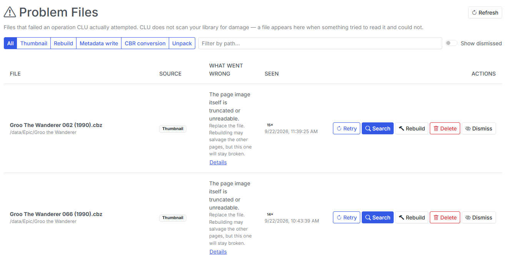
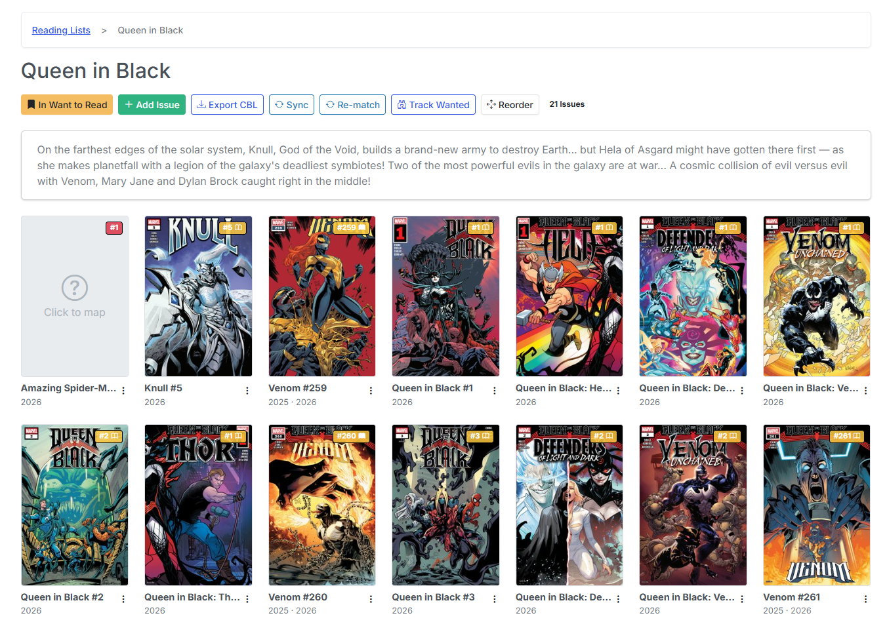
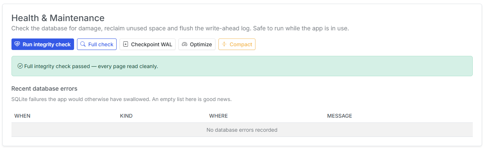
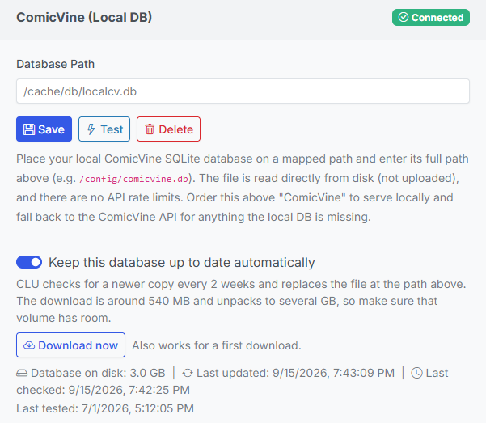
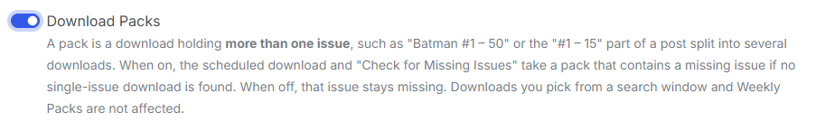

Most of v6.5 is infrastructure you're not supposed to think about. But three things in it are worth your attention, and they share a theme: **CLU now tells you when something is wrong, instead of failing quietly and hoping you don't notice.**

**Damaged comics get a page of their own.** **Reading lists maintain themselves.** **And the database can repair itself.**

Behind those, a long run of download-correctness fixes — including one that had CLU downloading the wrong comic under the right name.

<!-- more -->

### Problem Files

Before v6.5, a damaged comic produced a generic broken tile in your grid and a line in the app log. That was it. There was no list of what was broken, no explanation of *why*, and nothing you could click.

{: .center-image}

**Problem Files** is a new item in the gear menu — [Store Owner](https://clucomics.org/features/users/roles/) only, gated the same way Settings and Schedules are. Every row is a file CLU **actually tried to read and couldn't**, tagged with what it was doing at the time:

| Source | What was being attempted |
| --- | --- |
| **Thumbnail** | Generating the cover for the grid |
| **Rebuild** | A single-file or directory rebuild |
| **Metadata write** | Writing `ComicInfo.xml` back into the archive |
| **CBR conversion** | A CBR/RAR that wouldn't convert to CBZ |
| **Unpack** | An archive in your WATCH folder that wouldn't open |

The important thing to understand is what an **empty page** means. CLU does **not** scan your library looking for damage. A file appears here because something tried to read it and failed. So an empty page means *nothing has failed* — not *your library is clean*.

**Unpack** is the row type I'd draw your attention to. Its path is a **download**, not a library comic. The file never reached your library at all, which is exactly why nothing else would ever have told you about it. If you've ever had a download simply vanish, that's where it went.

Each row offers **Details** (the archive error in full), **Retry**, **Rebuild**, **Find a replacement**, **Dismiss**, **Delete** and **Remove**. A couple of the design decisions are worth explaining:

- **Rebuild is honest about its odds.** Repacking an archive fixes the container, not the contents. Its one genuine repair is a RAR wearing a `.cbz` name; a real CRC error aborts the extraction and no amount of rebuilding brings those pages back. So on most rows the page **demotes Rebuild and promotes Find a replacement**. That's a recommendation, not a limitation — Rebuild is still there.
- **Dismiss is keyed to the file, not the message.** A dismissal lifts by itself if the file is rewritten and still fails. It deliberately doesn't match on the error text, because a damaged archive raises a *different* error depending on which page happens to be read first.
- **An unwritable cache is not a damaged comic.** When the failure is CLU's own `/cache` rather than the archive, the page says so and **hides Delete entirely**. It's the one case where the fix is a permissions change, and deleting a perfectly good comic would be exactly wrong.

### Replacing a damaged file

This is the feature inside the feature, and it's the reason Problem Files is more than a list.

CLU's normal import only files issues that are **missing**. A corrupt file is still a file — so downloading a clean copy the ordinary way would leave it sitting in your processed folder forever while the broken one stayed in your library.

**Find a replacement** opens the source search pre-filled from the filename, and **claims whatever you queue for that exact path**. When it lands, CLU verifies it, trashes the damaged copy, and moves the replacement into its place.

The guarantees matter more than the flow:

- **The replacement is checked before anything is destroyed.** It's CRC-checked end to end and must actually contain pages. A partly-readable original is worth more than a broken replacement, so **a failed verification is a no-op** — nothing moves.
- **The damaged file goes to the trash**, never straight to deletion, and a failed swap **puts it back**.
- **A CBR won't replace a CBZ** — but that's a *hold*, not a failure. It means the conversion pipeline hasn't reached the file yet, and the swap happens on a later pass. The reverse (a CBZ replacing a damaged CBR) is an upgrade and goes straight through.
- **You don't have to sit on the page.** The swap is also applied by the normal download sweep, so closing the tab strands nothing.

A failed swap **stops retrying**, deliberately. Retrying the same bad release nightly would produce the same bad file nightly — run **Find a replacement** again and pick a different one.

***

### Reading lists maintain themselves

Five separate changes landed here and they compound into one story: **an imported reading list stops being a snapshot and becomes something CLU maintains.**

{: .center-image}

**Sync now covers every source.** It existed before, but covered **GitHub CBLs only**. It now covers all four import sources — a GitHub CBL URL, a Metron reading list, a Metron story arc and a ComicVine story arc. In each case CLU asks the cheap question first and only rebuilds when the answer has moved.

That produces two very different-looking outcomes, so it's worth knowing both are normal: **nothing changed** is answered instantly, in the request, with no progress bar at all; **something changed** runs the rebuild in the background, and a large ComicVine arc genuinely takes minutes.

Arcs sync differently from lists, for a reason that isn't obvious: adding an issue to a story arc modifies the **issue**, not the arc, so an arc's own "last modified" date never moves. CLU compares the arc's *membership* instead — which is why arc syncs are a little slower.

{: .center-image}

And if you've been re-importing a list to update it: **stop, and use Sync**. Re-importing still makes a second list. That's exactly what Sync is for.

**Track Wanted** is new, and it's the one to be deliberate about. Turn it on for a list and every entry with **no matched file** becomes a wanted issue — it shows on the Wanted page under **From Reading Lists**, and the nightly sweep searches for it.

It's **off by default and opt-in per list**, because a 300-issue arc import must not silently start 300 nightly searches. It's also restricted to users who can manage the list, unlike Bookmark: bookmarking is personal data, but Track Wanted spends **bandwidth and disk**.

One rule there will look like a bug if you don't know why: **undated issues are searched**, which is the opposite of how the rest of the Wanted page behaves. A release-calendar entry with no date is an unscheduled solicitation. A reading list is back catalogue — a missing year means *already released*, not *skip*.

**And lists now keep pointing at the right file.** Three fixes:

- **Matches follow the file.** Rename a comic, move it, or convert it from CBR to CBZ and the list entry follows. This matters most for mappings you made **by hand** — Re-match deliberately skips those, because your answer beats the matcher's, which used to mean a hand-picked mapping broken by a rename could *never* heal itself.
- **Gaps fill the moment the file arrives.** When a download lands, CLU checks whether it closes a gap on any tracked list and maps it immediately. No waiting for the nightly re-match. This only ever *adds* a match — an arriving file can never un-map something you'd already mapped.
- **The right volume.** A list entry no longer maps to an issue of the same number from a different volume or year.

***

### The database can repair itself

This is the half of the release nobody wants to need, which is why it wants to exist *before* you need it.

{: .center-image}

**Start with the Storage field.** The Database tab now reports what kind of filesystem your database is actually sitting on, and this is the most important field on the page. A database on **CIFS/NFS/sshfs** is the single commonest cause of SQLite corruption — the file locking SQLite needs isn't reliably implemented there, it isn't a CLU bug, and nothing in CLU can fix it. Your *library* on a NAS is fine. `/config` is not.

**`overlay` means `/config` was never mounted at all**, and your database will be destroyed the next time the container is recreated. CLU raises an alert on both.

**Salvage** reads out everything still readable and builds a **clean copy**, and **never modifies your current database**. You see the result — method, integrity, rows lost, size, and a per-table before/after diff — and then decide whether to install it.

One number on that report deserves explaining. **Rows lost can come back as "unknown", and that's the honest answer.** The corrupt table is usually the exact table whose row count can't be read, so CLU reports it as unknown rather than quietly counting it as zero loss. A naive "0 rows lost" on a salvage would be dangerously wrong.

**And if CLU won't start at all**, there's an offline rescue script that runs via `docker exec` with nothing but Python's standard library. Everything else on the recovery page assumes a running app; that one doesn't.

Alongside the recovery half, the maintenance half: a **Health & Maintenance** card (integrity check, full check, checkpoint WAL, optimize, compact — all safe to run while the app is in use), and a **Recent database errors** list of SQLite failures the app would previously have swallowed silently. An empty table there is good news.

Three quieter database fixes worth naming:

- **A backup now holds exactly one file.** Backups used to include the `-wal`/`-shm` sidecars captured at slightly different instants — a combination that reads back as a *corrupt* database. Older archives are still restorable; CLU just ignores the sidecars.
- **Backup filenames step forward a second on collision**, so a manual backup and an automatic one taken in the same second no longer overwrite each other.
- **Shutdown is clean.** `docker stop` and `restart` now flush the write-ahead log before exiting. Every restart used to be an unclean shutdown as far as SQLite was concerned — and on a container that restarts nightly, that was happening nightly. It was a contributing cause of the corruption this release is about.

***

### Auto-Updates for the Local ComicVine DB

The comicvine_sqlite provider ("ComicVine (Local DB)") reads a SQLite dump from a path the user types into Settings. Until now that file was entirely the user's problem: find it, download it, remember to refresh it. A stale dump silently means missing issues and missing credits, and nothing in the UI said how old it was.

{: .center-image}

This lets a user opt in to having CLU keep their copy current, checking every 2 weeks, plus a Download now button that runs the same path on demand — which doubles as a first-run bootstrap for someone who has configured a path but has no file there yet.

!!! Note
    **Future Enhancement**: Currently, the user must still manually download the database dump from [Reddit](https://www.reddit.com/r/comicrackusers/comments/1q7rex8/here_it_is_an_offline_comicvine_tagger_for/) to a known location. In a future release, we plan to add the ability to download this directly from CLU.

***

### Downloading the right thing

This is the least glamorous section and possibly the most valuable. Four fixes, all answering the same complaint: *CLU downloaded the wrong comic, or the same comic twenty times.*

**The big one: listing pages.** A DDL *listing* page — a weekly update, a Top-10 roundup — holds many unrelated comics. CLU used to fetch the **first download link on the page** whatever it was aiming for. So a run of wanted issues could all quietly download the **same unrelated comic**, each one filed under the name of the issue it was supposed to be.

A download of the wrong comic **under the right name** is worse than no download, because nothing looks broken until you open it. CLU now takes the specific entry or nothing.

**Split posts** had the mirror-image problem: a post split into "#1–15", "#16–30", "#31–50" always yielded the first part regardless of which issue was wanted. The correct part is now picked per issue.

**A sweep can't run twice over the same scope.** If a scheduled run is in progress, **Run Now** and the next scheduled trigger stand down rather than starting a second copy that re-queues everything the first is still working through. **Check for Missing Issues is the exception** — that's an explicit request about one series, and making you wait out a multi-hour sweep would be worse than the single duplicate it can cost.

**A sweep queues at most 150 downloads.** That's a blast-radius limit, not a throughput limit: hitting it stops that run and the rest is picked up next time. Nothing is lost.

**A rate-limited host is stood down**, not asked again on every queued item. MEGA in particular used to produce dozens of identical "Too many requests" failures against a handful of files. A cooling host is moved to the **back** of the list rather than dropped, so it's still used when it's the only link a post offers.

And the whole sweep now reports into **Active Operations**. A run that can last hours used to be completely invisible unless you'd started it from a series page.

#### Download Packs

A new switch, on **Settings --> Download and API --> Search Variant Settings**. A **pack** is a download holding more than one issue — "Batman #1–50", or the "#1–15" part of a split post.

{: .center-image}

With it **on**, the scheduled download and Check for Missing Issues will take a pack containing a missing issue *if no single-issue download is found*. With it **off** — the default — that issue stays missing.

It ships off because a pack can be **tens of gigabytes fetched to satisfy one missing issue**. It doesn't affect downloads you pick yourself: the search window marks packs, so choosing one is always your call.

Two scoring fixes came with it. **Plurals now score like their singulars** — "Annuals", "TPBs", "Quarterlies", "Omnibuses", "Galleries" are matched by the corresponding keyword, so you don't need to add plural forms yourself. And **"+ Annuals" is an add-on, not a sub-series**: "Batman #1–50 + Annuals" is still a Batman #1–50 pack.

***

### Thumbnails actually update

If your covers went stale after editing a comic and never came back, that's fixed. Two specifics, because they're what people actually reported: **rebuilding a whole directory** left every cover stale while rebuilding one issue at a time worked; and on `PUID`/`PGID` installs, thumbnails written by an earlier root-fallback start could **never be overwritten at all**.

Every operation that rewrites a comic now refreshes its cover, and the grid additionally notices on its own when a comic is newer than its cached cover. **Existing stale thumbnails repair themselves as you browse** — there's no rescan to trigger.

Two related cleanups: **formats that can't be thumbnailed are now skipped permanently rather than retried**. PDFs (and CBR/RAR on the background scan) have no thumbnail reader and were being re-queued at **every restart**, which is why large libraries saw a thumbnail storm on boot. They're skipped once — and deliberately **not** recorded on Problem Files, because "a PDF has no thumbnail reader" is a fact about the format, not damage. macOS sidecar files (`._Foo.cbz`) are no longer queued as comics either.

A **genuinely** failed thumbnail is a different matter, and now shows up on Problem Files with the actual archive error instead of a silent broken tile.

***

### Security

**v6.5 fixes a path-confinement issue in the folder cover art endpoint** (GHSA-vhvw-93fg-whm8): a signed-in user could read files outside the libraries they had been granted. The user would need to have known the filesystem path of a file outside their granted libraries, which CLU wouldn't expose through any UI. The probability of this being exploited is extremely low. It was reported via our [security policy](https://github.com/allaboutduncan/clu-comics/security/policy) and we appreciate the submitter's responsible disclosure. The patch was released in less than 24-hrs.

If your install has users you don't fully trust, the relevant action is simply: **upgrade to v6.5.**

***

### Bug Fixes

- **A corrupt archive in WATCH is opened once, not forever.** A damaged `.zip` used to be re-extracted on **every five-minute sweep**, producing `Comic (19).cbz`-style duplicates in your processed folder and thousands of log lines. It now fails once, is recorded on Problem Files under *Unpack*, and is left alone.
- **Partial downloads are left alone.** An AirDC++ transfer still in progress (`.dctmp`) was being imported as a finished comic every 30 seconds — one report left **28 copies** of the same file. Orphan cleanup now refuses to delete anything that's still growing, and the **Clean Up Orphan Files** button got the same guard, so clicking it mid-download no longer kills the download. Another client's in-progress queue items are never reaped at all: a DC++ queue item can legitimately sit idle for hours waiting for a source.
- **A failed move leaves no copy behind.** If a move out of WATCH failed, the partial destination stayed put — and a full copy left behind gets re-imported under a new name on the next sweep. CLU now cleans up after a failed move.
- **No more CBR sitting beside its own CBZ.** On CIFS/SMB and Windows-backed WSL2 mounts, a conversion could write a perfectly good CBZ and *still* be reported as failed, leaving both files in place on **every** download. Existing stray pairs need cleaning up by hand.
- **A failed rebuild restores the comic where it found it**, instead of leaving it renamed to `.bak`/`.zip` beside a folder of loose pages. Failures are recorded on Problem Files.
- **Clear Completed clears everything.** It only ever cleared direct downloads, so AirDC++ and Usenet rows stayed on the page reading "Complete" — which is what made the button look broken. A download that finished but couldn't be *filed* clears as completed rather than failed: the download worked; what failed is CLU finding the file afterwards, commonly because the client is on another host.
- **The Pull List menu is back on the Source Wall.** It was missing from that page only.
- **Saving settings no longer signs you out**, and **ComicVine works again on the current Simyan release**.
- **The container talks while it starts.** First-run and large-library starts could sit silent for **two minutes**, which is indistinguishable from a container that never started. Ownership passes over `/cache` and `/config` are now timed and reported, and the startup database backup no longer delays startup.

***

### Notes for Upgraders

Nothing to migrate, and nothing turns itself on.

- **Problem Files starts empty, and that's correct.** It's a report of failures, not a scan. Files appear as operations hit them.
- **Track Wanted is off on every list.** Your existing reading lists don't start searching for anything until you turn it on, per list.
- **Download Packs is off.** Auto-download behaviour is unchanged unless you switch it on.
- **ComicVine local-DB auto-update is off.** A 540 MB download that unpacks to several GB must not start unannounced on upgrade. The **Download now** button isn't gated, though — and it now works as a *first* download, so bootstrapping a local ComicVine database no longer involves any manual steps.
- **Your old database backups still restore.** Backups taken before v6.5 included `-wal`/`-shm` sidecars; CLU now ignores them.
- **Check the Storage field on the Database tab once.** It takes ten seconds, and it's the one thing in this release that can save you from losing a database rather than repairing one.

That's v6.5 — CLU that shows you the comics it couldn't read, reading lists that keep themselves current, and a database that can be rescued instead of restored from last week. Feedback is welcome via Discord or GitHub.

Previous release: [v6.4 — Push Notifications, Folder Art Styles, Metron Tokens, & Credit Repair](https://clucomics.org/blog/2026/09/01/v64---push-notifications-folder-art-styles-metron-tokens--credit-repair/)
