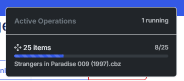
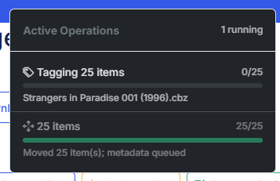

v6.7 is a smaller release with one headline and one theme. The headline: **recommendations can now run on a model you host yourself** — Ollama, LM Studio, LocalAI, or anything else that speaks the OpenAI API. No cloud account, no API key, nothing leaves your network.

The theme: **heavy file work now happens one job at a time, in order.** Dragging 70 files into a folder used to make the whole app crawl. It doesn't anymore.

Along the way: the reader finally hides its controls on a tablet turned sideways, All Books stops shuffling your volumes together, and ComicVine summaries stop showing raw HTML.

<!-- more -->
### Single Worker Queue

This one started with an issue I noticed and a previous request in Github. I was updating a directory and I moved 70+ files onto a folder and the app became sluggish.

The File Manager sent **one request per file**, and each request spun up its own thread to move the file, fetch metadata from Metron or ComicVine, rewrite the CBZ, and re-match the series' wanted list. Seventy threads fighting over one worker and one SQLite write lock is exactly as bad as it sounds. Worse, threads waiting on the Metron rate limiter reported no progress, so after five minutes the page announced "N of 70 moves failed" while the files were still being processed.

| {: .center-image }      | {: .center-image }                          |
| :---------: | :----------------------------------: |
| File Move Queue | File Update Progress |

v6.7 fixes that with a **one-worker FIFO job queue**. All the heavy file work now goes through it, one job at a time, in the order you submitted it:

- post-move tagging
- **Remove XML**
- **bulk metadata**
- **batch rename**

What you'll notice:

- **A drag-and-drop move is one request.** Everything moves at once, each series is reconciled **once**, and a single "Tagging N items" job is queued. The destination fills within seconds; the tagging counts up behind it.
- **A waiting job says so.** The operations indicator, the bulk metadata progress modal, and the rename dialogs show **Queued** (with how many jobs are ahead) instead of "Started!" or a false failure.
- **A queued job is never marked stalled.** The stale-operation sweep only touches jobs that are actually running.
- **Remove XML skips instead of failing.** A file with no ComicInfo.xml counts as skipped, and one bad file no longer ends the run.
- **The operations indicator scrolls** and escapes file names, which were previously inserted as raw HTML.

The trade-off, stated plainly: **a batch rename submitted behind a long tagging batch now waits for it.** The ordering is deliberate. A rename running beside a queued tagging job would move a path out from under it. Renaming a single directory (`/rename-directory`) still runs immediately and is not queued.

***

### Recommendations on Your Own Hardware

Settings → Recommendation Service has a new provider: **Local / OpenAI-compatible**.

- **Base URL** — a new field, shown only for Local. Point it at your Ollama or LM Studio server.
- **API key is optional** for Local. Local servers generally don't want one.
- **Model is now free text** for every provider, with suggestions per provider. Any model you've pulled locally, or any newer hosted model, can be typed in.

If you run CLU in Docker, you can leave the fields blank and set the environment instead. Blank Base URL and Model fall back to `OPENAI_BASE_URL` and `OPENAI_MODEL`:

```yaml
OPENAI_BASE_URL: "http://host.docker.internal:11434/v1"
OPENAI_MODEL: "mistral"
```

On a Linux host, `host.docker.internal` also needs `extra_hosts: ["host.docker.internal:host-gateway"]`. The field's help text says so, but it's the thing most likely to trip you up.

A few things I did to make small local models behave:

- **LM Studio rejects JSON mode**, so CLU retries without it when a server refuses `response_format`.
- **The response parser is more forgiving.** It now finds a list wrapped in chatty prose, and it handles untagged code fences, which were never parsed before. That was a bug on every provider, not just local ones.
- **Local requests time out at 110 seconds**, just under the 120-second worker timeout, so a slow model gives you an error instead of a dead request.

!!! note "Security"
    The Base URL is read only from saved, owner-only settings. It is never taken from the request body of `/api/recommendations`, which non-owners can call. Otherwise anyone able to ask for recommendations could point your server at an address of their choosing.

***

### Reader: Tap to Hide, Everywhere

Tapping or clicking the page in the reader now hides and shows the header and footer at **every screen size and orientation**.

It only worked up to 1024px wide before. A tablet turned to landscape is 1180–1366px wide, so rotating it brought the controls back and tapping stopped hiding them. The reader is shared by the collection, metadata browser, reading list view, and source wall, so all four get the fix.

Two details:

- **On desktop the controls now overlay the page** at the top and bottom edges instead of sitting beside it. They still show when the reader opens, and one click hides them. Zoom and double-click are unchanged.
- **The footer no longer slides under the mobile toolbar** after a rotation. The reader now sizes itself with `100dvh`, which excludes the browser chrome.

***

### All Books Keeps Volumes Together

All Books used to sort by series, then cover year, then issue number. Two volumes of the same series overlap in cover years, so they interleaved:

```
v1998/Captain America 048 (2001).cbz
v2002/Captain America 001 (2002).cbz
v2002/Captain America 007 (2003).cbz
v1998/Captain America 049 (2002).cbz   <- out of place
```

The order is now series → **parent folder** → issue number, with year as a tiebreaker. Each volume's folder stays together, and series still sorts first, so the A–Z letter bar matches. No database change.

One limit: two volumes kept loose in the *same* folder still sort by issue number within it.

***

### Bug Fixes

- **ComicVine summaries no longer contain raw HTML.** Descriptions come back from ComicVine as HTML, and CLU copied them straight into the `<Summary>` field, so the CBZ Info modal showed things like `<p>Katchoo's ongoing dislike of alarm-clocks continues ... <br />`. CLU now converts paragraphs and line breaks to real line breaks, decodes entities, collapses blank runs, and drops ComicVine's "List of covers and their creators" tables. This applies to both the online API and the local database.
- **The move, rename, and thumbnail pollers use a lighter endpoint.** They previously read `/api/operations`, which clears the header's pending notifications, so toasts could go missing.
- **Rename and replace use toasts instead of `alert()` dialogs.**

***

### Notes for Upgraders

Nothing to migrate, and nothing turns itself on.

- **Already-tagged files keep their HTML.** The ComicVine fix applies when a file is tagged. Existing summaries change only when you re-tag or edit them.
- **AniList summaries are unchanged.** They are also HTML and still go into `Summary` as-is. That's a known gap, not an oversight.
- **Local recommendations are opt-in.** Your current provider and key are untouched.
- **Big jobs queue now.** If you start a bulk metadata run and then a batch rename, the rename waits its turn. That's intended.

That's v6.7 — recommendations that can stay on your own hardware, a work queue that keeps big moves from swamping the app, and a handful of small things that stop getting in your way. Feedback is welcome via Discord or GitHub.

Previous release: [v6.5 — Problem Files, Self-Maintaining Reading Lists, & Database Recovery](https://clucomics.org/blog/2026/09/22/v65---problem-files-self-maintaining-reading-lists--database-recovery/)
