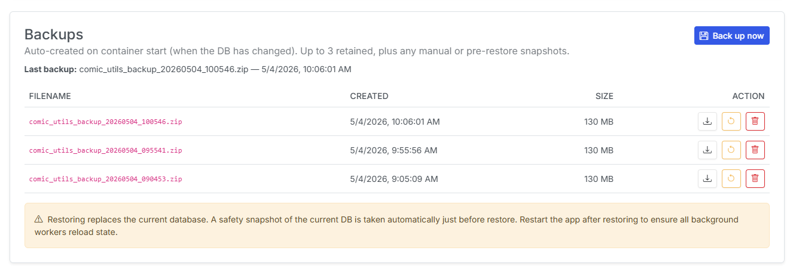

# Database

!!! info "New in v6.0"
    The **Database** tab is new in **v6.0**.

The **Database** tab shows the health of CLU's SQLite database and lets you manage backups. Find it on the Settings page (gear <i class="bi bi-gear-fill"></i> menu → **Settings → Database**).

## Current Database

{: .center-image}

The top section reports the SQLite file size and per-table row counts, alongside an **integrity** badge:

- **Healthy** <i class="bi bi-check-circle-fill text-success"></i> — the database passed its integrity check.
- **Corrupted — restore recommended** <i class="bi bi-x-circle-fill text-danger"></i> — the check failed. Restore a healthy backup below, then restart the app.

| Field | Description |
| --- | --- |
| **Path** | The database file location on disk. |
| **DB size** | Size of the main database file. |
| **WAL / SHM** | Size of the write-ahead log and shared-memory files. |
| **Tables** | Number of tables in the database. |
| **Total rows** | Total rows across all tables. |

A per-table breakdown (**Table** / **Rows**) is listed below the summary.

## Backups

Backups are **auto-created on container start** whenever the database has changed. Up to **3** automatic backups are retained, plus any manual snapshots you take and any pre-restore safety snapshots.

- **Last backup** shows when the most recent backup was taken.
- **Back up now** creates a manual snapshot immediately.

Each backup row (**Filename / Created / Size**) has actions:

| Action | What it does |
| --- | --- |
| <i class="bi bi-download"></i> **Download** | Download the backup file to your computer. |
| <i class="bi bi-arrow-counterclockwise"></i> **Restore** | Replace the current database with this backup. |
| <i class="bi bi-trash"></i> **Delete** | Permanently remove this backup (cannot be undone). |

!!! warning "Restoring replaces your current database"
    Restoring replaces the live database with the selected backup. CLU automatically takes a **safety snapshot** of the current database just before restoring, so you can roll back. **Restart the app after restoring** so all background workers reload their state.
