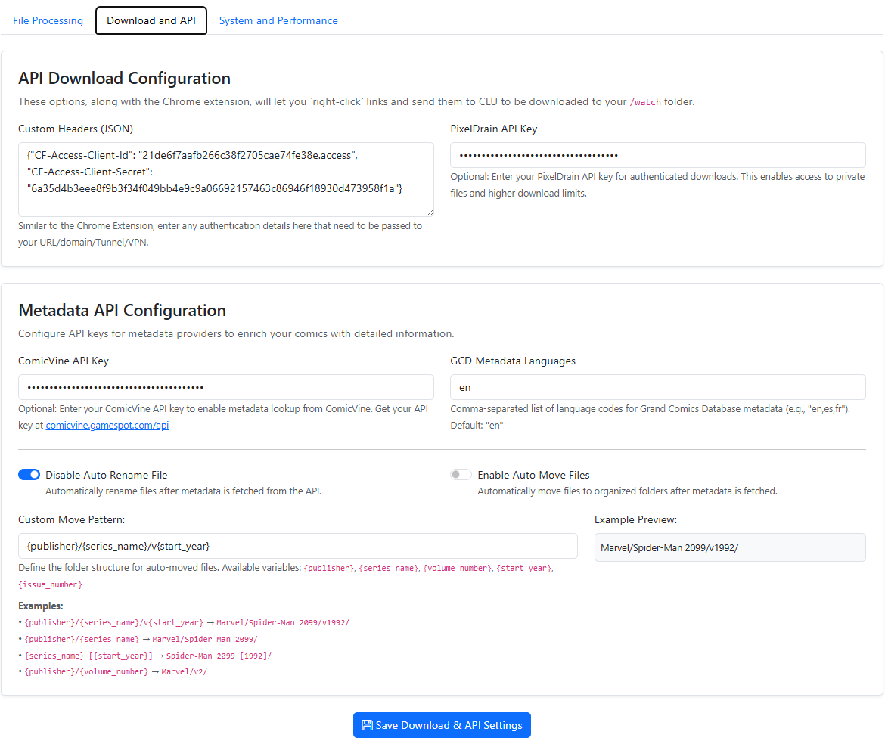

# Download Settings

{: .center-image}

### API Download Configuration <a href="#api-configuration" id="api-configuration"></a>

#### Custom Headers for Auth

Depending on your authentication/VPN/etc to protect your site, this setting will allow you to pass custom auth variables or anything else in the header. Simply enter the content you need to pass as JSON.&#x20;

The example provided shows you how to pass Client ID and Client Secret to authenticate to your site.

```json
{
    "CF-Access-Client-Id":"you-client-id",
    "CF-Access-Client-Secret":"your-secret"
}
```

#### PixelDrain API Key

For the [File Downloads](../../features/file-downloads/index.md) feature, you can bypass daily limits by entering your API key in this field.

### Metadata API Configuration

Various settings for calling metadata services and APIs are configured in this section.

#### Comicvine API Key

Enter your Comicvine API key here to allow the app to call the Comicvine API for metadata.

#### GCD Metadata Languages

Enter a comma-separated list of languages to search for metadata on. This is used by the app to search for metadata on comics in the GCD database. Defualts to `en`. 

#### Auto File Renaming

If this is enabled, anytime metadata from **Comicvine** is downloaded, the app will use the rename pattern to rename the file.

#### Auto Move Files

If this is enabled, anytime metadata from **Comicvine** is downloaded, the app will use the move pattern to move the file to the target directory.

#### Custom Move Pattern

Much like the custom rename pattern, this allows you to define a custom move pattern for your files. When enabled, anytime metadata from **Comicvine** is downloaded, the app will use this pattern to move the file to the target directory.

{: .center-image}

!!! info "To Do: Add GCD Support"
    Future versions will support auto renaming/moving files based on metadata from the GCD database.