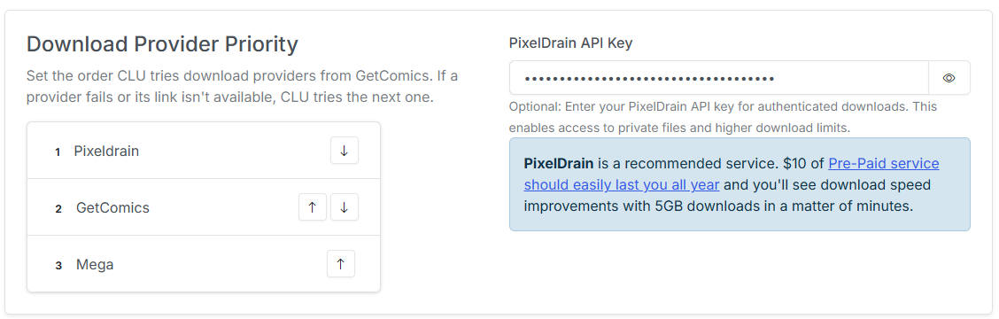

# Download and API Settings

The settings on this page are related to downloading files and connecting to various APIs for information OTHER than metadata. That is covered in the [Metadata Providers](metadata.md) page.

### API Download Configuration <a href="#api-configuration" id="api-configuration"></a>

{: .center-image}

Depending on your authentication/VPN/etc to protect your site, this setting will allow you to pass custom auth variables or anything else in the header. Simply enter the content you need to pass as JSON. These options, along with the Chrome extension, will let you `click` links and send them to CLU to be downloaded to your `/watch` folder.

The example provided shows you how to pass Client ID and Client Secret to authenticate to your site.

```json
{
    "CF-Access-Client-Id":"you-client-id",
    "CF-Access-Client-Secret":"your-secret"
}
```

## Download Provider Priority

{: .center-image}

This section allows you to set the priority of the download providers. This is used by the app to determine the order in which to try the download providers when downloading files.

Use the up and down arrows to move the download providers up and down in the list. The higher the provider is in the list, the higher the priority it has. If one provider fails, the download will be retried with the next provider in the list.

### PixelDrain API Key

For the [File Downloads](../../features/file-downloads/index.md) feature, you can bypass daily limits by entering your API key in this field. 

!!! Recommended Provider
    PixelDrain is a recommended service. $10 of [Pre-Paid service](https://pixeldrain.com/home#) should easily last you all year and you'll see download speed improvements with 5GB downloads in a matter of minutes.

## Komga Reading Sync

{: .center-image}

This section allows you to import your reading progress from Komga. Once imported, your reading history will be available in all [Library Insights](../../features/insights/index.md) sections. This will allow you to see your reading progress in the context of your entire collection.

Additionally, books you have started in Komga will marked as "In Progress" in CLU and when opened, will resume reading from where you left off in Komga.

### Server, Username and Password

These fields are used to connect to your Komga server. The URL should be the base URL of your Komga server. The username and password are the credentials for your Komga server. 

### Library Path Mapping

In order to correctly map your reading progress, CLU needs to know where your files are located on your Komga server. For each libray you have configured in CLU, simply enter the path to the files on your Komga server. When imported, files will be matched based on the relative path from the library path you provide here.

### Sync Schedule

This section allows you to setup a continual sync between CLU and Komga. This is a one way sync from Komga to CLU. It will not update Komga with any changes made in CLU.

**Frequency:** This will enable the sync between CLU and Komga. This is disabled by default. You can select **Daily** or **Weekly** for the sync frequency.

**Sync Interval (hours):** Set the timing for syncing your reading progress from Komga. The interval is set in hours. 

#### Sync Status

This section will display the status of the sync between CLU and Komga. It will display the *Last Sync* timestamp, *Total Read Issues Synced* and *Total In Progress Issues Synced*.

#### Save, Test Connection and Sync Now

- **Save:** Saves the settings in this section.
- **Test Connection:** Tests the connection to your Komga server. If successful, it will display a *Connected* indicator.
- **Sync Now:** Triggers an immediate sync between CLU and Komga. You can trigger a one-time sync anytime you'd like by clicking this button.