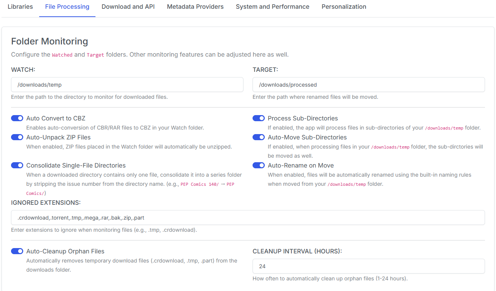
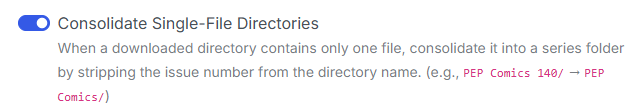
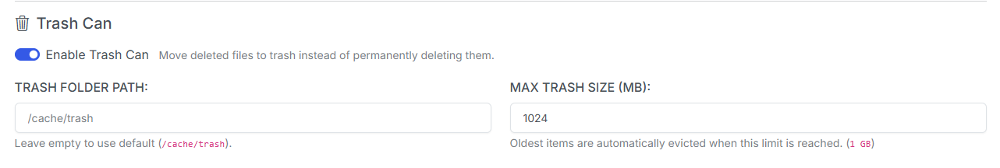
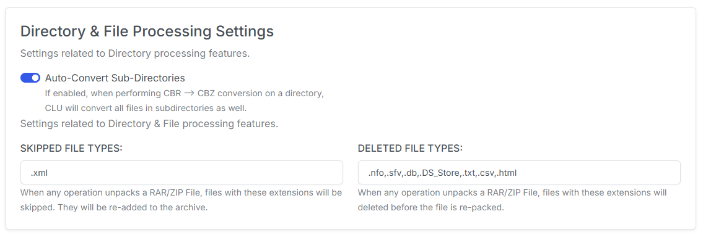
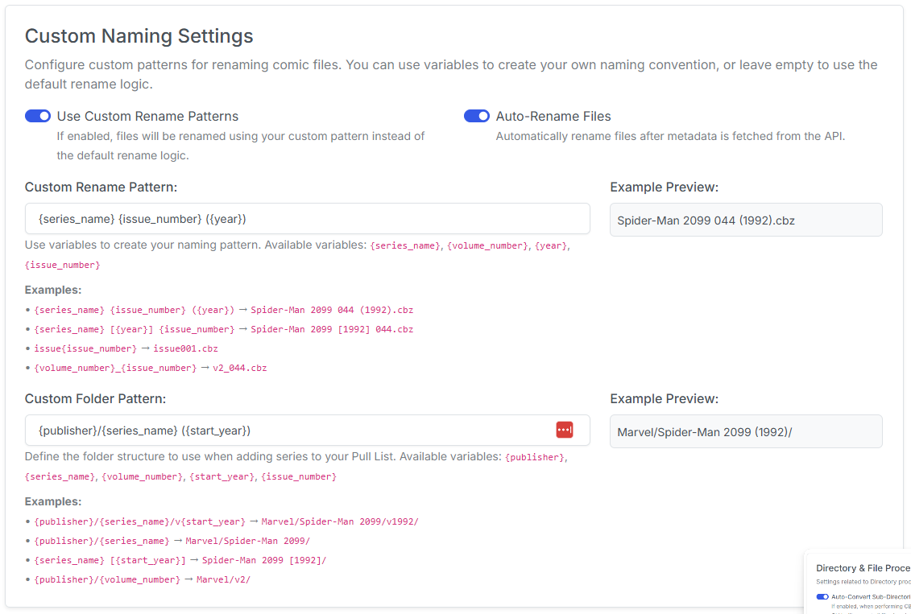

# File Processing Settings

All settings related to file moving, renaming and processing are updated in this section.

{: .center-image}

## Folder Monitoring

This is the most extensive set of features and will only be applicable if [folder-monitoring](../../features/folder-monitoring/index.md) is enabled. Most of these feature flags enhance the previous feature flag.

**WATCH:** The folder that will be monitored for files being added. This setting is dependent on the optional location mapped during [Quickstart](../../getting-started/quickstart.md).

**TARGET:** The folder where files will be after they are processed. This setting is dependent on the optional location mapped during [Quickstart](../../getting-started/quickstart.md).

**IGNORED EXTENSIONS:** File types listed here will be ignored by the file monitoring process. Many of these file types are `temp`file types and should be ignore. However, if you want to have others files in the WATCH folder and not have them processed with your enabled options - add those extenison types here.

**Auto-Convert to CBZ:** If enabled, when CBR files are downloaded, this will auto-convert them to CBZ

**Auto-Unpack ZIP Files:** If enabled, when ZIP files are added to your WATCH folder, this will automatically extract them. This does not create folders. It uses the structure within the ZIP file.&#x20;

For ZIP only, this specifically bypasses the IGNORED EXTENSIONS.

**Process Sub-Directories:** If enabled, this will perform monitoring functions on sub-directories within your WATCH folder. For example, if you have `/WATCH/archive01.zip` and it is auto-extracted to `/WATCH/archive`each file will be processed and moved to `/TARGET`.

**Autu-Move Sub-Directories:** If enabled, this will preserve any sub-directories in your `/WATCH` folder when they are moved to your `TARGET` folder. For example, if you have `/WATCH/archive01.zip` and it is auto-extracted to `/WATCH/archive`each file will be processed and moved to `/TARGET/archive`.

{: .center-image}

**Consolidate Single-File Directories:** If enabled, this will attempt to consolidate line-named single-file directories into a single folder when they are moved from **WATCH** to **TARGET**. This is handy for processing manually downloaded files from newsgroups. For example:
```
/PEP Comics 140/PEP Comics 140.cbz
/PEP Comics 141/PEP Comics 142.cbz
/PEP Comics 142/PEP Comics 142.cbz
```
Will all be place in a single directory:
```
/PEP Comics/
```

**Auto Rename on Move:** When enabled, files will be renamed using the default name cleansing patterns and your _Custom Name Pattern_ (if enabled) when files are moved from your WATCH to TARGET folder. This setting is enabeld by default. 

**Auto Cleanup Orphan Files:** If you are using the monitoring and [Chrome Extension](../../features/file-downloads/setup.md) for downloads, failed downloads will be removed at regular intervals.

**Cleanup Interval (hours):** Set the timing for removing orphaned files.

### Trash Can

{: .center-image}

When enabled, deleted files are moved to a trash folder instead of being permanently removed, so you can recover them.

**Enable Trash Can:** Move deleted files to trash instead of permanently deleting them.

**Trash Folder Path:** Where trashed files are stored. Leave empty to use the default (`/cache/trash`).

**Max Trash Size (MB):** When the trash exceeds this size, the oldest items are automatically evicted (range 100–100000 MB).

!!! info "New in v6.0"
    The Trash Can is new in **v6.0**.

!!! note "Missing Issue Configuration moved"
    The **IGNORED TERMS** and **IGNORED FILES** settings for the [Missing Issue Check](../../features/directory-features/missing.md) now live on the [System and Performance](system-settings.md#missing-issue-configuration) tab.

## Directory & File Processing Settings

{: .center-image}

**Enable Subdirectories for Conversion:** This specifically allows [Convert Directory](../../features/directory-features/convert.md) to traverse subdirectories and convert all CBR/RAR files to CBZ. This is not enabled by default - as running this on a high level folder AND a large collection could take quite a bit of time.

**SKIPPED TYPES:** Add a comma-separated list of extensions to skip while performing actions on files. When any operation unpacks a RAR/ZIP File, files with these extensions will be skipped. They will be re-added to the archive. Examples are `.xml`

**DELETED TYPES:** Add a comma-separated list of extensions to delete while performing actions on files. When any operation unpacks a RAR/ZIP File, files with these extensions will deleted before the file is re-packed. Examples are: `.nfo,.sfv,.db,.DS_Store`

{: .center-image}

**HIDDEN DIRECTORIES:** You can enter a comma-separated list of directory names to hide from all views (File Manager, Collection and Source Wall). Default configuration is: `@eaDir`

## Custom Naming Settings

{: .center-image}

Use the options below to customize the naming scheme for file and directory operations.

### Custom File Naming

Use a custom naming scheme for renaming issues when downloads are processed or files/directories are renamed in the UI

Enter your naming pattern using the syntax provided and see a real-time preview of the result.

### Issue Number Leading Zeros

{: .center-image}

The **Issue Number Leading Zeros** dropdown controls how issue numbers are padded when files are renamed.

| Setting | Example (issue 44) | Example (issue 3) |
| --- | --- | --- |
| **None** | `44` | `3` |
| **3** (default) | `044` | `003` |
| **4** | `0044` | `0003` |

The default is **3**.

!!! info "New in v6.0"
    This setting is new in **v6.0**. Decimal and alpha suffixes are **preserved at every width** — for example `44.MU` becomes `044.MU` at width 3, or `0044.MU` at width 4.

### Custom Folder Patterns

Similar to the custom file naming above, this allows you to customize the naming scheme for folders.

Currently, this is only used with the [Pull List](../../features/pull-list/index.md) feature to create folders for each series. This allows you to organize your files in a way that makes sense to you.

!!! info "Available Variables"
    - {publisher}
    - {series_name}
    - {volume_number}
    - {start_year}
    - {issue_number}

### Smart Rename

{: .center-image}

Smart Rename renames files using values from `series.json` and the issue number parsed from each filename, instead of regex-matching the whole name. It's run from the folder three-dots menu on the Files page.

**Preview Before Renaming:** Show a modal of planned renames and require *Apply* before any file is touched. Turn off to rename immediately on click.

**Recurse Into Subfolders:** Walk subdirectories and process each one that has its own `cvinfo` / `series.json`.

**Skip files containing:** A comma-separated, case-insensitive substring match against the filename (e.g. `Annual,Special`). Useful when Annuals/Specials share a folder with the main series — they have their own numbering and shouldn't be renamed onto the main slots. Leave blank to skip nothing.

### Filename Character Cleanup

Applied after pattern substitution to every rename (custom and default logic). The file extension is always preserved.

**Clean Spaces in Filenames:** Remove spaces, or replace them with a character of your choice (e.g. `Batman 001` → `Batman_001`).

**Clean Special Characters:** Remove or replace additional characters you list (treated literally, not as regex).

!!! warning "Always-removed characters"
    These filesystem-hostile characters are **always** removed, even when Clean Special Characters is off:
    `\ / : * ? " < > | & $ ;`. Use the cleanup field only to remove *additional* characters. Replacement text cannot contain Windows-reserved characters: `< > : " / \ | ? *`.