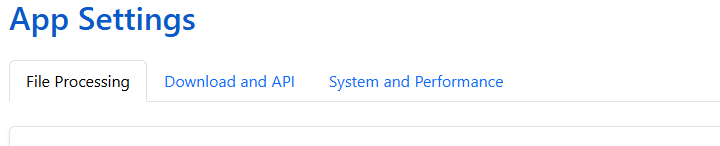

# Settings

## Config Settings

During installation or restart, some settings are set to default values and are persisted in the config volume

[Folder Monitoring](../../features/folder-monitoring/index.md), must be enabled/disabled during install or startup.

## App Settings

After installation, all other app options can be updated on the **Settings** page.

<figure></figure>

There are 6 sections in the app settings:

* **Libraries** - Add, Edit, Pause and Remove libraries
* **File Processing** - Settings related to file monitoring and renaming
* **Download and API** - Metadata providers configuration and download settings
* **System and Performance** - Timesone, performance logging and library scan settings
* **Styling** - Select any of the supported
* **Recommendations** - Enter an API key for ChatGPT, Google Gemini or Claude to get recommendations