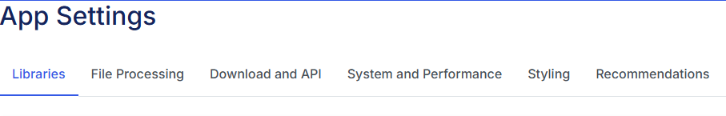

# Settings

## Config Settings

During installation or restart, some settings are set to default values and are persisted in the config volume

[Folder Monitoring](../../features/folder-monitoring/index.md), must be enabled/disabled during install or startup.

## App Settings

After installation, all other app options can be updated on the **Settings** page, reached from the **gear <i class="bi bi-gear-fill"></i> menu** in the top navigation.

<figure></figure>

The Settings page is organized into tabs:

* **Libraries** — Add, edit, pause, and remove [libraries](libraries.md)
* **File Processing** — [File monitoring, renaming, trash, and cleanup](file-settings.md) settings
* **Download and API** — [Download provider priority, search variants, the client API token, and Komga sync](download-settings.md)
* **Metadata Providers** — [Configure and prioritize metadata providers](metadata.md) per library
* **Download Clients** — [Usenet](../usenet/index.md) and [DC++](../dcpp/index.md) download clients, indexers, and [Source Priority](../usenet/source-priority.md)
* **System and Performance** — [Timeouts, timezone, cache, logging, and ComicInfo.xml cleanup](system-settings.md)
* **Database** — [Database stats, integrity, and backups](database.md)
* **Personalization** — [Site-default theme, dashboard layout, and recommendations](personalization.md)
* **Users** — [User accounts, roles, and library/folder grants](../users/managing-users.md) *(Store Owner only)*

!!! info "Schedules and Logs moved"
    Recurring jobs now live on their own [**Schedules**](schedules.md) page, and [**Logs**](logs.md) has its own page too. Both are reached from the same **gear <i class="bi bi-gear-fill"></i> menu**, alongside Settings.

!!! info "Settings is Store Owner only"
    In a multi-user install, every Settings tab requires the [Store Owner](../users/roles.md) role — including by direct URL. Readers and Clerks reach their own theme, dashboard layout, and API tokens from [My Account](../users/my-account.md) instead.
