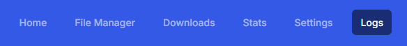

# Logs

{: .center-image }

Navigating to Logs will let you view log messages related to all app functions.

{: .center-image }

In the example above, we can see a few things:

* **App Status:** Startup up message and [folder-monitoring](/features/folder-monitoring/index "mention")enabled (yes/no)
* **Rename File: R**enaming to / from messaging
* **Single File Conversion:** Details of the file being converted and it's location
* **Error Messages:** While there are none displayed, error messages will show here as well

### Log Message Details

Most functions the app performs will have INFO level logging providing details of the processes being performed. These are helpful for debugging and understanding what the app is doing.

Most major app functions will have a start message like this:

```text
2025-12-12 10:26 - INFO - *****************// Single File Conversion //*****************
```

followed by the details of what is being converted, moved, renamed, etc.

### Folder Monitoring Logs

If you are using [folder monitoring](../features/folder-monitoring/index.md "Folder Monitoring"), you will see log messages related to the files being monitored.

### Debug Logging

Debug logging provides more detailed information about the app's internal state and can be helpful for debugging and understanding what the app is doing.

This can be enabled by visiting the [System Settings](system-settings.md#logging-debugging "System Settings") page and enabling the `Debug Logging` option.

This will show any log messages at the DEBUG level or higher.

```text
2025-12-12 10:29:50,293 - INFO - Debug logging enabled
2025-12-12 10:29:52,664 - DEBUG - 📁 Config file location: /config/config.ini
2025-12-12 10:29:52,666 - DEBUG - ✅ Config file loaded successfully (no migration needed)
2025-12-12 10:29:52,666 - DEBUG - Config file reloaded at: 
2025-12-12 10:30:11,349 - DEBUG - 📁 Config file location: /config/config.ini
2025-12-12 10:30:11,350 - DEBUG - ✅ Config file loaded successfully (no migration needed)
2025-12-12 10:30:11,352 - INFO - Debug logging disabled
```

### Console Logging

{: .center-image }

Additional details can be displayed in the console by updating the `docker-compose.yaml` file. Locate the following line:

```yaml
- FLASK_ENV=production
```

and update it to 

```yaml
- FLASK_ENV=development
```

Most pages will now display additional details in the Dev Tools console log as items load and actions are performed.