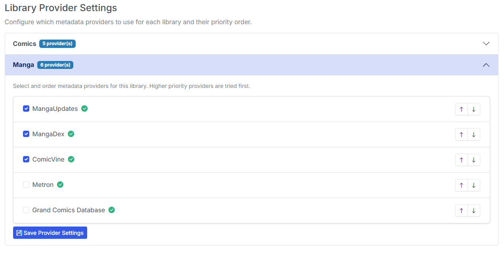

# Metadata Providers

{: .center-image}

Metadata provviders and credentials are now configured and stored in the database. This allows you to add, edit, test and remove metadata providers from this page.

## Configure MetaData Providers

For each section, enter the prompted credentials and click the **Save** button <i class="bi bi-floppy text-info"></i> to save the credentials. 

Once the credentials have been saved, you may click the **Test** button <i class="bi bi-lightning text-info"></i> to test the credentials.

If the test is successful, a green checkmark <i class="bi bi-check-circle-fill text-success"></i> will appear and say **Connected** in the provider header.

!!! info "API Keys"
    Existing API keys and credentials are still in settings (config.ini) and will be removed in a future release.

## Available Metadata Providers

Metadata providers and implementations status are listed below:

| Provider | Status | Description |
|----------|--------|-------------|
| [Metron](https://metron.cloud) | <i class="bi bi-check-circle-fill text-success"></i> | Metron Comic Book Database |
| [ComicVine](https://comicvine.gamespot.com/) | <i class="bi bi-check-circle-fill text-success"></i> | ComicVine Database |
| [GCD](https://www.comics.org/) | <i class="bi bi-info-circle-fill text-info"></i> | Grand Comics Database (requires [local setup](../gcd-settings/index.md)) |
| AniList | <i class="bi bi-info-circle-fill text-warning"></i> | AniList Database (FUTURE IMPLEMENTATION) |
| Bedetheque | <i class="bi bi-info-circle-fill text-warning"></i> | Bedetheque Database (FUTURE IMPLEMENTATION) |
| MangaUpdates | <i class="bi bi-info-circle-fill text-warning"></i> | MangaUpdates Database (FUTURE IMPLEMENTATION) |

## Assign Metadata Providers to Libraries

{: .center-image}

For each library, you can enable the metadata providers you want to use. Simply clcik the checkbox to enable the provider. Click the **Save Provider Settings** button <i class="bi bi-floppy text-info"></i> to save the changes.

You can assing priority and preference for each library and provider combination. Click the up <i class="bi bi-arrow-up text-dark"></i> and down <i class="bi bi-arrow-down text-dark"></i> arrows to change the priority and preference. 

When applying metadata to an issue or a folder, CLU will iterate through the providers in order of priority and preference and apply the metadata from the first provider that returns a result.