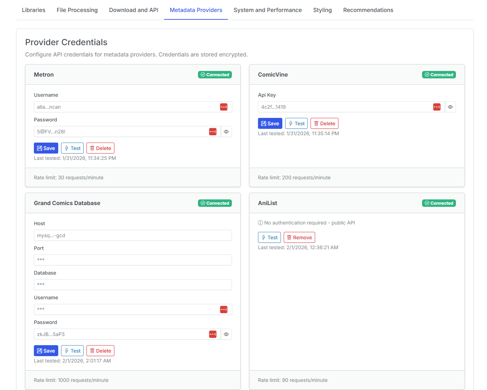
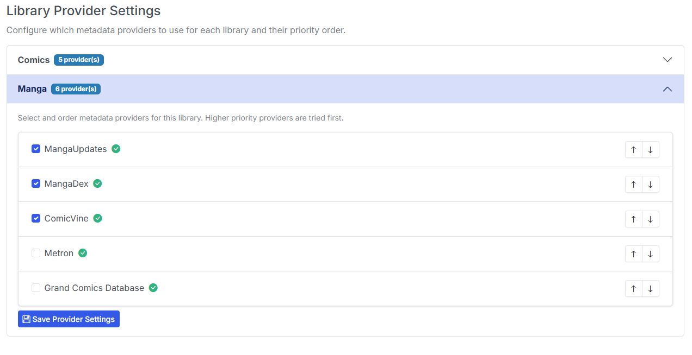

# Metadata Providers

{: .center-image}

Metadata provviders and credentials are now configured and stored in the database. This allows you to add, edit, test and remove metadata providers from this page.

## Configure MetaData Providers

For each section, enter the prompted credentials and click the **Save** button <i class="bi bi-floppy text-info"></i> to save the credentials. 

Once the credentials have been saved, you may click the **Test** button <i class="bi bi-lightning text-info"></i> to test the credentials.

If the test is successful, a green checkmark <i class="bi bi-check-circle-fill text-success"></i> will appear and say **Connected** in the provider header.

!!! info "API Keys"
    Existing API keys and credentials are still in settings (config.ini) and will be removed in a future release.

## Metron Authentication

!!! info "New in v6.4"
    Metron supports **API token** authentication alongside username and password, and CLU now **stops sending requests entirely** when Metron rejects your credentials.

### Choosing an auth method

The Metron card shows an **authentication method** picker with two options. Both are fully supported — the token is an addition, not a replacement.

| Method | What you enter |
| --- | --- |
| **Username & Password** | Your metron.cloud login. This is how CLU has always worked. |
| **API Token** *(new in v6.4)* | A token generated on your [metron.cloud](https://metron.cloud) account page. Sent as a bearer token. |

If both are stored, the **token takes precedence**.

Save the credentials with the **Save** button <i class="bi bi-floppy text-info"></i>. As of v6.4, **saving Metron credentials verifies them in the same request**, so you find out immediately whether they work. They're stored either way — refusing the save would strand you if Metron itself happened to be down.

### Rejected credentials lock Metron out

!!! warning "Why this exists"
    A user mistyped their Metron credentials and CLU kept sending requests until **fail2ban blocked their IP**, and a Metron admin asked for it to be reported.

    CLU couldn't tell a **401** apart from a normal miss, and the "is Metron configured?" check only tested whether the fields were non-empty. Meanwhile the call volume is large and repeating — the nightly [series sync](schedules.md#automatic-series-sync-schedule) makes one call per mapped series across your whole library, the [Weekly Releases](../pull-list/releases.md) publisher cache is re-warmed by a browser poll, and credit backfill, [automap](../pull-list/automap.md) and post-download auto-tagging all loop too.

    Metron's own [API best practices](https://metron-project.github.io/blog/api-best-practices) are explicit: *"Only retry on 429 and 5xx. Retrying 4xx errors (other than 429) wastes requests."*

Now, the moment Metron returns a **401** or **403**, CLU **latches a block on all Metron traffic**. Every subsequent call short-circuits without a network request, and no Metron client is handed out at all. The provider card shows the block with the reason Metron gave — for example, *"Metron rejected the credentials (HTTP 401). Invalid token."*

**The block does not time out.** A rejected credential doesn't heal on its own, so there's no automatic retry that would quietly resume hammering. Exactly three things clear it:

| Action | Clears the block |
| --- | --- |
| **Saving** your Metron credentials | Yes |
| **Test** <i class="bi bi-lightning text-info"></i> succeeding | Yes |
| The **Re-enable** button on the Metron card | Yes |
| Waiting | **No** |
| Restarting the container | **No** — the block is persisted, so a crash-looping container doesn't resume hammering. |

!!! tip "Test always gets through"
    **Test Connection** is the one path allowed past the block — otherwise you could never prove you'd fixed your credentials.

!!! note "Fixed alongside it"
    Story-arc pages built their own HTTP request and passed username/password unconditionally. On a token session both are empty, which strips the only credential and **401s every arc page**. Basic auth is now only sent when there's a real username/password pair.

    Five raw Metron calls that bypassed CLU's rate limiter entirely — one of them inside the *Sync All* loop — now take a rate-limit slot and respect the lockout like everything else.

## Available Metadata Providers

Metadata providers and implementations status are listed below:

| Provider | Status | Description |
|----------|--------|-------------|
| [Metron](https://metron.cloud) | <i class="bi bi-check-circle-fill text-success"></i> | Metron Comic Book Database |
| [ComicVine](https://comicvine.gamespot.com/) | <i class="bi bi-check-circle-fill text-success"></i> | ComicVine Database |
| ComicVine (Local DB) | <i class="bi bi-info-circle-fill text-info"></i> | Local ComicVine SQLite database (requires [local setup](../local-databases/comicvine.md)) |
| [GCD API](https://github.com/GrandComicsDatabase/gcd-django/wiki/API) | <i class="bi bi-check-circle-fill text-success"></i> | Grand Comics Database API |
| [GCD](https://www.comics.org/) | <i class="bi bi-info-circle-fill text-info"></i> | Grand Comics Database (requires [local setup](../local-databases/gcd.md)) |
| MangaDex | <i class="bi bi-check-circle-fill text-success"></i> | MangaDex Database |
| MangaUpdates | <i class="bi bi-check-circle-fill text-success"></i> | MangaUpdates Database
| Bedetheque | <i class="bi bi-info-circle-fill text-warning"></i> | Bedetheque Database (Future Implementation) | |

## Assign Metadata Providers to Libraries

{: .center-image}

For each library, you can enable the metadata providers you want to use. Simply clcik the checkbox to enable the provider. Click the **Save Provider Settings** button <i class="bi bi-floppy text-info"></i> to save the changes.

You can assing priority and preference for each library and provider combination. Click the up <i class="bi bi-arrow-up text-dark"></i> and down <i class="bi bi-arrow-down text-dark"></i> arrows to change the priority and preference. 

When applying metadata to an issue or a folder, CLU will iterate through the providers in order of priority and preference and apply the metadata from the first provider that returns a result.

!!! info "Metron credit roles"
    Metron's **Script** and **Plot** credit roles now map to **Writer**, so writers credited as "Script" (e.g. Jeff Lemire on *Black Hammer*) are no longer dropped from metadata.

!!! info "Editor credits — new in v6.4"
    Metron's editorial credits now land in `<Editor>`. Metron spells these roles out in full — *Editor*, *Executive Editor*, *Group Editor*, *Editor In Chief*, *Assistant Editor*, *Associate Editor* — and CLU was matching role names **exactly**, so it found one name out of four and dropped the rest silently.

    Editors are now matched on substring, the same way ComicVine already worked. Non-editorial titles Metron credits on the issue — President, Publisher, Chief Creative Officer, Designer — don't contain the word, which is what keeps them out.

    This applies to **newly tagged files** and to any file the [credit backfill](schedules.md#credit-backfill) repairs. Files that already carry credits but no `<Editor>` are not rewritten automatically — repairing those is a bulk re-tag with *overwrite existing*, not a backfill.

!!! info "Re-tagging preserves what the new provider doesn't supply — new in v6.4"
    Applying metadata used to rebuild `ComicInfo.xml` from scratch, destroying every tag the new provider didn't have. ComicVine carries no genre data at all, so re-tagging a GCD-sourced file through ComicVine **always lost its `Genre`**. Tags the new metadata omits are now carried forward.

    Several ComicVine credit defects were fixed in the same pass: ComicVine returns each creator's roles as a single comma-joined string (`"penciler, inker"`) and CLU matched the whole string first-match-wins, so **a creator landed in exactly one bucket and every other credit they held was discarded**. `editor`, bare `artist`, `painter`, `plot`, `finishes` and `translator` had no bucket at all — and bare `artist` is very common. `Web` is now mapped, and `Notes` records the issue id rather than only the volume id, so files round-trip with comicbox and ComicTagger.