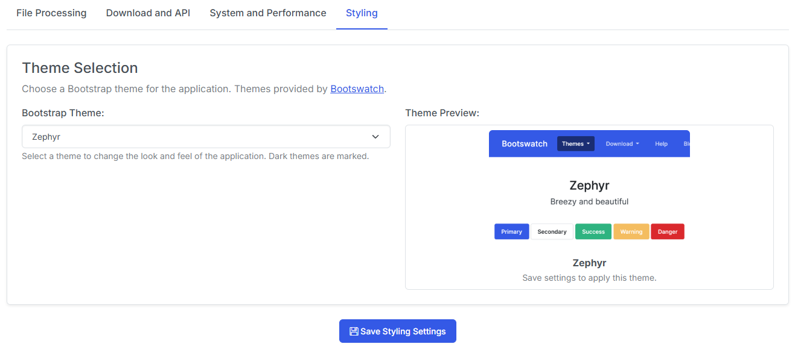

# Personalization

Update the layout of the homepage, change the theme, and enable recommendations from the Personalization page.

## Theme Selection

{: .center-image}

Simply select the theme from the dropdown and click Save. You'll see a preview image of the theme when selected.

!!! note
    The **Default** theme and the **Zephyr** theme are the only officially supported themes.

## Homepage Layout

{: .center-image}

### Ordering

Use the up <i class="bi bi-arrow-up"></i> and down <i class="bi bi-arrow-down"></i> arrows to reorder the sections on the homepage.

### Display

Check and uncheck sections you want to display on your homepage.

!!! Note
    For an explanation of each section, visit the [Collection](../collection/index.md#sections) page

## Recommendations

{: .center-image}

This setting let's you configure an AI-powered recommendation service for your reading list. Requires an API key from your preferred provider.

This feature takes your reading history and "Want to Read" list and uses it to generate personalized recommendations for you. Recommendations are manually triggerer, so you can manage how often they run and use them when you want to find something new to read.

### AI Provider

Select your preferred AI provider from the dropdown. Currently supported providers are:

- OpenAI (ChatGPT)
- Anthropic (Claude)
- Gemini (Google)

### API Key

Enter your API key for the selected provider.

### Model

Select the model you would like to use for recommendations.
