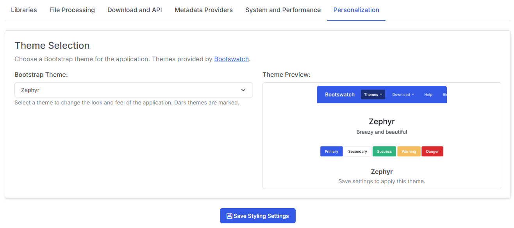
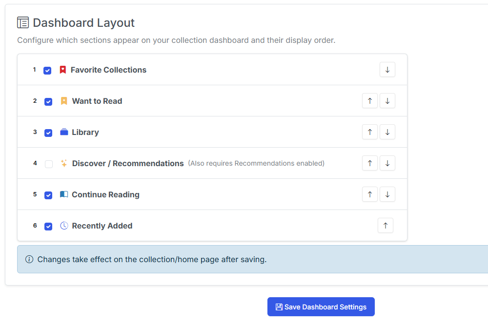
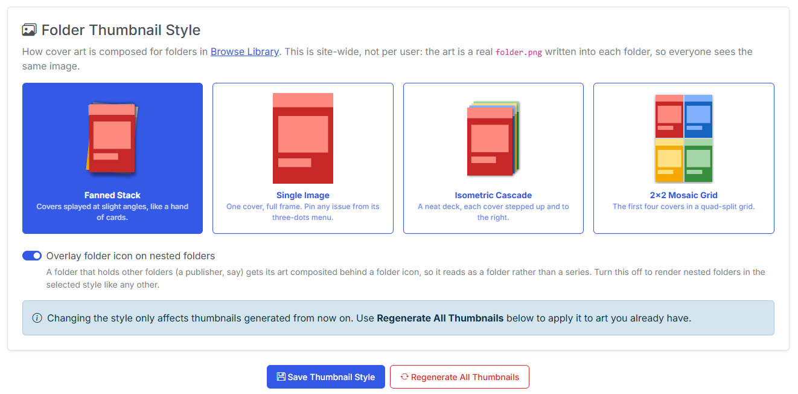
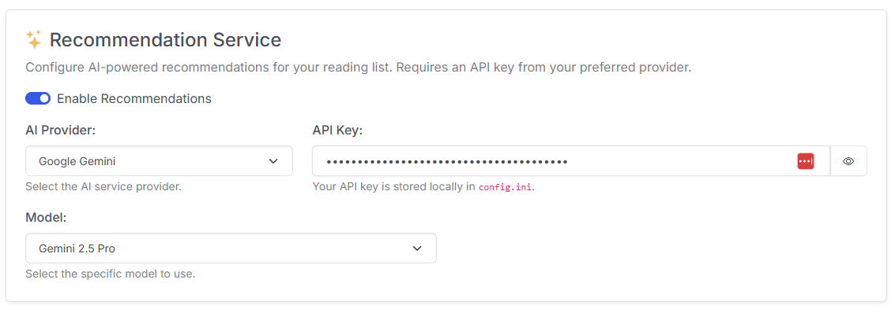

# Personalization

Set the **site defaults** for the homepage layout, theme and folder cover art, and configure the AI recommendation service, from the Personalization page.

!!! info "These are site defaults, not global settings"
    As of **v6.3**, the theme and dashboard layout you set here are the **default for anyone who hasn't chosen their own**. Any user can override both from [My Account](../users/my-account.md); an account with no override *follows* what you set here, and keeps following it when you change it.

    Only [Store Owners](../users/roles.md) can change the site defaults. Everyone — Readers included — can set their own.

## Theme Selection

{: .center-image}

Simply select the theme from the dropdown and click Save. You'll see a preview image of the theme when selected.

The theme you pick becomes the site default. Users who have set their own theme in [My Account](../users/my-account.md#appearance) are unaffected — they've opted out of the default.

!!! info "Saving a site default also clears your own override"
    If you had previously set a personal theme in My Account, saving a site default here **clears that override** so the new default is what you see. Without this, changing the site default would appear to do nothing on your own screen.

!!! note
    The **Default** theme and the **Zephyr** theme are the only officially supported themes.

!!! note "Fixed in v6.3"
    The **(Dark)** suffixes in the theme list are now derived from the actual dark-theme list rather than maintained by hand. *Quartz* was previously labelled `(Dark)` while rendering light.

## Homepage Layout

{: .center-image}

### Ordering

Use the up <i class="bi bi-arrow-up"></i> and down <i class="bi bi-arrow-down"></i> arrows to reorder the sections on the homepage.

### Display

Check and uncheck sections you want to display on your homepage.

As with the theme, this is the **site default** layout. Users who have arranged their own dashboard in [My Account](../users/my-account.md#dashboard-layout) keep their arrangement, and saving here clears your own override so the change is visible immediately.

!!! Note
    For an explanation of each section, visit the [Collection](../collection/index.md#sections) page

## Folder Thumbnail Style

!!! info "New in v6.4"
    Folder cover art now has **four styles**, plus a switch for the nested-folder icon overlay and a **Regenerate All Thumbnails** sweep.

{: .center-image}

<!-- TODO: screenshot — Personalization → Folder Thumbnail Style picker showing the four previews -->

Pick how CLU composes [folder cover art](../collection/index.md#folder-art). The picker shows a real preview of each style — the previews are generated by running the actual composers, so what you see is what you get.

| Style | Look |
| --- | --- |
| **Fanned Stack** *(default)* | Up to four covers fanned at random rotations. This is the v6.3 look, unchanged. |
| **Single Image** | One cover, full-bleed. |
| **Isometric Cascade** | 3–4 covers with no rotation, stepped 7px up-and-right, with a crisp shadow per layer. |
| **2x2 Mosaic Grid** | Quad-split into four tiles, 4px interior dividers, one unified outer shadow. |

The style is **site-wide**, not per user — folder art is written to disk as `folder.png` inside the folder itself, so there is only ever one copy of it to look at.

A folder with fewer than four covers degrades gracefully in every style rather than leaving gaps.

### Show the folder icon overlay

For folders that contain other folders, CLU can draw the composed art *inside* a folder icon so nested folders read differently from series at a glance. In v6.3 this was hardcoded; it's now **its own switch**, applied to whichever style you've selected.

### Regenerate All Thumbnails

Changing the style only affects art generated **from that point on**. To restyle art you already have, use **Regenerate All Thumbnails**.

There are two entry points:

| From | Scope |
| --- | --- |
| **Settings → Personalization** | Every library. |
| A top-level folder's <i class="bi bi-three-dots-vertical"></i> menu in the [collection grid](../collection/index.md) | That folder's contents. |

It runs on a background thread with live progress in **Active Operations**, so a large library doesn't hit the gateway timeout the way the old in-request Generate-All-Missing did.

!!! warning "This replaces existing folder art"
    Regeneration overwrites `folder.png` for every folder in scope — **including art you uploaded by hand**. It sits behind a confirmation modal for that reason. [Pinned covers](../collection/issues.md#set-as-folder-thumbnail) survive, because the pin is re-applied when the art is rebuilt.

!!! info "A sweep never touches the folder you ran it on"
    Running it on `/data/DC Comics` restyles every series **inside** it and leaves that publisher's own `folder.png` alone. A hand-picked publisher image is not what you're replacing when you restyle your series art. The all-libraries sweep excludes the library roots the same way.

!!! note "Fixed in v6.4"
    **Single Image** could produce a blank thumbnail — it took the first cover blindly, so one corrupt cache entry left an empty `folder.png` where every other style fell through to the next cover. Unreadable covers are now filtered out *before* the four-cover cap, so a bad file no longer eats a slot in the other styles either.

    **`folder.webp` is now recognized as folder art.** Two hardcoded extension lists omitted it, so an uploaded `.webp` survived a rebuild and kept winning — the new art was generated and then never displayed.

## Recommendations

{: .center-image}

!!! info "Recommendations stay global"
    Unlike the theme and dashboard layout, the recommendation service is **not** a per-user setting. It gates an owner-configured service holding a **shared API key**, so it is configured once for the whole install rather than per account. See [Per-User Data](../users/personal-data.md#still-shared).

This setting let's you configure an AI-powered recommendation service for your reading list. Requires an API key from your preferred provider.

This feature takes your reading history and "Want to Read" list and uses it to generate personalized recommendations for you. Recommendations are manually triggerer, so you can manage how often they run and use them when you want to find something new to read.

### AI Provider

Select your preferred AI provider from the dropdown. Currently supported providers are:

- OpenAI (ChatGPT)
- Anthropic (Claude)
- Gemini (Google)

### API Key

Enter your API key for the selected provider.

### Model

Select the model you would like to use for recommendations.
