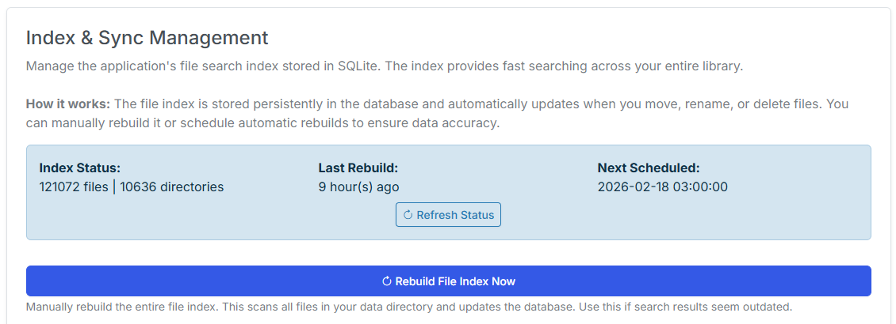
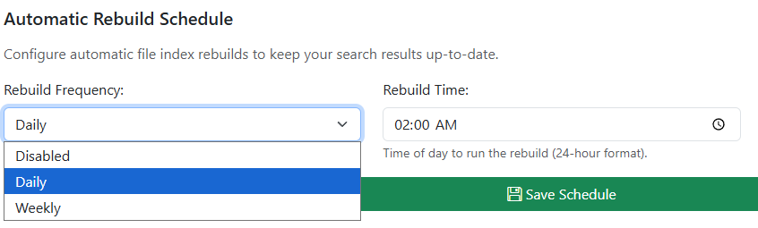
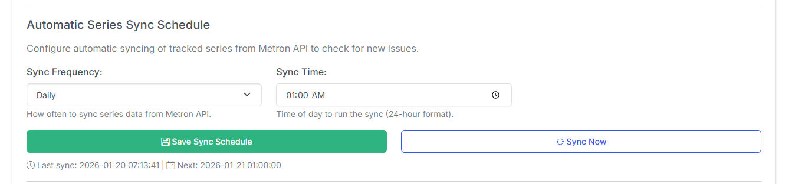
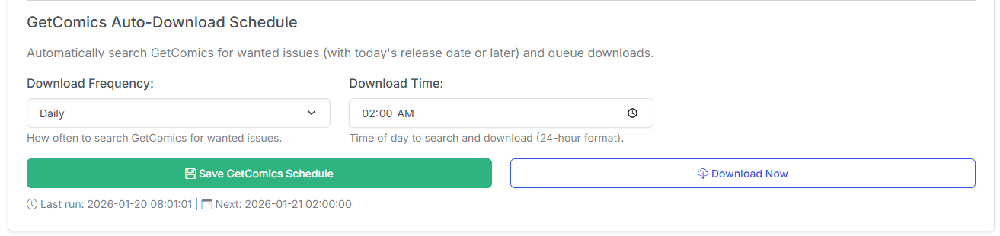

# Schedules

The **Schedules** page is where you configure CLU's recurring background jobs — file-index rebuilds, the GetComics scrape index, Metron series sync, GetComics auto-download, and reading-list sync.

Open it from the **gear <i class="bi bi-gear-fill"></i> menu** in the top navigation → **Schedules**.

!!! info "Times are local, stored as UTC"
    All schedule times are entered in **your local timezone** (set on the [Personalization](personalization.md) page) and stored internally as UTC. If your times look off, check that your timezone is set correctly.

!!! info "Moved in v6.0"
    Scheduling used to live on the System & Performance settings tab. In **v6.0** it has its own dedicated **Schedules** page, and a new **GetComics Scrape Index** schedule was added.

Every schedule works the same way:

| Control | Description |
| --- | --- |
| **Frequency** | `Disabled`, `Daily`, or `Weekly`. Disabled turns the job off. |
| **Time** | The time of day (your timezone) to run the job. |
| **Day of Week** | Only shown when frequency is **Weekly** — which day the job runs. |
| **Save** | Persists that schedule. Each schedule has its own Save button. |

## Index & Sync Management

This card manages CLU's SQLite **file search index** and the jobs that keep your library data current.

### Index Status

{: .center-image}

At the top you'll see the current **Index Status** (file and directory counts), the **Last Rebuild** time, and the **Next Scheduled** rebuild. Use **Refresh Status** to re-check.

!!! warning
    New files won't appear in search or the metadata browser until the index includes them. Either rebuild manually or set an automatic schedule.

### Rebuild File Index Now

Click **Rebuild File Index Now** to immediately scan your entire data directory and rebuild the index. Use this if search results seem outdated.

### Automatic Rebuild Schedule

{: .center-image}

Set how often CLU rebuilds the file index automatically (**Frequency** / **Time** / **Day of Week**), then **Save Schedule**. Default is **Disabled**.

### GetComics Scrape Index Schedule

The **scrape index** pre-populates a local cache of GetComics results — page titles, issue info, and download links — for your tracked series by scraping sitemap URLs. With it populated, wanted-issue searches can answer from the local cache instead of hitting GetComics live every time.

The status area shows how many **entries** are cached and the **next scheduled** run. Set the **Frequency** / **Time** / **Day of Week** and click **Save Scrape Index Schedule**.

<!-- TODO: screenshot — GetComics Scrape Index schedule card -->

!!! info "New in v6.0"
    The GetComics scrape index and its schedule are new in **v6.0**.

### Automatic Series Sync Schedule

{: .center-image}

Configures how often CLU syncs your tracked series from the **Metron API** to check for new issues and updated details. Set the schedule and **Save Sync Schedule**, or click **Sync Now** to run it immediately. The last sync and next run are shown below the buttons.

### GetComics Auto-Download Schedule

{: .center-image}

Configures how often CLU searches GetComics for **wanted issues** (with today's release date or later) and queues downloads. Set the schedule and **Save GetComics Schedule**, or click **Download Now** to run it immediately.

!!! note "Weekly Packs takes over"
    If [Weekly Packs](../pull-list/weekly.md) is enabled, individual-issue auto-download is disabled and this section is greyed out — a banner links you to **Manage Weekly Packs**. Disable Weekly Packs to re-enable per-issue auto-download here.

Downloaded files are moved to the [Series Folder](../pull-list/series.md) once processed, and metadata is added at that time if missing.

## Reading List Sync Schedule

{: .center-image}

Automatically syncs GitHub-sourced [reading lists](../collection/reading-lists.md) so CLU can detect upstream changes. Set the **Frequency** / **Time** / **Day of Week** and click **Save Reading List Sync Schedule**.

<!-- TODO: screenshot — Reading List Sync schedule card -->
