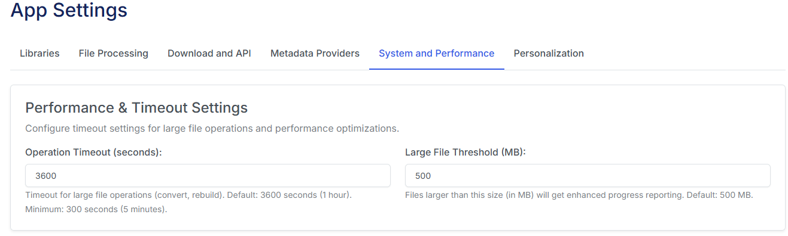
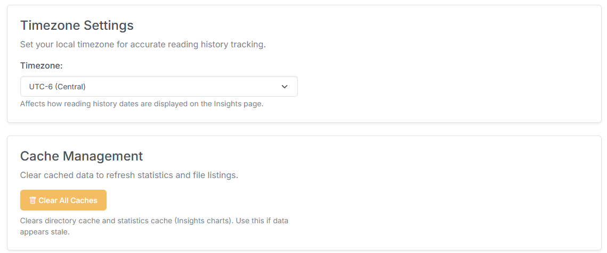
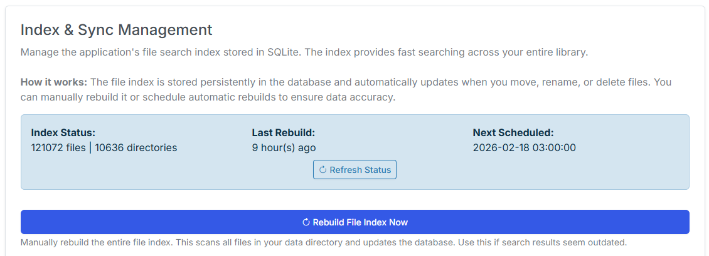
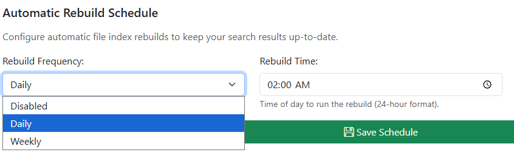
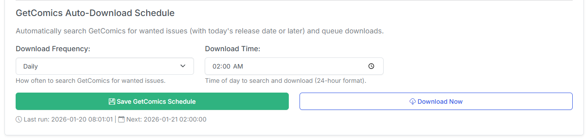

# System and Performance Settings

## Performance and Timeout Settings

Allows you to better manage large files depending on your system. Adjusting these values will enable/disable additional timing checks when processing large files (converting or rebuilding files). The default settings on average systems should easily handle converting a 2GB CBR file to CBZ.

## Timezone and Cache Management

### Timezone

Update to your timezone to show reading stats and other date/time related information in your timezone.

### Cache Management

Clears system cache and API to remove any cached data.

## Index & Sync Management

In v4, the **Cache Management** has been replaced with databased managed file indexing. This provides faster page loads and improved search performance. 

From this area in admin, you can manually trigger a file index rebuild and schedule daily or weekly rebuilds. You'll also see your current index status here.

### Automatic Rebuild Schedule

Timing for automatically rebuilding the file index. Default is disabled

You can set Daily or Weekly and specify the hour to rebuild the index. 

### Automatic Metron Sync Schedule

Timing for automatically syncing and updating your Pull List with the Metron API. This determines how often CLU checks the Metron API for new issues and updates your local Pull List. 

You can set Daily or Weekly and specify the hour to sync. 

### GetComics Auto-Download Schedule

Timing for attempting to download new, wanted and missing issues from GetComics.

You can set Daily or Weekly and specify the hour to download. When a file is downloaded, it will will be moved to the [Series Folder](../pull-list/series.md) once it is processed. Metadata will be added to the file at that time if it does not already have it.

!!! note
    Any files that are manually downloaded and placed in the the TARGET directory will be checked against your **Want List** and **Missing List** and processed accordingly.

### Logging & Debugging

If you are experiencing issues or odd behavior, enable this to add more detailed logging.

### ComicInfo.XML Updates

All of these features related to updating/cleaning the `ComicInfo.xml` file in archives. I would consider these experimental or beta features - in that they have been tested the least.

**Update Volume to First Issue Year:** If there is not a **volume year** in the `ComicInfo.xml` this will read the (YEAR) from the first issue in the folder and update the **volume year** for each file to match.

**Remove All Markdown Content:** When enabled, if there are _tables_, _bold text_, or _headers_ in the Comments field of the `ComicInfo.xml` file, they will be removed.

**Remove 'Covers & Creators' Table:** When enabled, if there is a _Covers & Creators table_ in the Comments field of the `ComicInfo.xml` file, it will be removed.

### Save & Restart

**SAVE:** Click the Save button to save any changes you have made to the app.

**RESTART APP:** Only require on the initial install and a quick way to force restart to reload the config/settings changes.
