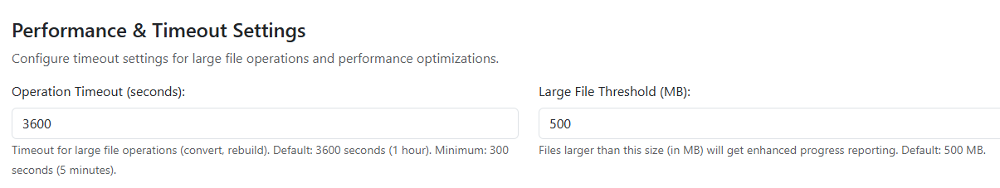
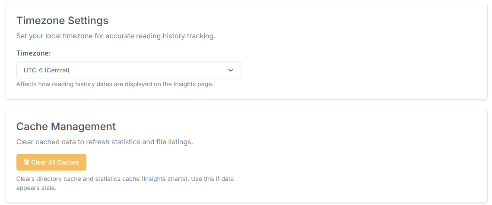
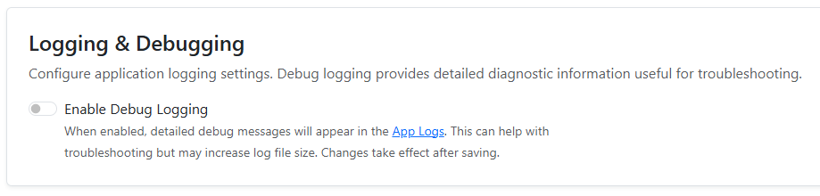
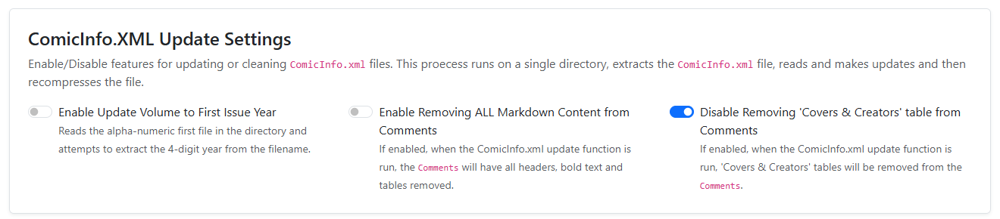

# System and Performance Settings

Settings related to system performance and operations are managed on the **System and Performance** tab.

!!! info "Scheduling moved to its own page"
    Index rebuilds, Metron sync, GetComics auto-download, and the other recurring jobs are no longer configured here — they're on the dedicated [**Schedules**](schedules.md) page (also in the gear <i class="bi bi-gear-fill"></i> menu).

## Performance & Timeout Settings

These help you manage large files depending on your system. The default settings on an average system will easily handle converting a 2GB CBR to CBZ.

| Setting | Description |
| --- | --- |
| **Operation Timeout (seconds)** | Timeout for large file operations (convert, rebuild). Default **3600** (1 hour). Minimum 300 (5 minutes), maximum 7200. |
| **Large File Threshold (MB)** | Files larger than this get enhanced progress reporting. Default **500 MB** (range 100–2000). |

## Timezone Settings

Set your local **Timezone** so reading history and other date/time information — including [Schedules](schedules.md) times and the [Insights](../insights/index.md) page — display and run correctly for you.

## Cache Management

Click **Clear All Caches** to clear the directory cache and the statistics cache (Insights charts). Use this if data appears stale after moving or editing files.

## Missing Issue Configuration

These two settings tune the [Missing Issue Check](../directory-features/missing.md). How much they matter depends on how heavily you use that feature and how your library is structured.

| Setting | Description |
| --- | --- |
| **IGNORED TERMS** | Comma-separated words/terms to ignore while scanning for missing issues. Update these and re-run the check to better parse your library. |
| **IGNORED FILES** | Comma-separated file names to ignore when checking for missing issues (e.g. `cover.jpg, cvinfo`). |

## Logging & Debugging

**Enable Debug Logging** adds detailed diagnostic messages to the [App Logs](logs.md). This helps with troubleshooting but increases log file size. Changes take effect after saving. See [Debug Logging](logs.md#debug-logging) for what the output looks like.

!!! tip
    When reporting a problem, enable debug logging, reproduce the issue, then use **[Download Debug Package](logs.md#download-debug-package)** on the Logs page to bundle everything up (with secrets redacted).

## ComicInfo.XML Update Settings

These features update/clean the `ComicInfo.xml` inside archives. The process runs on a single directory: it extracts the `ComicInfo.xml`, makes the updates below, and recompresses the file. Consider them experimental — they've been tested the least.

**Update Volume to First Issue Year:** When there's no volume year in the `ComicInfo.xml`, this reads the 4-digit year from the alphanumerically-first file in the folder and applies it as the volume year for each file.

**Remove ALL Markdown Content from Comments:** Removes headers, bold text, and tables from the `Comments` field of the `ComicInfo.xml`.

**Remove 'Covers & Creators' Table:** Removes a *Covers & Creators* table from the `Comments` field of the `ComicInfo.xml`.

## Save & Restart

**Save System & Performance Settings:** Saves any changes made on this tab.

**Restart App:** Only needed on the initial install and as a quick way to force a restart to reload config/settings changes. The Restart App button lives at the bottom of the [Personalization](personalization.md) tab.
