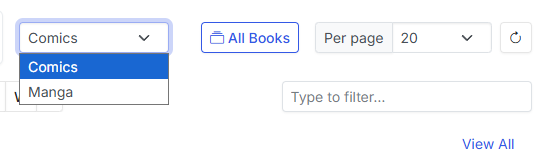

# Collection Homepage

| { width="300" }      | { width="300" }                          |
| :---------: | :----------------------------------: |
| Example Collection Landing Page with Favorites and Reading Lists | Example Collection Publisher Page with Nested Folders |

In version 4.0, CLU now uses a visual browser to navigate your collection. Generally this is grouped by publisher, but CLU will render any folder structure you have.

## Viewing Multiple Libraries

{: .center-image}

If you have multiple libraries, you can select which library you want to view from the dropdown menu in the top left of the collection page.

## Sections

Currently, there are up to 6 sections that can show on the collection page. They are:

### Publisher

This is the default section. It will display all publishers in your collection. This is the only section that is always available. As you click into a publisher, it will display all folders (series) or issues in that publisher. Publisher, Series and Issues will have different options in the dropdown menu. 

!!! Note
    In documentation, this will be referred to as the "Publisher" section, but it can be any folder structure you have in your collection.

With the introduction of multiple libraries, this section will update based on your selected library.

### Favorite Collections

This section will display all publishers that have been marked as a favorite. You can mark a publisher as a favorite by clicking the <i class="bi bi-bookmark-heart fs-2 text-icon"></i> icon in the top left of the publisher list.

### Want to Read List

This section will display all folders (series) or issues that have been bookmarked as "Want to Read". You can mark a folder or issue as "Want to Read" by clicking the <i class="bi bi-bookmark fs-2 text-icon"></i> icon in the top left of the publisher list.

### Continue Reading

{: .center-image}

This section will display issues that have been started but not completed. Clicking the <i class="bi bi-x-circle-fill text-danger"></i> icon will remove the issues from this section.

### Discover

This feature takes your reading history and "Want to Read" list and uses it to generate personalized recommendations for you. Recommendations are manually triggerer, so you can manage how often they run and use them when you want to find something new to read. You'll need to enter an API in [Recommendations](../app-settings/personalization.md#recommendations) to use this feature.

### Recently Added

This section shows the last 100 issues added to your collection.