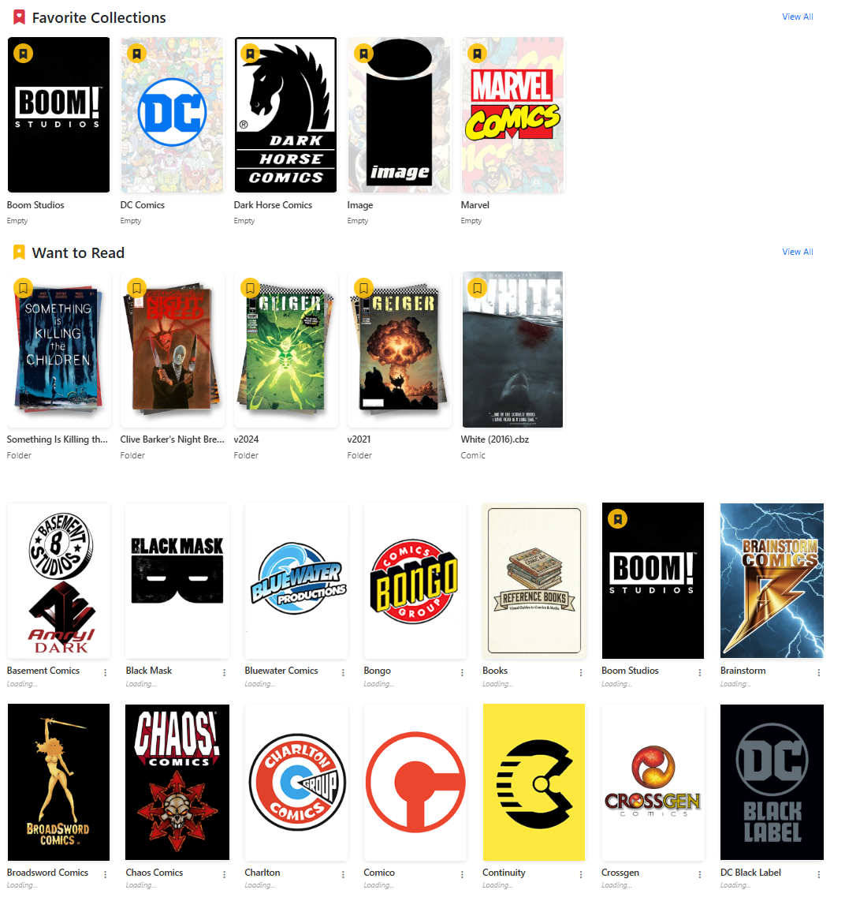
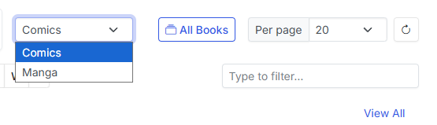
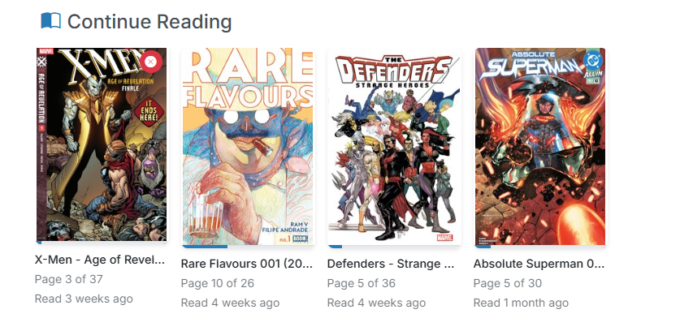
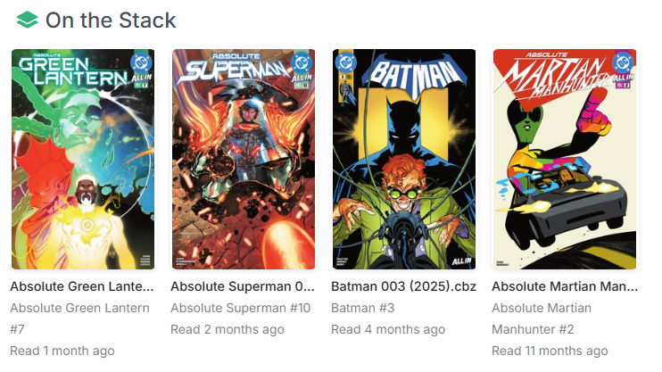

# Collection Homepage

| { width="300" }      | { width="300" }                          |
| :---------: | :----------------------------------: |
| Example Collection Landing Page with Favorites and Reading Lists | Example Collection Publisher Page with Nested Folders |

In version 4.0, CLU now uses a visual browser to navigate your collection. Generally this is grouped by publisher, but CLU will render any folder structure you have.

## Viewing Multiple Libraries

{: .center-image}

If you have multiple libraries, you can select which library you want to view from the dropdown menu in the top left of the collection page.

## Sections

Currently, there are up to 6 sections that can show on the collection page. They are:

!!! info "Your dashboard is yours"
    As of **v6.3**, the order of these sections and which ones are hidden is a **per-user** setting. Arrange your own from [My Account](../users/my-account.md#dashboard-layout); the Store Owner sets the [site default](../app-settings/personalization.md) that new accounts follow.

### Publisher

This is the default section. It will display all publishers in your collection. This is the only section that is always available. As you click into a publisher, it will display all folders (series) or issues in that publisher. Publisher, Series and Issues will have different options in the dropdown menu. 

!!! Note
    In documentation, this will be referred to as the "Publisher" section, but it can be any folder structure you have in your collection.

With the introduction of multiple libraries, this section will update based on your selected library.

!!! info "Per-page selection persists"
    Your **Per page** choice when browsing is now saved and restored across navigation instead of resetting on each load.

### Favorite Collections

This section will display all publishers that have been marked as a favorite. You can mark a publisher as a favorite by clicking the <i class="bi bi-bookmark-heart fs-2 text-icon"></i> icon in the top left of the publisher list.

### Want to Read List

This section has **two sources**:

- **Files and folders you flagged.** Mark a folder (series) or issue as "Want to Read" by clicking the <i class="bi bi-bookmark fs-2 text-icon"></i> icon in the top left of the publisher list, or from the **Want to Read** action in the folder dropdown (see [Additional Features](../file-management/additional.md)).
- **[Reading lists you've bookmarked](reading-lists.md#bookmarking-a-list).** *(New in v6.3.)* Each bookmarked list appears as a single card — cover stack, read/total count, and a progress bar — that opens the list.

### Continue Reading

{: .center-image}

This section will display issues that have been started but not completed. Clicking the <i class="bi bi-x-circle-fill text-danger"></i> icon will remove the issues from this section.

### Discover

This feature takes your reading history and "Want to Read" list and uses it to generate personalized recommendations for you. Recommendations are manually triggerer, so you can manage how often they run and use them when you want to find something new to read. You'll need to enter an API in [Recommendations](../app-settings/personalization.md#recommendations) to use this feature.

### On the Stack

{: .center-image}

The *On the Stack* section will alert you to new issues for series that you are reading, to ensure you are always caught up.

You have read `Absolute Batman 001` through `Absolute Batman 017` and are currently caught up.

When `Absolute Batman 018` is available, it will be shown in "On the Stack", letting you know it's available for you to read.

!!! Note

    We should only show the next unread issue. So if you have `Absolute Batman 019` and `Absolute Batman 018` is still unread, we should only show `Absolute Batman 018`

On the Stack draws from **two sources**:

- **Series in your [Pull List](../pull-list/pull-list.md).** If you don't want certain series to show here, there's an option to remove them on the [Series page](../pull-list/series.md).
- **[Bookmarked reading lists](reading-lists.md#on-the-stack).** *(New in v6.3.)* Each bookmarked list contributes its **next unread issue**, carrying a **list-name badge** so you can tell where it came from.

If a bookmarked list and a subscribed series point at the same next issue, it is shown **once**.

### Recently Added

This section shows the last 100 issues added to your collection.

## Browsing the grid

### The pager

!!! info "New in v6.3"
    The pagination control is **sticky**. It pins to the bottom of the viewport for as long as there's grid left to scroll, then lands inline at the true bottom of the page.

Previously the pager was rendered below the grid and nowhere else, so at **Per page** 100 or 250 reaching **Next** meant scrolling past every cover on the page — and the page then scrolled back to the top, so the next page cost the same trip again.

{: .center-image}

/// caption
The pager pinned to the bottom of the viewport over a full grid.
///

The pager also gained:

- **Windowed page numbers** with ellipsis, so long libraries don't produce an unusable row of numbers.
- A **"Showing X–Y of Z"** readout.
- A mirrored **Per page** selector, so you can change page size without scrolling back up.

The old **page-jump dropdown** has been removed — the windowed page numbers replace it.

!!! info "Multi-Select no longer blocks paging"
    The bulk action bar used to cover the pager and the last row of the grid, making paging impossible while Multi-Select was on. Both now clear it.

### Card size

!!! info "New in v6.3"
    A **Standard / Large** card size toggle in the filter bar.

{: .center-image}

Like **Per page**, this is saved **in your browser** rather than on your account — so it's per-device. Set it once on your desktop and once on your tablet, and each remembers its own.

The bump is deliberately modest (roughly 13–15% on desktop, up to 22% on tablets; phones are unchanged), because raising the floor further drops an entire column and the remaining cards absorb every freed pixel.

!!! info "Upgrading from an earlier version?"
    Comic filenames were previously **unreadable on all six dark themes** — a hardcoded light-text class was overriding the theme-aware rule on grid tiles, dashboard card titles, and the tile actions button. If you switched away from a dark theme because of it, it's fixed. See [My Account](../users/my-account.md#appearance) to set your own theme.

## Folder art

!!! info "New in v6.3"
    Folder cover art is now **generated automatically as you browse**.

Folder art previously appeared only if you uploaded it or ran **Generate Thumbnail** by hand, so new series sat behind a generic icon indefinitely.

Now, when the grid asks for art it can't draw, those folders are handed to a background queue that produces the art, and the page re-checks a few times so it appears within a few seconds — while you're still looking at the folder.

How the queue behaves:

| Behavior | Detail |
| --- | --- |
| **One worker at a time** | Generation opens comic archives, so it's deliberately serialized rather than run in parallel. |
| **In-flight paths deduped** | The same folder is never queued twice at once. |
| **6-hour backoff** | A folder that can't produce art isn't retried for six hours, so a broken folder doesn't get hammered every time you browse past it. |
| **Existing art is never replaced** | If a folder already has art — uploaded or generated — the queue leaves it alone. |

`folder.gif` is now recognized as folder art alongside `.png`, `.jpg`, and `.jpeg` — and as of **v6.4**, so is `folder.webp`. Two separate hardcoded extension lists had omitted it, so an uploaded `.webp` survived a rebuild and kept winning: the new art was generated and then never shown.

!!! info "New in v6.4 — pick how folder art looks"
    Generated folder art now has **four styles** — Fanned Stack (the default, unchanged), Single Image, Isometric Cascade and 2x2 Mosaic Grid — chosen site-wide on the [Personalization](../app-settings/personalization.md#folder-thumbnail-style) page, along with a switch for the nested-folder icon overlay.

    You can pin a specific issue's cover as a folder's primary art with **[Set as Folder Thumbnail](issues.md#set-as-folder-thumbnail)**, and apply a style change to art that already exists with **[Regenerate All Thumbnails](../app-settings/personalization.md#regenerate-all-thumbnails)**.

**Card art also renders at a consistent size** regardless of the source image's dimensions. Previously only some card types constrained the image, so identical art could appear at two different scales — a 200×300 file overflowed its frame and got centre-cropped while a 167×250 one sat inside it untouched.

!!! info "Upgrading from an earlier version?"
    Generated thumbnails used to **vanish on reload** until the next full library scan, because nothing updated the index flag after writing the art and the grid reads art off that flag rather than the disk. That's fixed — and the same fix repairs the manual **Generate Thumbnail** button.

You can turn automatic generation off entirely from [File Processing Settings](../app-settings/file-settings.md).

## Access in a multi-user install

!!! info "Readers see a simplified grid"
    In a [multi-user install](../users/index.md), **Readers** don't see the actions dropdown, Multi-Select, or the bulk action bar — those are [Clerk](../users/roles.md) features.

    What appears in the grid at all is governed by [library and folder grants](../users/library-and-folder-access.md), and **Recently Added** is filtered to the folders a user has been granted.
