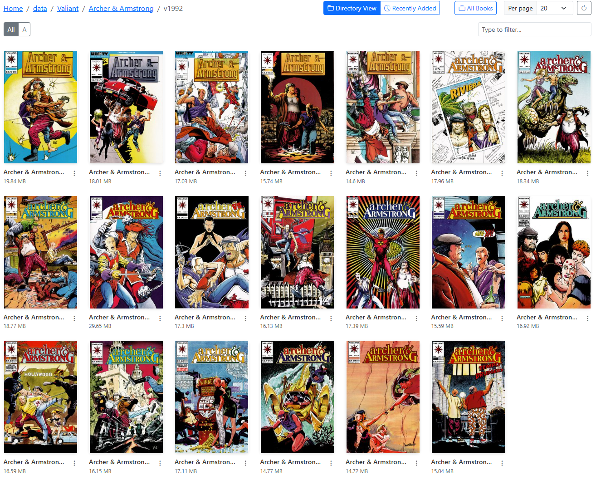

# Collection Browsing (Issues)

/// caption
Example Issues Page
///

When you navigate to a folder (series) with only files (issues), you will see a list of files (issues) in that folder.

To ensure you can quickly determine the issue number, the issue number will be displayed in the top right corner of the cover.

/// caption
Issue Number
///

## Issue Options
For issues, there are 6 options in the dropdown menu that can be accessed by clicking the <i class="bi bi-three-dots-vertical fs-2 text-icon"></i> menu.

/// caption
Example Issue Dropdown Menu
///

1. **Crop Cover**: This will crop the first image of the CBZ, saving the right-side as the new cover and the full image as the 2nd image. This is the same process as [Crop Cover](../single-file-features/crop.md).
2. **Remove First Image**: This will remove the first image from the issue. This is same feature as [Remove First Image](../single-file-features/remove.md). I recommend using this option after using "Edit File" as to ensure the incorrect image is truly the first image in the file.
3. **Edit File**: This unpacks the CBZ and allows you to edit the files. See a full list of features in the [Edit File](../single-file-features/edit.md) section.
4. **Rebuild**: This will quickly rebuild a incorrectly built CBZ file and/or convert a CBR to a CBZ file. This is the same feature as [Rebuild](../single-file-features/rebuild.md).
5. **Enhance**: This will enhance the image quality of all images in the issue. This is the same feature as [Enhance](../single-file-features/enhance.md).
6. **Delete**: This will delete the issue. This is the same feature as [Delete](../single-file-features/delete.md).