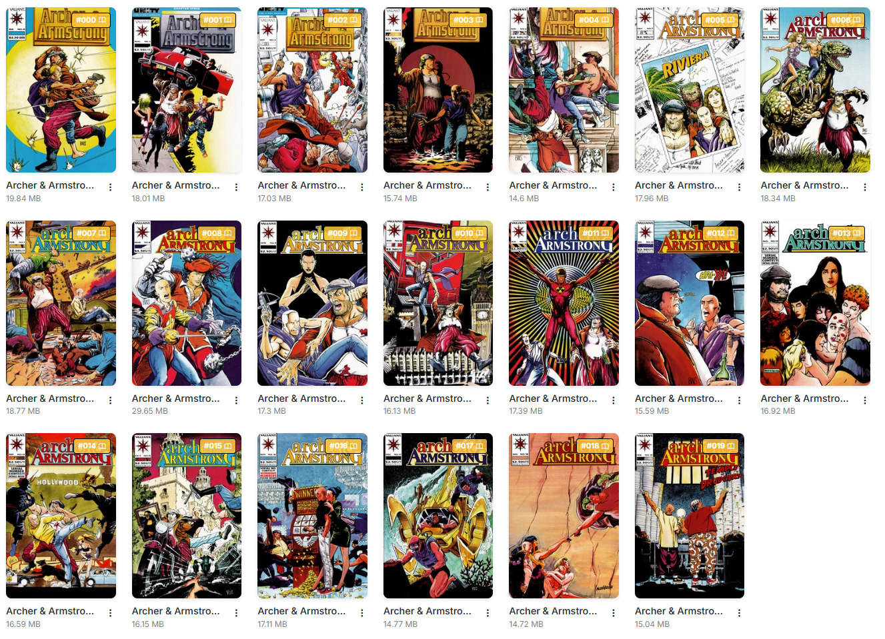
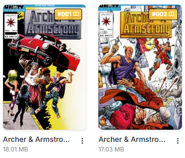
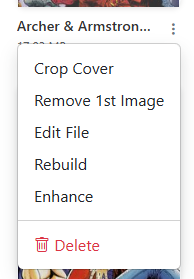

# Collection Browsing (Issues)

{: .center-image}
/// caption
Example Issues Page
///

When you navigate to a folder (series) with only files (issues), you will see a list of files (issues) in that folder.

To ensure you can quickly determine the issue number, the issue number will be displayed in the top right corner of the cover.

{: .center-image}
/// caption
Issue Number
///

## Issue Options
For issues, there are 7 options in the dropdown menu that can be accessed by clicking the <i class="bi bi-three-dots-vertical fs-2 text-icon"></i> menu.

{: .center-image}
/// caption
Example Issue Dropdown Menu
///

1. **Crop Cover**: This will crop the first image of the CBZ, saving the right-side as the new cover and the full image as the 2nd image. This is the same process as [Crop Cover](../single-file-features/crop.md).
2. **Remove First Image**: This will remove the first image from the issue. This is same feature as [Remove First Image](../single-file-features/remove.md). I recommend using this option after using "Edit File" as to ensure the incorrect image is truly the first image in the file.
3. **Edit File**: This unpacks the CBZ and allows you to edit the files. See a full list of features in the [Edit File](../single-file-features/edit.md) section.
4. **Rebuild**: This will quickly rebuild a incorrectly built CBZ file and/or convert a CBR to a CBZ file. This is the same feature as [Rebuild](../single-file-features/rebuild.md).
5. **Enhance**: This will enhance the image quality of all images in the issue. This is the same feature as [Enhance](../single-file-features/enhance.md).
6. **Set as Folder Thumbnail**: Pins this issue's cover as the folder's cover art. See [below](#set-as-folder-thumbnail).
7. **Delete**: This will delete the issue. This is the same feature as [Delete](../single-file-features/delete.md).

## Set as Folder Thumbnail

!!! info "New in v6.4"
    You can pin any issue's cover as the folder's cover art.

Click the <i class="bi bi-three-dots-vertical fs-2 text-icon"></i> menu on the issue whose cover you want and choose **Set as Folder Thumbnail**. The folder's art is regenerated immediately with that issue as its **primary** cover.

"Primary" means something slightly different in each [folder art style](../app-settings/personalization.md#folder-thumbnail-style), and that's the point — **switching styles never loses your choice**:

| Style | Where the pinned cover appears |
| --- | --- |
| **Single Image** | It's the whole image. |
| **Fanned Stack** | The front card of the stack. |
| **Isometric Cascade** | The front card of the cascade. |
| **2x2 Mosaic Grid** | The top-left tile. |

The pin is stored per folder and survives regeneration, so [Regenerate All Thumbnails](../app-settings/personalization.md#regenerate-all-thumbnails) restyles the art without discarding the cover you picked.

!!! note "Comics only"
    Only comic files can be pinned. A pinned text or image file would occupy a cover slot forever — and in **Single Image** style it's the *only* slot.

!!! tip "To un-pin"
    Pin a different issue, or upload your own `folder.png` / `folder.jpg` / `folder.webp` to the folder — [uploaded art always wins](publishers.md#custom-thumbnails) over generated art.