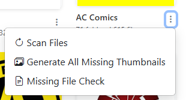
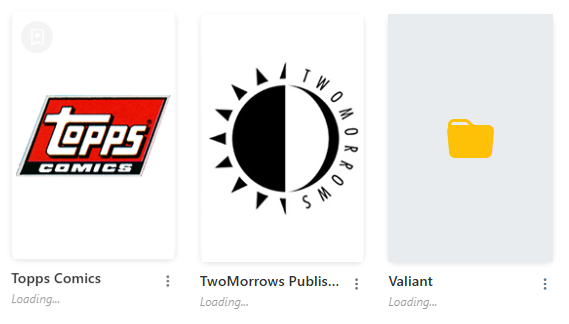

# Collection Browsing (Publishers)

/// caption
Example Publisher Page with Nested Folders
///

With CLU, you can visually browse your collection. It will load you root (/data) folder and display all folders and files in it. For documentation purposes, we'll refer to this as the "Publisher" section, but it can be any folder structure you have in your collection.

Each folder will have a <i class="bi bi-three-dots-vertical fs-2 text-icon"></i> menu that will allow you to perform actions on the folder. Publisher folders will have different options than folders that contain issues. 

!!! Warning
    On the first load, CLU will scan your collection and generate thumbnails for all files. This can take some time if you have a large collection. A collection of 100,000 files will take ~2 hours to scan. All future loads will be near-instant.

## Publisher Folders

There are 3 options in the dropdown menu:

- **Scan Files**: This will scan the folder and rebuild the database for this publisher, capturing any new files or structure changes.
- **Generate Missing Thumbnails**: This will generate thumbnails for all folders that are missing a thumbnail. This uses the same process as [Generating Thumbnails](series.md#generating-thumbnails).
- **Missing File Check**: This will check for missing files in the folder based on the [Directory Features Missing File Check](../directory-features/missing.md).

### Custom Thumbnails

All folders support custom thumbnails. CLU will look for an image file named `folder.png` or `folder.jpg` in the folder. If it finds one, it will use it as the thumbnail. Recommended image size is 200x300 pixels.

### Uploading a Publisher Thumbnail

/// caption
Publisher without Thumbnail
///

You can upload a thumbnail for a publisher by dragging and dropping an image file onto the publisher folder.

/// caption
Uploading a Thumbnail
///

Once you browse back to the publisher page, you should see your thumbnail.

/// caption
Publisher with Thumbnail
///

### Favorite Publisher

You can mark a publisher as a favorite by clicking the <i class="bi bi-bookmark-heart fs-2 text-icon"></i> icon in the top left of the publisher list. This will add the publisher to the "Favorite Collections" section on the collection page, allowing you to quickly access your favorite publishers.

### Navigating to Series

Clicking on a publisher will take you to that Publisher page and display all folders (series) or issues in that publisher. 
