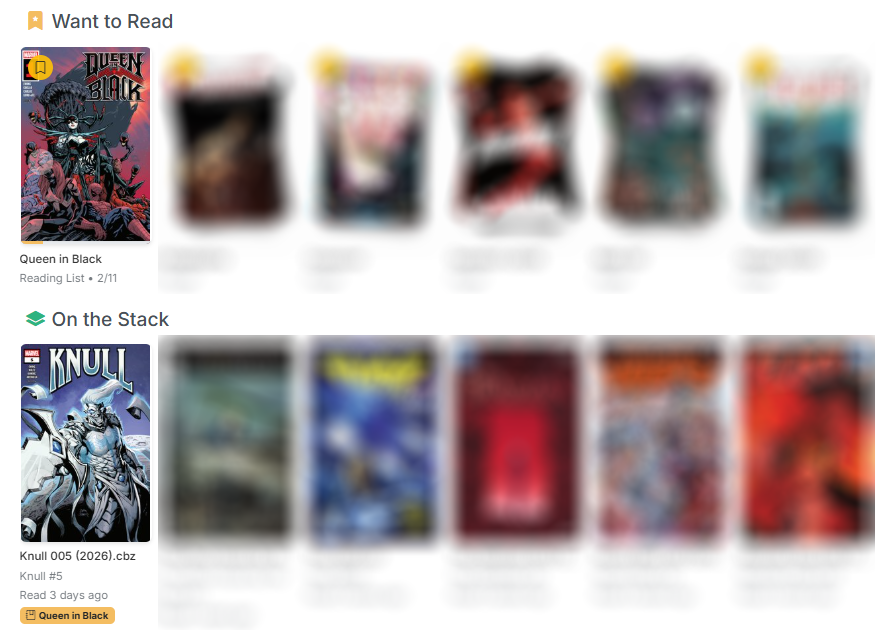
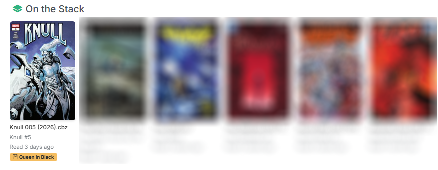

# Reading Lists

CLU supports importing reading lists from multiple sources, as well as creating your own and sharing them.

{.center-image}
/// caption
Reading Lists Page
///

## Importing Reading Lists

You can import reading lists from the following sources:

- **DieselTech GitHub Repository** — Browse and import from a curated collection of CBL reading list files
- **Import by URL** — Paste a GitHub URL to a `.cbl` file
- **Upload CBL File** — Upload a local `.cbl` (ComicBookLover) XML file directly
- **Metron Reading Lists** — Import curated reading lists from the Metron database. *Note:* most of these are imported from the DieselTech GitHub Repository
- **Metron Story Arcs** — Import story arcs from Metron as reading lists. *Note:* these are user created, based on Publisher Story Arcs.
- **ComicVine Story Arcs** — Import story arcs from ComicVine as reading lists

### GitHub Repository Browser

{.center-image}
/// caption
GitHub Import Modal
///

Click **GitHub Import** to open the import modal. The **Browse Repository** tab loads the full file tree from the DieselTech/CBL-ReadingLists repository (cached for 30 minutes).

1. Use the filter input to narrow the file tree by keyword
2. Select individual `.cbl` files using the checkboxes, or use **Select All** / **Deselect All**
3. The selected file count updates as you check items
4. Click **Import Selected** to begin a batch import

Each selected file is downloaded and processed in the background. Up to 5 imports run concurrently — the rest are queued. Progress for each import is tracked and displayed.

### Import by URL

Switch to the **Import by URL** tab to paste a direct link to a `.cbl` file on GitHub. CLU automatically converts GitHub blob URLs to raw content URLs for download.

### Upload CBL File

Click **Upload CBL** to upload a `.cbl` or `.xml` file from your local machine. The file is parsed and imported in the background.

### Metron Import

{.center-image}
/// caption
Metron Import Modal
///

Click **Metron Import** to open the Metron import modal. Two tabs are available:

- **Reading Lists** — Search and browse Metron's curated reading lists by name. Select one or more lists and click **Import Selected**. Each list's description, issue order, and metadata are preserved.
- **Story Arcs** — Browse Metron's story arcs with infinite scroll pagination. Select arcs and import them as reading lists. Arc issues are ordered by their arc sequence number.

Metron credentials must be configured in **Settings > Metadata Providers** before importing.

### ComicVine Import

{.center-image}
/// caption
Reading Lists imported from ComicVine have additional details and can contain links
///

Click **ComicVine Import** to search and browse story arcs from ComicVine. Select one or more arcs and click **Import Selected**. A ComicVine API key must be configured in **Settings > Metadata Providers**.

### Global Reading List Features

The following features are available for all reading list imports:

#### Browsing Reading Lists from Providers

When browsing Metron or ComicVine imports, the modal provides:

- **Search input** — Filter results by name as you type
- **Select All / Deselect All** — Bulk selection controls
- **Selected count** — Displays how many items are currently selected
- **Infinite scroll** — Story arcs load additional pages as you scroll (Metron arcs)

#### Filter and Search

On the main Reading Lists page, if any lists have tags assigned, a **tag filter bar** appears at the top. Click a tag to filter the grid to only lists with that tag, or click **All** to show everything.

#### Import Status

{.center-image}

When importing reading lists, the import status is displayed in the header. The status includes:

- **Importing** — The reading list is being imported
- **Count** — The number of items imported / the number of items remaining
- **Progress Bar** — The progress of the import
- **Current Issue** — The current issue being imported

## Keeping an imported list up to date

!!! info "New in v6.5"
    An imported reading list is no longer a **snapshot**. CLU can now keep it matching its source, keep its entries pointing at the right files, and — if you ask it to — go and find the issues you're missing.

    Sync existed before v6.5 but covered **GitHub CBLs only**. It now covers every import source.

### Sync

The **Sync** button re-reads the list's original source and rebuilds the list to match it — issues added upstream appear, issues removed upstream go away, and the reading order follows.

| Source | What syncing it does | How CLU knows it changed |
| --- | --- | --- |
| **GitHub CBL URL** | Re-reads the `.cbl` file at the URL you imported from. | The file's contents. |
| **Metron reading list** | Re-reads the list from Metron. | The list's last-modified date. |
| **Metron story arc** | Re-reads which issues belong to the arc. | Which issues are in the arc. |
| **ComicVine story arc** | Re-reads which issues belong to the arc. | Which issues are in the arc. |

In every case CLU asks the **cheap question first** and only rebuilds the list when the answer has actually moved.

#### The Sync button has two outcomes

They look quite different, which is worth knowing before you assume one of them is a bug:

- **Nothing changed** — answered **instantly**, in the request itself. No progress bar, no background task, no task in Active Operations. The list was already correct.
- **Something changed** — the rebuild runs **in the background** and the page tells you so. A large ComicVine arc genuinely takes minutes.

!!! info "The Sync button only appears on lists that have a syncable source"
    A list you built by hand, or imported from an **uploaded** CBL file, has nothing to sync against — there's no remote copy to compare with. Those lists show no Sync button.

!!! info "Re-importing the same list makes a second list"
    This is still true, and it is exactly what Sync is for. Importing a list you already have gives you **two lists**, not an updated one.

    **Sync the list you have; don't re-import it.**

!!! info "Why an arc syncs differently from a reading list"
    Adding an issue to a story arc modifies the **issue**, not the arc — so an arc's own "last modified" date never moves, and asking for it would tell you nothing.

    For arcs, CLU compares the arc's **membership** instead. That's a slightly more expensive question than a date, which is why arc syncs take a little longer than reading-list syncs.

### Sync is not Re-match

The **Re-match** button sits next to Sync and shares its icon, so it's worth being explicit:

| Button | What it re-reads |
| --- | --- |
| **Sync** | The **source**. Pulls what GitHub / Metron / ComicVine now holds, and rebuilds the list's entries to match. |
| **Re-match** | Your **library**. Re-runs local file matching against the entries that are already in the list. Nothing about the list's contents changes. |

Use **Sync** when the upstream list has changed. Use **Re-match** when your *files* have changed and the list hasn't caught up.

### Automatic syncing

The [Reading List Sync Schedule](../app-settings/schedules.md#reading-list-sync-schedule) runs the same thing on a schedule, across every list that has a syncable source.

## Track Wanted

!!! info "New in v6.5"
    A per-list **Track Wanted** button <i class="bi bi-binoculars"></i>, beside **Sync** on the reading list page.

Turn it on and **every entry in the list with no matched file becomes a wanted issue**. Those entries:

- appear on the [Wanted](../pull-list/wanted.md#from-reading-lists) page, in their own **From Reading Lists** section, and
- are searched for by the nightly GetComics sweep like any other wanted issue.

Turn it off and they leave again. That's the whole feature — it's a switch on one list.

!!! warning "Off by default, and that's deliberate"
    Importing a 300-issue arc must not silently start **300 nightly searches** on your behalf. Tracking is **opt-in, per list**, so nothing starts downloading until you've decided that's what you want for that specific list.

!!! info "Who can turn it on"
    Unlike [bookmarking](#bookmarking-a-list) — personal data any role may set — **Track Wanted spends bandwidth and disk**, so it's restricted to users who can manage the list. Readers see the button but can't use it. See [Roles & Permissions](../users/roles.md).

### Nothing is stored, so nothing goes stale

"Unmatched" *is* the definition of a tracked wanted issue — there's no separate list being maintained alongside the reading list. That has one useful consequence:

**Mapping an issue by hand removes it from the Wanted page immediately, and clearing the mapping puts it back.** There's nothing to rebuild, nothing to refresh, and no way for the two views to disagree.

Entries with a **blank series name or issue number** are excluded from tracking entirely — they can never match a file, so searching for them forever would be pointless.

## Create a Reading List

{.center-image}

Click **Create List** on the Reading Lists page. Enter a name for the new list in the modal and click **Create**. The empty list is created immediately and you can begin adding issues to it.

### Adding Issues to a Reading List

There are two ways to add issues to a reading list:

#### Add Via Search

{.center-image .sixty}

Open a reading list and click the **Add Issue** button. This opens a search modal where you can:

1. Type a search query in the input field (searches your CLU file index)
2. Browse the results — each result shows the file path
3. Click a result to select it
4. Click **Add to List** to add the issue

#### Add Via Browser

{.thirty}
{.thirty}

Anywhere you can view an issue, you can add it to a reading list by clicking the **Add to List** button in the issue's three-dot menu. 

This will open a modal allowing you to select the reading list to add the issue to.

### Adjusting the Reading Order of Issues

{.center-image}

Click the **Reorder** button in the reading list detail view to enter reorder mode. In this mode:

1. The grid switches to a drag-and-drop interface
2. Drag issue cards to rearrange them in the desired reading order
3. Click **Save Order** to persist the new order

{.center-image .sixty}

The new order is saved to the database and reflected everywhere the list is displayed.

### Mapping Missing Issues

Issues can also be matched after import. 

For imported lists where an issue was not automatically matched to a local file, click the issue's cover (which shows a "Click to map" placeholder) or use the three-dot menu and select **Map Issue** to search for and link a local file.

{.center-image}
/// caption
For example, this Constantine reading list is missing an issue of Swamp Thing before it was renamed.
///

Additionally, you can search for the missing issue and download it to your CLU Downloads folder. As of **v6.5** you don't have to come back and map it by hand — see [Gaps fill the moment the file arrives](#gaps-fill-the-moment-the-file-arrives) below.

{.center-image}
/// caption
Here we are searching for a missing issue.
///

### Lists keep themselves matched

!!! info "New in v6.5"
    Three changes, one promise: **a reading list keeps pointing at the right file.**

#### Matches follow the file

**Rename a comic, move it to another folder, or convert it from CBR to CBZ, and the list entry follows it.** Previously any of those broke the mapping and left a "Click to map" placeholder behind on a file you still owned.

Delete the file and the entry goes back to unmatched — which, on a [tracked list](#track-wanted), is what puts it back on the Wanted page.

This matters most for **mappings you made by hand**. Re-match deliberately **skips** an entry you mapped yourself — your answer beats the matcher's, and that's the right default. But it used to mean a hand-picked mapping broken by a rename could **never** heal itself: the matcher wouldn't touch it, and you had to notice and redo it. Now the path follows the file, so it doesn't break in the first place.

#### Gaps fill the moment the file arrives

When a download lands in your library, CLU checks whether it closes a gap on any tracked list and **maps it immediately**. You don't have to wait for the nightly re-match or press **Re-match** yourself.

!!! info "This only ever adds a match"
    An arriving file can **never un-map** something you'd already mapped. *Clearing* a match stays a decision for the nightly sweep and the explicit **Re-match** button — the arrival path is add-only.

#### The right volume

A list entry no longer maps to an issue of the **same number from a different volume or year**. `Daredevil #1 (1964)` and `Daredevil #1 (1998)` are no longer interchangeable to the matcher.

### Managing Tags

{.center-image .sixty}

Use the **Tags** button <i class="bi bi-tags"></i> on each reading list card to open the tag manager. You can:

- Type to add new tags with autocomplete suggestions from existing tags
- Click predefined tag suggestions
- Remove tags by clicking the X on each tag badge
- Tags are used for filtering on the main Reading Lists page

<!-- ## Exporting a Reading List

Open a reading list and click the **Export CBL** button. CLU generates a standard `.cbl` XML file containing all issues in the list with their series, issue number, volume, and year fields. The file downloads immediately with the list name as the filename.

The exported CBL file is compatible with ComicBookLover, ComicRack, and other comic readers that support the CBL format. -->

## Reading Lists on the Dashboard

!!! info "New in v6.3"
    A reading list can now surface on the [Collection homepage](index.md). Before v6.3 a list only existed if you deliberately navigated to it.

### Bookmarking a list

The **Bookmark** action on a reading list card is the single opt-in that drives **both** dashboard surfaces. Bookmark a list once and it appears in Want to Read *and* feeds On the Stack; un-bookmark it and it leaves both.

!!! info "Per user"
    Bookmarks are **user-scoped**. In a [multi-user install](../users/index.md) everyone curates their own dashboard from the same shared lists — your bookmarks don't change anyone else's homepage.

    **Readers can bookmark.** It's their own personal data, so it isn't gated behind the Clerk role. See [Per-User Data](../users/personal-data.md).

### Want to Read

{: .center-image}

/// caption
A bookmarked reading list as a single Want to Read card.
///

Each bookmarked list gets **one card** in the Want to Read swiper, showing:

- A **cover stack** built from the list's issues
- A **read / total** count
- A **progress bar**
- Click-through to the list itself

### On the Stack

{: .center-image}

On the Stack surfaces each bookmarked list's **next unread issue**, defined precisely as:

> the first entry **in the list's own sort order** that is unread **and** has a matched file.

Two consequences worth knowing:

- **Entries with no matched file are skipped, not counted as unread.** This is why a list can show a later issue than you'd expect — the unmatched ones in between are passed over rather than blocking. [Map the missing issues](#mapping-missing-issues) if you want them in the sequence.
- **A list you've never started still appears.** It doesn't require prior progress; an untouched list contributes its first entry.

Entries carry a **list-name badge** so you can tell which list an issue came from.

On the Stack merges these with your subscribed series and **dedupes**: if a bookmarked list and a subscribed series point at the same next issue, it's shown once. The existing folder-scope filter applies to reading-list issues too.

## Searching for Missing Issues

!!! info "Updated in v6.3"
    The search modal on the Reading Lists page now includes **Usenet** and **DC++** sections with full result scoring. It was GetComics-only before.

When you search for a missing issue from a reading list, you get the same combined, scored, multi-source results as the series page and [Wanted Issues](../pull-list/wanted.md) — ordered by [Source Priority](../usenet/source-priority.md) — plus the **download and keep searching** behavior described in [Click to Download](../file-downloads/send.md#queue-more-than-one-at-a-time).

The modal also now passes the **issue year** into the query, which improves matching on long-running series.

## Reading Lists and roles

!!! info "Who can do what"
    In a [multi-user install](../users/index.md), **Readers** can browse reading lists and bookmark them for their own dashboard. Creating, importing, editing, deleting, mapping, reordering, **syncing**, and **[Track Wanted](#track-wanted)** are [Clerk](../users/roles.md) actions.
