# Reading Lists

CLU supports importing reading lists from multiple sources, as well as creating your own and sharing them.

{.center-image}
/// caption
Reading Lists Page
///

## Importing Reading Lists

You can import reading lists from the following sources:

- **DieselTech GitHub Repository** — Browse and import from a curated collection of CBL reading list files
- **Import by URL** — Paste a GitHub URL to a `.cbl` file
- **Upload CBL File** — Upload a local `.cbl` (ComicBookLover) XML file directly
- **Metron Reading Lists** — Import curated reading lists from the Metron database. *Note:* most of these are imported from the DieselTech GitHub Repository
- **Metron Story Arcs** — Import story arcs from Metron as reading lists. *Note:* these are user created, based on Publisher Story Arcs.
- **ComicVine Story Arcs** — Import story arcs from ComicVine as reading lists

### GitHub Repository Browser

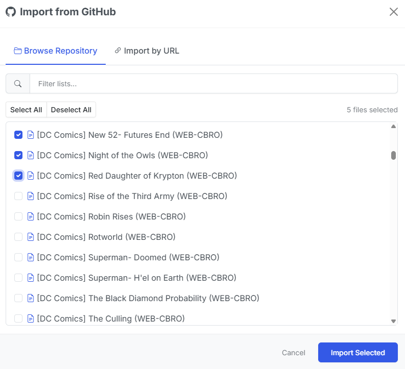{.center-image}
/// caption
GitHub Import Modal
///

Click **GitHub Import** to open the import modal. The **Browse Repository** tab loads the full file tree from the DieselTech/CBL-ReadingLists repository (cached for 30 minutes).

1. Use the filter input to narrow the file tree by keyword
2. Select individual `.cbl` files using the checkboxes, or use **Select All** / **Deselect All**
3. The selected file count updates as you check items
4. Click **Import Selected** to begin a batch import

Each selected file is downloaded and processed in the background. Up to 5 imports run concurrently — the rest are queued. Progress for each import is tracked and displayed.

### Import by URL

Switch to the **Import by URL** tab to paste a direct link to a `.cbl` file on GitHub. CLU automatically converts GitHub blob URLs to raw content URLs for download.

### Upload CBL File

Click **Upload CBL** to upload a `.cbl` or `.xml` file from your local machine. The file is parsed and imported in the background.

### Metron Import

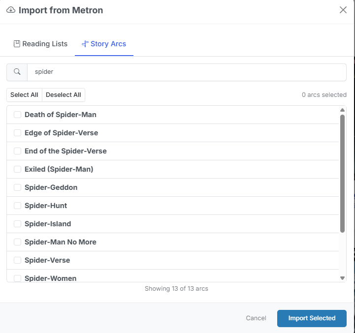{.center-image}
/// caption
Metron Import Modal
///

Click **Metron Import** to open the Metron import modal. Two tabs are available:

- **Reading Lists** — Search and browse Metron's curated reading lists by name. Select one or more lists and click **Import Selected**. Each list's description, issue order, and metadata are preserved.
- **Story Arcs** — Browse Metron's story arcs with infinite scroll pagination. Select arcs and import them as reading lists. Arc issues are ordered by their arc sequence number.

Metron credentials must be configured in **Settings > Metadata Providers** before importing.

### ComicVine Import

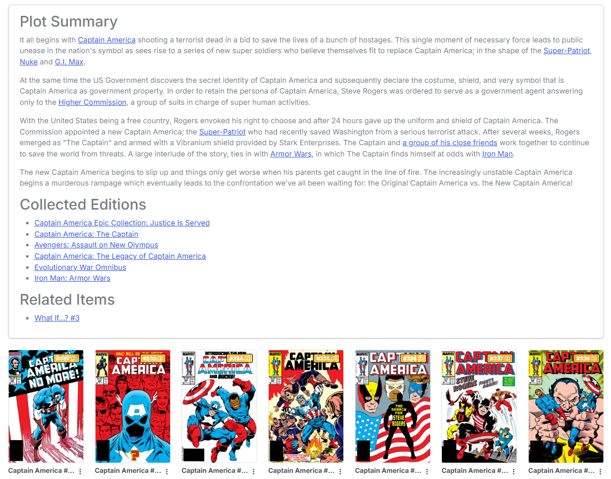{.center-image}
/// caption
Reading Lists imported from ComicVine have additional details and can contain links
///

Click **ComicVine Import** to search and browse story arcs from ComicVine. Select one or more arcs and click **Import Selected**. A ComicVine API key must be configured in **Settings > Metadata Providers**.

### Global Reading List Features

The following features are available for all reading list imports:

#### Browsing Reading Lists from Providers

When browsing Metron or ComicVine imports, the modal provides:

- **Search input** — Filter results by name as you type
- **Select All / Deselect All** — Bulk selection controls
- **Selected count** — Displays how many items are currently selected
- **Infinite scroll** — Story arcs load additional pages as you scroll (Metron arcs)

#### Filter and Search

On the main Reading Lists page, if any lists have tags assigned, a **tag filter bar** appears at the top. Click a tag to filter the grid to only lists with that tag, or click **All** to show everything.

#### Import Status

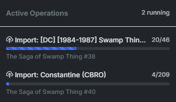{.center-image}

When importing reading lists, the import status is displayed in the header. The status includes:

- **Importing** — The reading list is being imported
- **Count** — The number of items imported / the number of items remaining
- **Progress Bar** — The progress of the import
- **Current Issue** — The current issue being imported

## Create a Reading List

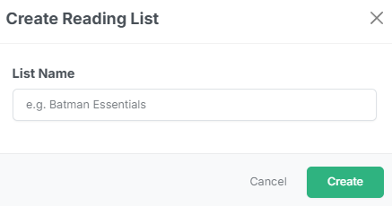{.center-image}

Click **Create List** on the Reading Lists page. Enter a name for the new list in the modal and click **Create**. The empty list is created immediately and you can begin adding issues to it.

### Adding Issues to a Reading List

There are two ways to add issues to a reading list:

#### Add Via Search

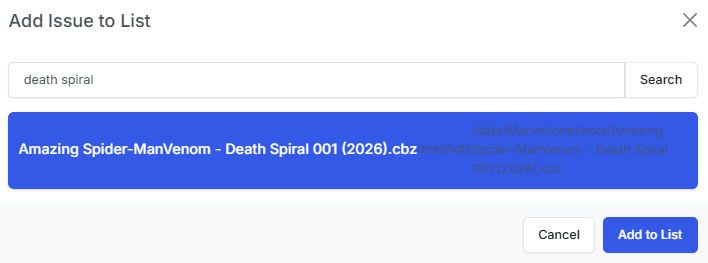{.center-image .sixty}

Open a reading list and click the **Add Issue** button. This opens a search modal where you can:

1. Type a search query in the input field (searches your CLU file index)
2. Browse the results — each result shows the file path
3. Click a result to select it
4. Click **Add to List** to add the issue

#### Add Via Browser

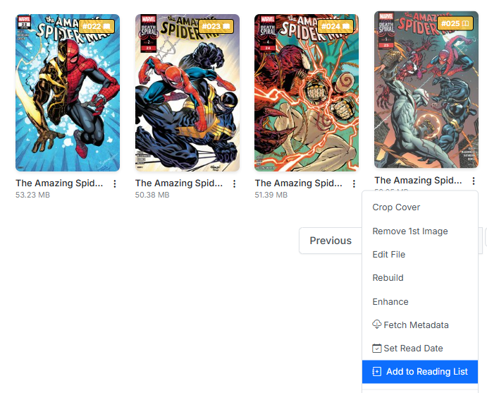{.thirty}
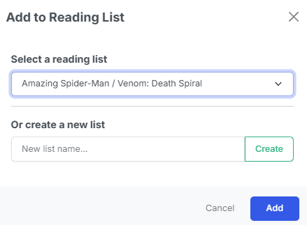{.thirty}

Anywhere you can view an issue, you can add it to a reading list by clicking the **Add to List** button in the issue's three-dot menu. 

This will open a modal allowing you to select the reading list to add the issue to.

### Adjusting the Reading Order of Issues

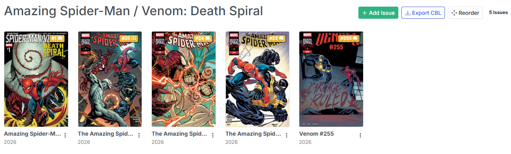{.center-image}

Click the **Reorder** button in the reading list detail view to enter reorder mode. In this mode:

1. The grid switches to a drag-and-drop interface
2. Drag issue cards to rearrange them in the desired reading order
3. Click **Save Order** to persist the new order

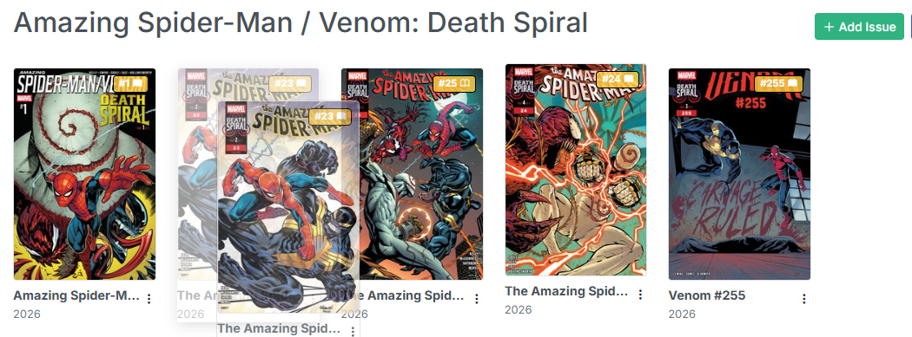{.center-image .sixty}

The new order is saved to the database and reflected everywhere the list is displayed.

### Mapping Missing Issues

Issues can also be matched after import. 

For imported lists where an issue was not automatically matched to a local file, click the issue's cover (which shows a "Click to map" placeholder) or use the three-dot menu and select **Map Issue** to search for and link a local file.

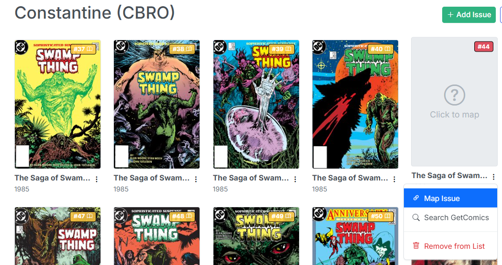{.center-image}
/// caption
For example, this Constantine reading list is missing an issue of Swamp Thing before it was renamed.
///

Additionally, you can search GetComics for the missing issue and download it to your CLU Downloads folder. Once downloaded, it will be automatically added to your CLU file index and you can map it to the reading list.

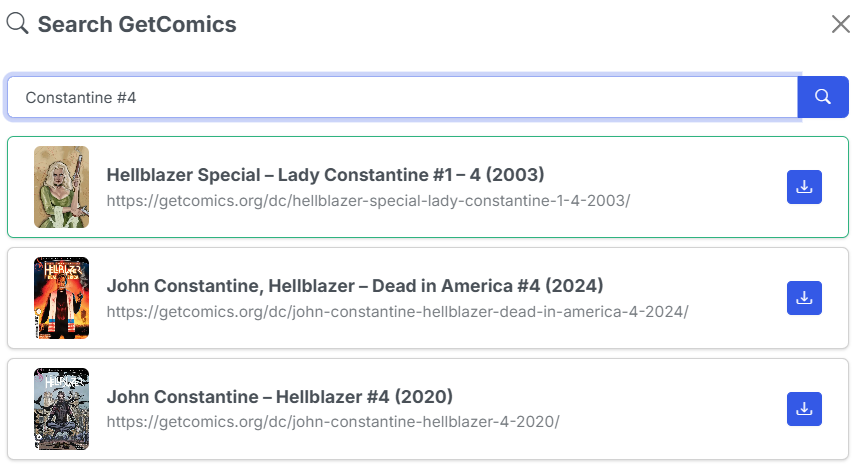{.center-image}
/// caption
Here we are searching for a missing issue.
///

### Managing Tags

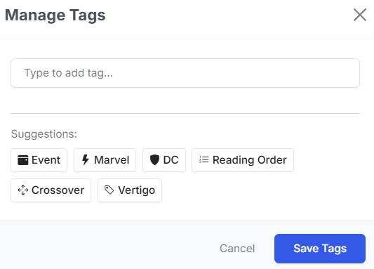{.center-image .sixty}

Use the **Tags** button <i class="bi bi-tags"></i> on each reading list card to open the tag manager. You can:

- Type to add new tags with autocomplete suggestions from existing tags
- Click predefined tag suggestions
- Remove tags by clicking the X on each tag badge
- Tags are used for filtering on the main Reading Lists page

<!-- ## Exporting a Reading List

Open a reading list and click the **Export CBL** button. CLU generates a standard `.cbl` XML file containing all issues in the list with their series, issue number, volume, and year fields. The file downloads immediately with the list name as the filename.

The exported CBL file is compatible with ComicBookLover, ComicRack, and other comic readers that support the CBL format. -->
