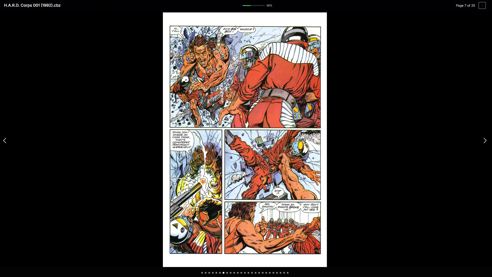
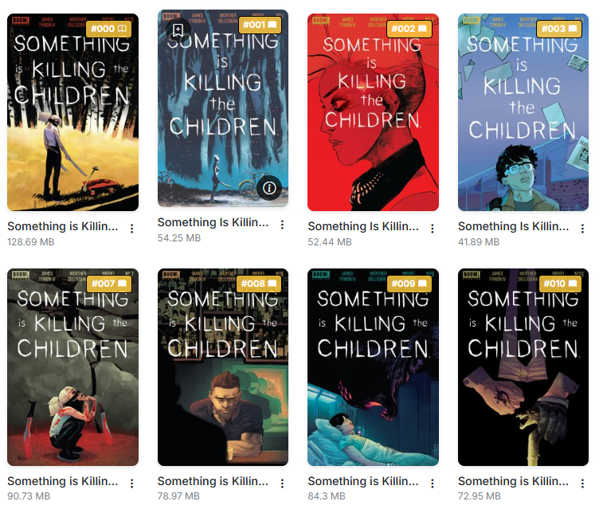
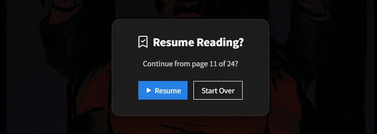

# Reading Comics

{: .center-image}
/// caption
Reading a Comic
///

When browsing your collection, you can click on a comic to read it. The reader will open in a modal over the page.

## Read vs Unread Status

{: .center-image}
/// caption
Read vs Unread Status
///

When you read a comic, it will be marked as read and saved in your history. This is done automatically when you reach 90% of the issue.

Additionaly, you'll see a unread/read icon <i class="bi bi-book text-primary"></i> in the right corner of the cover, directly after the issue number

## Reader Features
The current implementation is a simple reader that allows you to read your comics quickly.  

It has the following features:

1. **Fast Performance**: Even with large files, the reader will load near instantly. It does this byb loading only the first image of the file and pre-loading the next image as you read.
2. **Responsive Design**: The reader is designed to work on any device, whether it be a desktop, tablet, or phone.
3. **Page Count**: The reader will show the page count of the issue along with the current page number.
4. **Progress Bar**: The reader will show a progress bar, indicating how far you have read. When this reaches 90%, the issue will be marked as read and saved in your history.
5. **Jump to Page**: The dots along the bottom allow you to jump to a specific page in the issue.

### Resume Reading

{: .center-image}
/// caption
Resume Reading
///

If you close the reader before reaching 90%, CLU will Bookmark your place and ask if you want to resume reading when you open that file again 

You can manually set a bookmark by clicking on the icon <i class="bi bi-bookmark text-primary"></i> in the top-right corner. 

### Reading Position Reliability

!!! info "Improved in v6.3"
    Reading positions are saved far more reliably, and **follow a file through renames, moves and CBR→CBZ conversion**.

That last one is the headline: reorganizing your library no longer costs you your place. Rename a file, move it to a different folder, or convert it from CBR to CBZ, and your bookmark comes with it.

The rest of the improvements:

| Change | What it fixes |
| --- | --- |
| **Autosave and unload flushes** | Position is saved on tab close, refresh, and navigation — not only on an explicit modal close. A mobile browser discarding the page no longer loses your place. |
| **Resuming no longer destroys the bookmark** | Jumping to a late bookmark used to count as reading progress, so resuming at page 90 of 100 instantly read as 90% complete — closing then marked the comic read and deleted the bookmark. |
| **"Start Over" actually clears the position** | It used to return you to the same place forever. |
| **Very short comics can be bookmarked** | Comics of **three pages or fewer** were previously excluded. |
| **No cross-user leakage** | One user's reading progress no longer appears on another user's browse listings. |

!!! note "Unload flushes only ever save"
    The autosave and unload paths **never** mark a comic read and **never** delete a bookmark — a hidden tab is an ambiguous signal, and guessing wrong would destroy the position it's supposed to protect.
