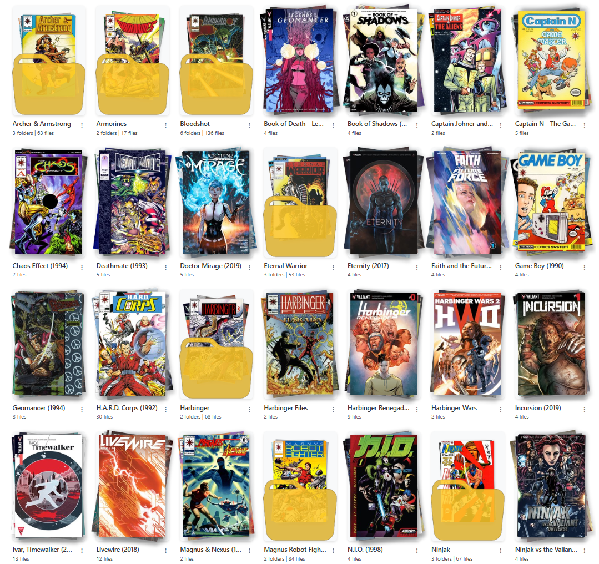
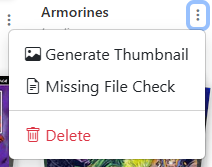
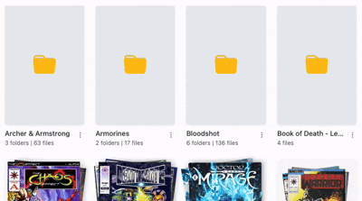

# Collection Browsing (Series)

{: .center-image}
/// caption
Example Collection Series Page
///

Once you navigate within a publisher, you will see a list of folders (series) or issues in that publisher.

## Series Options
For a series folder (any folder that is non-root / non-publisher), there are 3 options in the dropdown menu that can be accessed by clicking the <i class="bi bi-three-dots-vertical fs-2 text-icon"></i> menu.

{: .center-image}
/// caption
Example Series Dropdown Menu
///

1. **Generate Thumbnail**: This will generate thumbnails for all folder that are missing a thumbnail.
2. **Missing File Check**: This will check for missing files in the folder based on the [Directory Features Missing File Check](../directory-features/missing.md).
3. **Delete**: This will delete the folder and all files in it. You will be prompted to confirm this action.

### Generating Thumbnails

{: .center-image}
/// caption
Example of Generating Thumbnails
///

To generate thumbnails for a series, click the <i class="bi bi-three-dots-vertical fs-2 text-icon"></i> menu and select "Generate Thumbnail". This will generate a thumgnail for the folder based on it's contents.

1. Folders with a single file will use that file as the thumbnail.
2. Folders with multiple files will use up to the first 4 files, composed in whichever [folder art style](../app-settings/personalization.md#folder-thumbnail-style) is selected. In the default **Fanned Stack** style the first file is the top of the stack and the last is the bottom, with random rotation so every folder doesn't look identical.
3. Folders containing other folders use the first image from up to 4 of those folders, and can additionally be drawn "inside" a folder icon — see the [folder icon overlay](../app-settings/personalization.md#show-the-folder-icon-overlay) switch.

!!! info "New in v6.4 — four styles, and you can pick the cover"
    The fanned stack is no longer the only look. There are now **four styles** — Fanned Stack, Single Image, Isometric Cascade and 2x2 Mosaic Grid — selected site-wide under [Personalization](../app-settings/personalization.md#folder-thumbnail-style).

    You can also pin a specific issue's cover as the folder's primary art with **[Set as Folder Thumbnail](issues.md#set-as-folder-thumbnail)** on any issue.

### Regenerate All Thumbnails

!!! info "New in v6.4"
    Changing the folder art style only affects art generated from that point on. **Regenerate All Thumbnails** applies it to art you already have.

On a **top-level folder** (a publisher), the <i class="bi bi-three-dots-vertical fs-2 text-icon"></i> menu gains **Regenerate All Thumbnails**, which restyles every series inside it. There's an all-libraries version on the [Personalization](../app-settings/personalization.md#regenerate-all-thumbnails) page.

It runs in the background with live progress in **Active Operations**, so a large library won't time out.

!!! warning "The folder you run it on is deliberately skipped"
    Running it on `/data/DC Comics` restyles every series inside and leaves that publisher's **own** art alone — a hand-picked publisher image isn't what you're replacing when you restyle series art.

    Everything *inside* is overwritten, including art you uploaded by hand, which is why it sits behind a confirmation modal. [Pinned covers](issues.md#set-as-folder-thumbnail) survive.

### Mark a Series as "Want to Read"

You can mark a series as a "Want to Read" by clicking the <i class="bi bi-bookmark-plus fs-2 text-icon"></i> icon in the top left of the series list. This will add the series to the "Want to Read" section on the collection page, allowing you to quickly access the series from the collection page or the OPDS feed.