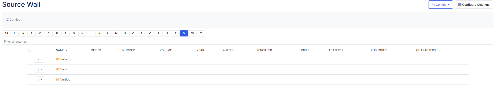
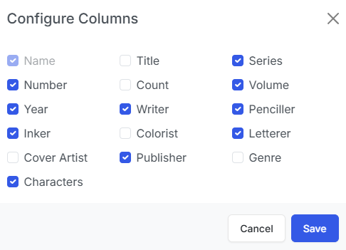
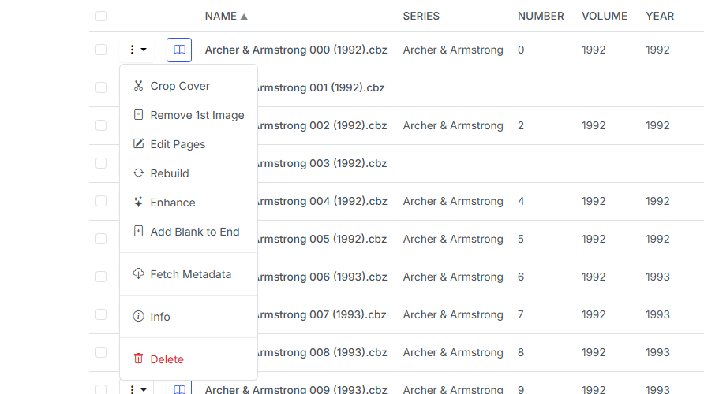

# Source Wall

/// caption
Example Source Wall
///

Fine-tuning your comic metadata just got a lot easier. In v4.10, we've introduced the Source Wall view (naming inspired by Metron). This view is a table-based view of your libray, that also includes the metadata.

/// caption
Publishers
///

## Config Options

You can configure the Source Wall view by clicking the <i class="bi bi-layout-three-columns fs-1 text-icon"></i> icon in the top right corner of the Source Wall view.

{: .center-image}
/// caption
Config Options
///

This allows you to show/hide the columns that are displayed in the Source Wall view.

## Issue Options

You can read any issuse in this view by clicking the <i class="bi bi-book fs-2 text-info"></i> icon in the row of the issue.

Additionally you can perform 9 actions on issues via the dropdown menu that can be accessed by clicking the <i class="bi bi-layout-three-dot fs-2 text-icon"></i> menu.

{: .center-image}
/// caption
Example Issue Dropdown Menu
///

1. **Crop Cover**: This will crop the first image of the CBZ, saving the right-side as the new cover and the full image as the 2nd image. This is the same process as [Crop Cover](../single-file-features/crop.md).
2. **Remove First Image**: This will remove the first image from the issue. This is same feature as [Remove First Image](../single-file-features/remove.md). I recommend using this option after using "Edit File" as to ensure the incorrect image is truly the first image in the file.
3. **Edit Pages**: This unpacks the CBZ and allows you to edit the files. See a full list of features in the [Edit File](../single-file-features/edit.md) section.
4. **Rebuild**: This will quickly rebuild a incorrectly built CBZ file and/or convert a CBR to a CBZ file. This is the same feature as [Rebuild](../single-file-features/rebuild.md).
5. **Enhance**: This will enhance the image quality of all images in the issue. This is the same feature as [Enhance](../single-file-features/enhance.md).
6. **Add Blank to End**: Adds a blank `.png` file named `zzzz9999` to the file. This corrects display issues with Manga files.
7. **Fetch Metadata**: The retrieves the metadata for the issue and generates the `ComicInfo.xml` file. This is the same process documented at [Get ComicInfo.xml](../file-management/comicinfo.md#get-metadata-for-a-single-issue)
8. **Info**: View the full contents of the  `ComicInfo.xml` and other file information (number of image, image size, etc)
9. **Delete**: This will delete the issue. This is the same feature as [Delete](../single-file-features/delete.md).