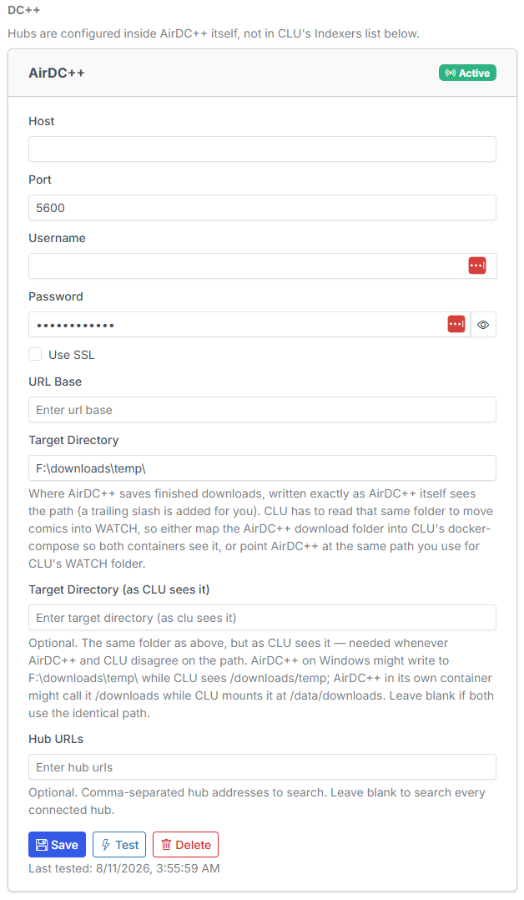

# Adding AirDC++

You add AirDC++ from the **Download Clients** tab in [Settings](../app-settings/index.md), the same place [Usenet clients](../usenet/setup.md) live.

{: .center-image}

/// caption
Settings → Download Clients, with an AirDC++ client configured alongside an active SABnzbd.
///

!!! info "AirDC++ does not deactivate your Usenet client"
    Download clients now belong to a **group** — `usenet` or `dcpp` — and the "only one active client" rule is scoped **per group**. Activating AirDC++ leaves SABnzbd or NZBGet active and untouched. See [Download & API Settings](../app-settings/download-settings.md).

## Fields

| Field | Meaning | Example |
| --- | --- | --- |
| **Host** | Hostname or IP where the AirDC++ Web Client is running. | `192.168.1.10` or `airdcpp` |
| **Port** | The AirDC++ Web Client port. | `5600` |
| **Use SSL** | Tick if your instance is served over HTTPS. | *unticked* |
| **URL Base** | Optional path prefix, if AirDC++ sits behind a reverse proxy on a subpath. | `/airdcpp` |
| **Username** | An AirDC++ Web Client user with API access. | `clu` |
| **Password** | That user's password. | |
| **Target Directory** | Where AirDC++ should write completed bundles, **expressed the way AirDC++ sees it**. | `/downloads/comics/` |
| **Local Target Directory** | That **same folder**, expressed the way **CLU** sees it. | `/downloads/comics` |
| **Hub URLs** | Optional. Restrict searches to specific hubs; leave empty to search every connected hub. | |

## Two different paths

!!! warning "Two different paths"
    **Target Directory** and **Local Target Directory** point at the *same folder on disk*, but they are written from two different points of view — and they are usually **not the same string**.

    - **Target Directory** is the path **AirDC++** uses to write the file. AirDC++ receives this value and hands it to its own filesystem.
    - **Local Target Directory** is the path **CLU** uses to find that file afterwards, so it can move it into WATCH.

    AirDC++ normally runs natively on the host or in its own container, so its filesystem is not CLU's filesystem. If you enter CLU's path in both boxes, AirDC++ will write somewhere CLU cannot see — or somewhere that does not exist — and downloads will complete but never reach your library.

The fix is a shared volume: map the folder AirDC++ downloads into your CLU container (in CLU's `docker-compose.yml`), then put the AirDC++-side path in **Target Directory** and the CLU-side path in **Local Target Directory**. Using CLU's existing **WATCH** folder for both sides is a perfectly good option if you can mount it into AirDC++.

## Test Connection

Click **Test Connection** after entering your details. CLU calls the instance live and reports a readable result.

| Result | Meaning | What to check |
| --- | --- | --- |
| **Connected** | CLU reached AirDC++, authenticated, and could open the local target directory. | Nothing — you're good. |
| **Could not connect** | Nothing answered at that host/port. | Host, port, SSL setting, and that AirDC++ is reachable from CLU's container. |
| **Authentication failed** | AirDC++ answered but rejected the credentials. | Username and password. |
| **Non-JSON response** | Something answered, but it wasn't the AirDC++ API. | You are probably pointed at the wrong port, a reverse proxy, or a login page. |
| **Timed out** | No response in time. | Network path, firewall, or an overloaded instance. |
| **Target Directory is not a valid path on the AirDC++ host** | The path shape doesn't match the host's separator. | See [Path separators](#path-separators) below. |
| **CLU cannot see '…'** | The **Local** Target Directory isn't a real directory inside CLU's container. | Your volume mapping — the folder AirDC++ downloads into has to be mounted into CLU. |

!!! info "Test Connection tests what's on screen"
    Test Connection validates the values **currently in the form**, not the last saved configuration. You can correct a field and verify the fix *before* committing it.

## Path separators

AirDC++ does not reject a target directory it cannot parse — it silently folds the whole path into the **filename**. On a Windows host, `/` is a forbidden filename character rather than a separator, so a POSIX target directory like `/downloads/temp/` turns a grab into a single file called `_downloads_temp_Farmhouse 007.cbr` sitting in AirDC++'s own default download folder. A Windows-style path on a Linux host fails the same way.

CLU reads the host's actual separator from the instance and **refuses a target directory it can't parse**, with a message naming the fix, rather than letting it through and producing mangled filenames.

CLU also appends the trailing separator AirDC++ expects, so you don't have to — `/downloads/comics` and `/downloads/comics/` both work.

!!! warning "Change the path, re-test"
    Because this check depends on the AirDC++ host's own separator, it can only be validated against a live instance. Re-run **Test Connection** any time you change either directory.
