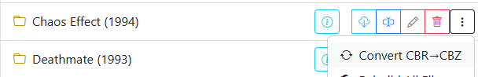

# Convert Directory

{: .center-image }

Converts all _CBR / RAR_ files in a **directory** to ZIP/CBZ.

This is accessed via the <i class="bi fs-2 bi-three-dots-vertical text-warning"></i> icon to the right of the directory name and will be the first option in the dropdown.
<i class="bi bi-arrow-repeat text-dark"></i> Convert CBR-->CBZ

This process skips any existing CBZ files.

If you need to rebuild a directory to fix corrupted files as well, use [Rebuild Directory](rebuild.md).

### Converting Sub-Directories

By default, this feature will only convert the directory selected and will not convert any sub-directories.

In [File Settings](../app-settings/file-settings.md#directory-file-processing-settings), you may "_Enable Subdirectories for Conversion_" which will allow this feature to traverse sub-directories as well.

!!! warning
    Be aware, running this on a high level directory could run for a good bit of time. In testing, I was able to convert 98 files (between 50MB to 300MB each) in \~20 minutes.

## A CBR left beside its own CBZ

!!! info "Fixed in v6.5"
    On **CIFS/SMB and Windows-backed WSL2 mounts**, a conversion could write a **perfectly good CBZ** and *still* be reported as failed — so the source CBR was kept rather than removed, leaving both files in the folder. It happened on every conversion, not occasionally.

    If you're on one of those mounts and your library is full of `.cbr`/`.cbz` pairs, this is why.

!!! note "Existing stray pairs need cleaning up by hand"
    The fix prevents new pairs; it doesn't remove the ones already on disk. Sort a folder by name and they sit next to each other.

The same fix applies to conversions done by [folder monitoring](../folder-monitoring/features.md) as files arrive.
