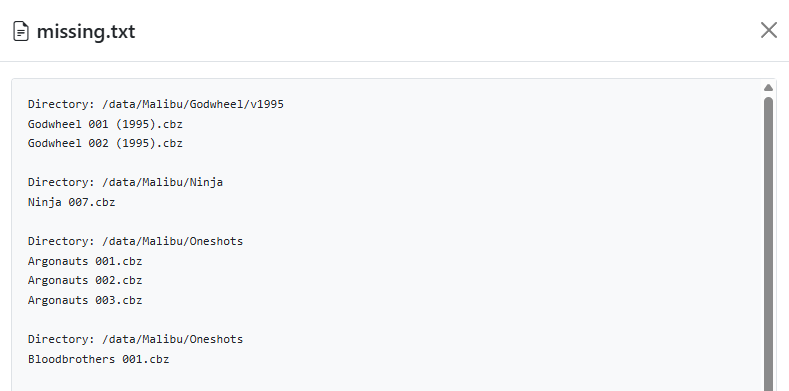

# Missing Issue Check

{: .center-image }

Having various folders from various sources over many years, I wanted to be able to check and see if any issues were "missing" from a series.

When using File Manager or Collection to Browse - you will see <i class="bi bi-search text-dark"></i> __Missing Issue Check__ in the drop-down menu.

{: .center-image }

Running this feature on my `/data/Valiant` directory, generated the following `missing.txt` file

```
Directory: /data/Valiant/Eternal Warrior/v1992
Eternal Warrior 008 (1992).cbz

Directory: /data/Valiant/Harbinger Wars 2 (2018)
Harbinger Wars 001 (2018).cbz

Directory: /data/Valiant/Harbinger/v1992
Harbinger 011 (1992).cbz

Directory: /data/Valiant/The Valiant/v2014
The Valiant 001 (2015).cbz

Directory: /data/Valiant/X-O Manowar/v1992
X-O Manowar 050 (1992).cbz

Directory: /data/Valiant/X-O Manowar/v2012
X-O Manowar 005 (2012).cbz
X-O Manowar 006 (2012).cbz
X-O Manowar 007 (2012).cbz

Directory: /data/Valiant/X-O Manowar/v2017
X-O Manowar 001 (2018).cbz
X-O Manowar 002 (2018).cbz
X-O Manowar 003 (2018).cbz
X-O Manowar 004 (2018).cbz
X-O Manowar 005 (2018).cbz
X-O Manowar 006 (2018).cbz
X-O Manowar 007 (2018).cbz
X-O Manowar 008 (2018).cbz
X-O Manowar 009 (2018).cbz
X-O Manowar 010 (2018).cbz
X-O Manowar 011 (2018).cbz
X-O Manowar 012 (2018).cbz
X-O Manowar 013 (2018).cbz
X-O Manowar 014 (2018).cbz
X-O Manowar 015 (2018).cbz
X-O Manowar 016 (2018).cbz
X-O Manowar 017 (2018).cbz
```

From this, I can assume that in `Directory: /data/Valiant/X-O Manowar/v2012` I am missing issues 001 - 004 and so on.

There is a threshold of 50 issues currently configured, so if more than 50 issues are missing of a series, the results will be truncated like so:

```
Series Name 071-499 (1998) [Total missing: 429]
```

This is useful when publishers revert to the original number of a long-running series and you have issues like `001 - 070, 500-542`

!!! warning
    This is not a "smart" feature and simply assumes each folder should have files starting with (#01, 01, 001) and the "last" file is the last alpha-numeric file in the folder.

### Ignored Terms

See the [System Settings](../app-settings/file-settings.md#missing-issue-configuration) page to configure ignored terms.

### Missing.txt Files

By default, the missing.txt files are created in the same directory as the directory you are running the feature on. These files will now show in the [Collection](../collection/index.md) UI.

{: .center-image }

Additionally, they can bew viewed from within the UI as well, by clicking the file.

{: .center-image }
