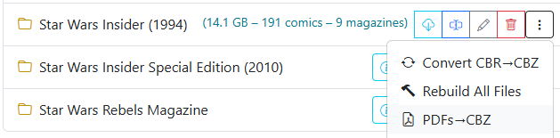

# Convert PDF to CBZ

{: .center-image }

Converts all PDF files in a directory to CBZ files.

This seems to be an edge case, but I had several comic magazines in PDF format. With the art and full-color pages, I wanted them available as CBZ for reading on my iPad.
