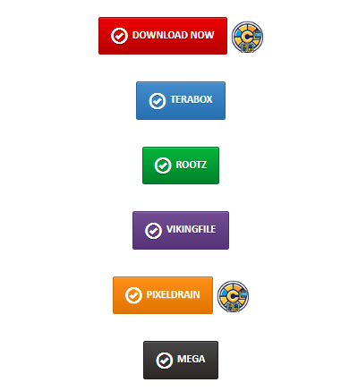

# Click to Download

## Supported Sites

Currently, GetComics.org and [Comic Book Plus](https://comicbookplus.com) are supported for downloads.

As you browse these sites and find a book you'd like to read, v2 of the extension will append a `CLU` icon next to the supported download link(s).

{: .center-image}
/// caption
Click to send to CLU
///

Clicking this will send the download request to CLU and you'll see it show up in the download status page.

Some older style links may not have the icon appended. In this case, you can right click one of the [supported download providers](send.md#supported-providers) and you should see `Send to CLU` in your context menu

{: .center-image}
/// caption
Send download to CLU
///

You can then navigate to the Download Status page in CLU (http://localhost/status) and watch the progress of the file download

### Supported Providers 

All supported providers are free tier only and currently do not support login or credentials.

#### **GetComics.Org**

Indicated by Red Download Now and Blue Mirror Download buttons.

#### **Pixeldrain**

Indicated by the Pixeldrain button

#### **Mega.nz**

Indicated by the Mega button

#### **Comic Book +**
When logged in and browsing [https://comicbookplus.com](https://comicbookplus.com), right-click on the "Download File" link