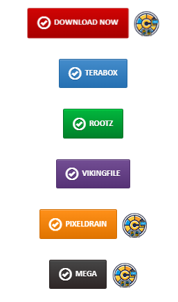
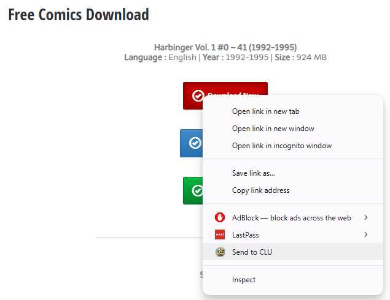

# Click to Download

## Supported Sites

Currently, GetComics.org and [Comic Book Plus](https://comicbookplus.com) are supported for downloads.

As you browse these sites and find a book you'd like to read, v2 of the extension will append a `CLU` icon next to the supported download link(s).

{: .center-image}
/// caption
Click to send to CLU
///

Clicking this will send the download request to CLU and you'll see it show up in the download status page.

Some older style links may not have the icon appended. In this case, you can right click one of the [supported download providers](send.md#supported-providers) and you should see `Send to CLU` in your context menu

{: .center-image}
/// caption
Send download to CLU
///

You can then navigate to the Download Status page in CLU (http://localhost/status) and watch the progress of the file download

### Supported Providers 

All supported providers are free tier only and currently do not support login or credentials.

#### **GetComics.Org**

Indicated by Red Download Now and Blue Mirror Download buttons.

#### **Pixeldrain**

Indicated by the Pixeldrain button

#### **Mega.nz**

Indicated by the Mega button

#### **Comic Book +**
When logged in and browsing [https://comicbookplus.com](https://comicbookplus.com), right-click on the "Download File" link

## The Search Modal

Separately from the browser extension, CLU has a **source-search modal** you open from inside the app — on a series page, the [Wanted Issues](../pull-list/wanted.md) page, and the [Reading Lists](../collection/reading-lists.md) page. It queries every configured download source at once: GetComics, [Usenet](../usenet/index.md), and [DC++](../dcpp/index.md), each under its own section header ordered by [Source Priority](../usenet/source-priority.md).

### Queue more than one at a time 

!!! info "New in v6.3"
    Every result now has **two buttons**: **download**, or **download and keep searching**.

Clicking a result used to queue it *and close the modal*, which made queuing a terminal action — so spotting a second or third file you wanted meant reopening the modal and re-running the entire search for each one.

| Button | What it does |
| --- | --- |
| **Download** | Queues the release and closes the modal. The original behavior. |
| **Download and keep searching** | Queues the release and leaves the modal open, so you can carry on browsing the same result set. |

### Duplicate protection

Because the grab endpoints aren't idempotent, keeping the modal open needs protection against sending the same release twice:

- **Both buttons in a row lock together** while a grab is in flight. Otherwise the second button stays live and the same release gets sent twice.
- **Queued rows stay locked for the visit.** Narrowing your query and re-searching brings already-taken rows back **locked** rather than arming them again.

!!! warning "DC++ is the exception"
    DC++ result tokens belong to a **single live search instance** and are re-minted on every search, so DC++ rows **re-arm** when you run a new search. They can't be matched back to what you already queued. See [DC++ Searching & Grabbing](../dcpp/search-and-grab.md).
