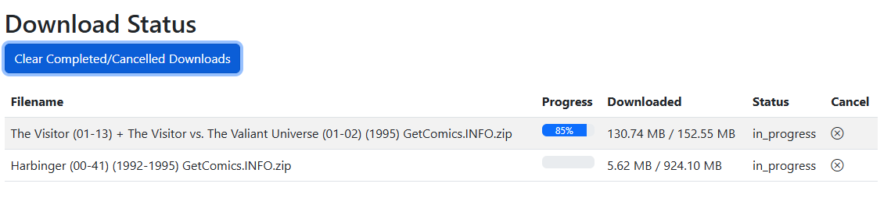

# Download Status Page

From this page you can view current and pending downloads.

#### **Download Queue**

Downloads are queued in the order they are received. Downloads are restricted to 3 at a time. When one download finishes, the next in the queue will start.

Once a download is started, the Filename and File Size/Downloaded fields will populate. Prior to starting, downloads currently show "N/A" for file details.

#### Status

This will show one of the following statuses:

* queued
* in\_progress
* retry\_pending *(new in v6.4)*
* error
* complete

### Automatic Retries

!!! info "New in v6.4"
    A failed download is now **retried automatically up to 3 times** before it's reported as failed.

Most download failures are transient — an overloaded GetComics mirror, a dropped connection, a 5xx — and would have succeeded on a second attempt a few minutes later. CLU already failed *over* between mirrors, but once the last mirror raised, that was the end of it and you had to notice the red row and click **Retry** by hand.

A failed download is now parked and re-queued **3 times, spaced 1, 5 and 15 minutes apart**. The row shows the wait live:

> **`Retrying in 4m 12s (2 of 3)`** — in warning colour, with the last error on hover.

While a retry is pending the row offers **Cancel** rather than Retry, since it's already going to run again. **Clear Failed Downloads** won't delete a row that's waiting to retry.

!!! info "Failure notifications wait for the retries"
    The **Download failed** [push notification](../app-settings/notifications.md) is held back until all three retries are spent, so a notification means *"this one is genuinely dead"* rather than *"the first mirror hiccuped"* — and it tells you how many retries were burned.

A manual retry during a backoff doesn't double-download: the pending timer expires into a no-op.

!!! note "Scope"
    Retries cover **direct downloads** — GetComics, Pixeldrain, MEGA, ComicBookPlus. [Usenet](../usenet/index.md) and [DC++](../dcpp/index.md) clients do their own retrying.

    A hand-driven **Retry** now also keeps the download's fallback mirrors, which it used to silently drop.

### Blocked by Cloudflare

!!! info "New in v6.4"
    Cloudflare-blocked downloads now say so, and offer the link that actually works.

A managed Cloudflare challenge is the one download failure CLU can't retry its way out of — **no automated client can pass one**. These rows previously showed a bare **error** with nothing explaining why, and a Retry button that could only fail again.

Now:

- The **Status** column reads **"Blocked by Cloudflare"** in warning styling, with a hover explanation.
- The **Actions** column leads with a **Download manually** button that opens the original GetComics page in a new tab — ahead of Retry, because Retry is pointless here.

These downloads **skip the automatic retries entirely**. Three more attempts would do nothing but delay the manual link you actually need by twenty minutes.

### Downloads from every source

The Status page shows all three download sources in one table, each with its own icon:

| Source | What you see | Notes |
| --- | --- | --- |
| **Direct (GetComics)** | Queue position, filename, size, and percentage. | Downloaded by CLU itself. |
| **[Usenet](../usenet/index.md)** | Live percentage, byte counts, and the client's current stage — **Downloading / Verifying / Repairing / Extracting / Moving**. | View-only rows; SABnzbd/NZBGet does the work. Refreshed on a ~5-second cadence while active. |
| **[DC++](../dcpp/index.md)** | Live percentage, stage, byte counts, and the bundle's target. | View-only rows. Bundles queued **directly in AirDC++** also appear, read-only — CLU never moves those. See [Status & Restart Recovery](../dcpp/status-and-recovery.md). |

!!! info "DC++ jobs survive a restart"
    DC++ bundles are recorded in the database at grab time, so a container restart no longer orphans one — and a bundle that completed while CLU was down can still be imported. **Failed** and **complete-but-not-moved** rows persist until you dismiss them, deliberately. Usenet jobs are **not** yet covered by this. See [Status & Restart Recovery](../dcpp/status-and-recovery.md).

!!! tip "You don't have to watch this page"
    As of **v6.4**, CLU can [push a notification](../app-settings/notifications.md) to Discord, Telegram, ntfy, email and 100+ other services when a download completes or fails — from **all three sources**. Set it up in Settings → Notifications.

### Completed Downloads

Downloads use the [Folder Monitoring](../folder-monitoring/index.md) feature to process downloads. All files will saved in the **WATCH** directory and moved to the **TARGET** once they are processed. 

You can adjust how files are processed in the [File Settings](../app-settings/file-settings.md).

#### Cancel

Before a download starts or while in progress, you can cancel a download. Once cancelled, the details are still present until you click the "Clear Completed / Cancelled Downloads" button

!!! info "Cancel actually stops the download (fixed in v6.3)"
    Cancellation is cooperative — the button sets a flag and the download worker has to notice it. Two providers didn't, and the old failure modes were actively misleading:

    - A cancelled **Pixeldrain** download ran to completion and **got imported anyway**, while the UI said "cancelled".
    - A cancelled **GetComics** download came back as **Failed with a Retry button** — the cancel triggered an error that then overwrote the cancelled status.

    Both now check for cancellation before and during transfer, delete the partial file (which is resume state and must not survive a cancel), close the connection so the mirror stops streaming, and refuse to overwrite a *cancelled* status with an error.

    **Stopping isn't instantaneous.** Granularity is bounded by chunk size, so on a slow link a cancel takes a few seconds to take effect.

## Automated Downloads

If you are using the Metron API and the [Pull List](../pull-list/index.md) feature, CLU will attempt to auto-download all missing issues for the series on your pull list.

