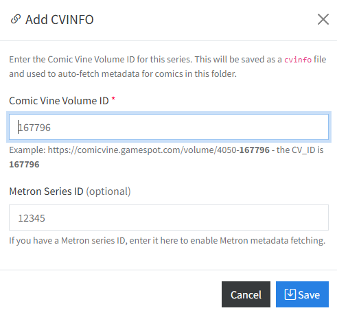
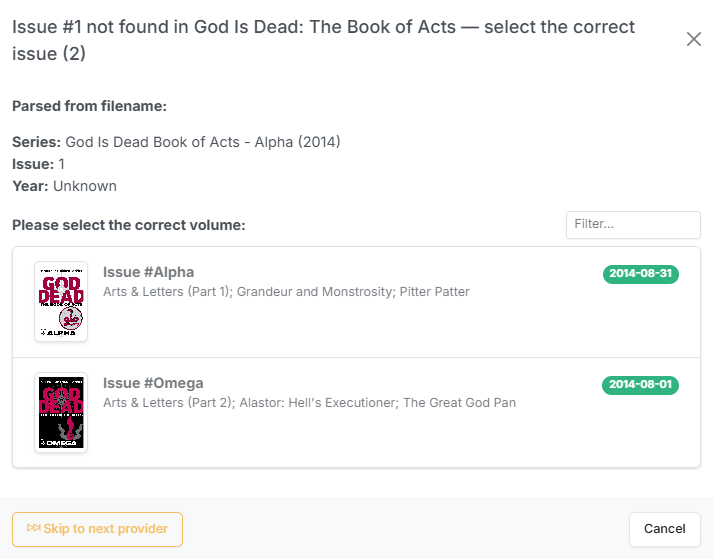

# Adding Metadata

CLU supports multiple metadata provides that can be configured per library. Search any or all of them in your preferred order when adding metadata to your files.

## Overview

CLU supports multiple metadata providers for populating your files with ComicInfo.xml metadata. Providers can be enabled per library with configurable priority ordering — CLU iterates through providers in order and applies metadata from the first provider that returns a result.

| Provider | Status | Description |
|----------|--------|-------------|
| [Metron](https://metron.cloud) | <i class="bi bi-check-circle-fill text-success"></i> | Metron Comic Book Database |
| [ComicVine](https://comicvine.gamespot.com/) | <i class="bi bi-check-circle-fill text-success"></i> | ComicVine Database |
| ComicVine (Local DB) | <i class="bi bi-info-circle-fill text-info"></i> | Local ComicVine SQLite database (requires [local setup](../local-databases/comicvine.md)) |
| [GCD API](https://github.com/GrandComicsDatabase/gcd-django/wiki/API) | <i class="bi bi-check-circle-fill text-success"></i> | Grand Comics Database API |
| [GCD](https://www.comics.org/) | <i class="bi bi-info-circle-fill text-info"></i> | Grand Comics Database (requires [local setup](../local-databases/gcd.md)) |
| MangaDex | <i class="bi bi-check-circle-fill text-success"></i> | MangaDex Database |
| MangaUpdates | <i class="bi bi-check-circle-fill text-success"></i> | MangaUpdates Database
| Bedetheque | <i class="bi bi-info-circle-fill text-warning"></i> | Bedetheque Database (Future Implementation) | |

If you have enabled a [Local Metadata Database](../local-databases/index.md "Local Metadata Databases") you'll see an additional icon in the File Manager for searching your local database for Metadata.

!!! warning
    While not as thorough as ComicVine, the GCD database offers a quick way to get metadata for a large collection.

## Configuration

Navigate to **[Settings > Metadata Providers](../app-settings/metadata.md)** tab to add, edit, test, and remove provider credentials. Save and test each connection before use — a green checkmark confirms successful connectivity.

Ensure you also enable the metadata provider(s) for the library you are working with. See **[Settings > Libraries](../app-settings/metadata.md#assign-metadata-providers-to-libraries)** for more information.

## CVINFO File and Creation

If you have used Mylar3 to download comics, it adds a `cvinfo` file when you add a series. This file contains the ComicVine ID of the series, which CLU can use to search for metadata from ComicVine. 

To enable this functionality for series created outside of Mylar3, you can create a `cvinfo` file in the same directory as the comic by clicking the <i class="bi bi-link-45deg text-pruple"></i>Add CVINFO</i> button. 

CLU will also create a `cvinfo` file if you use the [Subscribe to Series](../pull-list/series.md) feature and when retrieving metadata for a folder.

{: .center-image}

This will open a modal window where you can add the ComicVine ID of the series as well as the Metron ID of the series.

### Metadata Added on File Move

If enabled, when you move a file to a new location the metadata will be applied automatically if the following criteria are met:

- There is a valid `cvinfo` file in the same directory
- There is no `ComicInfo.xml` file OR if the `ComicInfo.xml` file was generated from Amazon data, it will be replaced.

### File Renamed when Metadata is Added

If this feature is enabled, when a `ComicInfo.xml` file is generated, the file will be renamed to match your configured [Custom Rename Pattern](../app-settings/file-settings.md#custom-naming-settings) based on the data in the `ComicInfo.xml` file.

## When the Issue Number Won't Match

!!! info "New in v6.3"
    When the **volume matches but the issue number doesn't**, CLU now shows the volume's issues and lets you pick one — instead of dead-ending on *"No metadata found for selection"*.

Applying metadata resolves the issue by **exact number** against the volume you chose. Odd numbering means the volume is right but the issue is never found, and the old flow simply gave up with a red toast.

{: .center-image}

/// caption
The volume's issues, listed after an issue-number match failed.
///

### Cases this covers

| Case | Example |
| --- | --- |
| **Decimal or suffixed numbering** | `1.MU`, `13A` |
| **A file numbered differently from the provider** | your file says `003`, the provider stores `23` |

Rather than teaching the parser every numbering scheme ever invented, CLU shows you the volume's issues in the same card layout and filter as the volume picker, and you pick the right one.

### Batch behavior

On a **folder run**, files that hit this are **collected as you go** rather than interrupting the batch. When the run finishes you walk through them one at a time. The issue list is cached per volume, so a folder of near-misses from the same volume doesn't re-fetch it repeatedly.

!!! info "A real match always wins"
    Providers that matched a series but no issue are recorded as **near misses** and offered **only after the whole provider cascade comes up empty**. Every provider still runs first, so a genuine match from a later provider always takes precedence over a near-miss picker from an earlier one.

### Scope

| Path | Providers covered |
| --- | --- |
| **Single file** | Metron, ComicVine, ComicVine local DB, GCD API |
| **Batch / folder** | The above, plus GCD |

The [bulk-review wizard](../collection/source-wall.md) already had its own picker and is unchanged.
