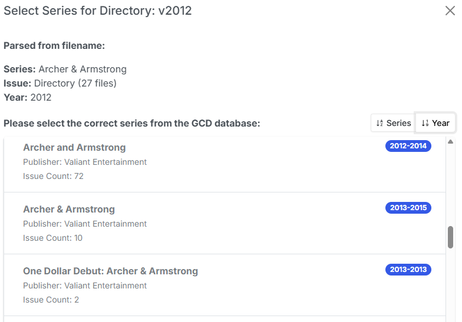

# Generate ComicInfo.xml

If you have enabled [GCD Database Support](../gcd-settings/index.md "GCD Database Support") you'll see an additional icon in the File Manager for searching your local GCD Database for Metadata.

!!! warning
    While not as thorough as ComicVine, the GCD database offers a quick way to get metadata for a large collection.

### Get Metadata for all comics in a folder

To get metadata and generate a ComicInfo.xml file for all issues in a folder, simply click the <i class="bi bi-cloud-download fs-2 text-success"></i> GCD Download icon.

Depending on your folder structure, CLU will then search for the best match using:

* Series Name Year - using the year from the folder name, we attempt to match the series and year
* Series Name - if no exact match, we then search for the exact series name
* % Series Name % - if no match, we then search for the words in the series name

Here are two specific examples:

#### Series Name (Year)

{: .center-image}

{: .center-image}

Searching for _'H.A.R.D. Corps (1992)'_ finds an exact match and applies metadata. Any issues with existing metadata will be skipped.

#### Series Name \ v(Year)

{: .center-image}

Similarly, when multiple volumes are present, CLU will grab the 'YEAR' from the folder and append it to the parent folder, so this search was for _'Archer & Armstrong (1992)'_ and we found an exact match.

{: .center-image}

Searching for _'Archer & Armstrong (2012)'_ however, does not find an exact match, so we're presented with a list of possible matches. From that we can see a series from (2012-2014) with 72 Issues, so we select this for matching.

!!! note
    GCD counts alternate covers and reprints, so some issues counts (like this) are exaggerated. Simply select the correct issue from the list.

### Get metadata for a single issue

Getting details for single issues works similar to the directory search. The search order is:

* Series Name Year Issue Number - we attempt to find an example match an apply the results
* Series Name Year - If no exact match, we search for Series Name and year and llok for the issue
* % Series Name % - If that fails, we search for series words, return the results and then match the issue from the user selection

{: .center-image}

{: .center-image}

Selecting the (2016-2017) series will match and generate the data.

{: .center-image}

!!! info
    Usage of this feature requires a copy of the GCD database running on a local mySQL server. You can use your own setup and follow the [GCD Database Additions Options](../gcd-settings/settings.md) or follow the guide on how to setup[GCD Database Support](../gcd-settings/setup.md "GCD Database Support").