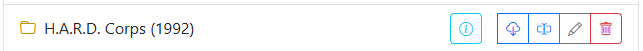
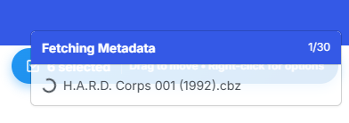
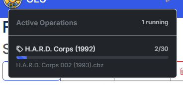
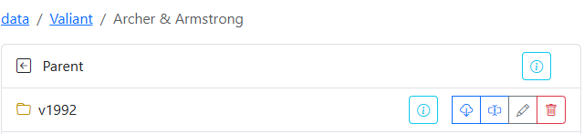
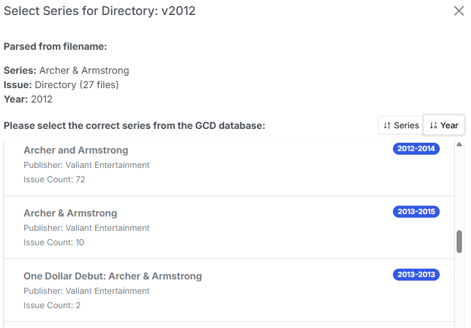
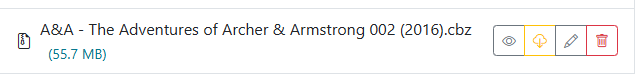
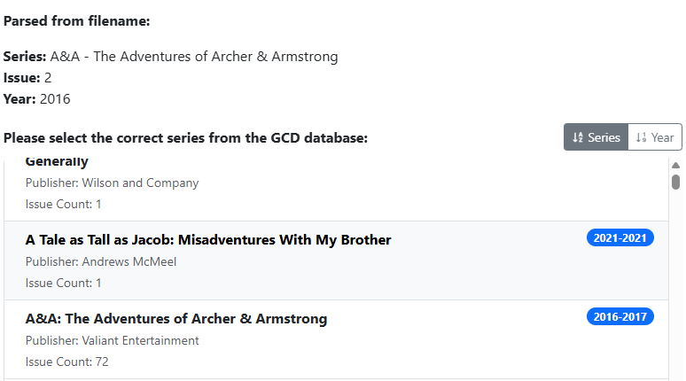
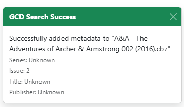
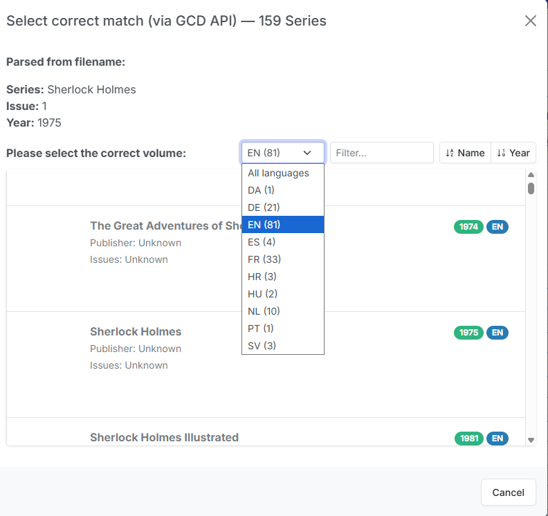

# Generate ComicInfo.xml

Depending on your metadata provider settings, and the method used (file vs folder) you may be presented differening options are you attempt to get metadata for your comics.

### Get Metadata for all comics in a folder

To get metadata and generate a ComicInfo.xml file for all issues in a folder, simply click the <i class="bi bi-cloud-download fs-2 text-success"></i> *Fetch Metadata for All Comics in Folder* button.

Depending on your folder structure, CLU will then search for the best match using:

* `{Series Name} ({Year})` - using the year from the folder name, we attempt to match the series and year
* `{Series Name}` - if no exact match, we then search for the exact series name
* `% {Series Name} %` - if no match, we then search for the words in the series name

Here are two specific examples:

#### Series Name (Year)

{: .center-image}

Searching for _'H.A.R.D. Corps (1992)'_ finds an exact match and applies metadata. Any issues with existing metadata will be skipped. 

{: .center-image}

Progress will be shown in a toast notification while on the page. 

{: .center-image}

You may navigate away from the page and the process will continue in the background with status being displayed in the header.

#### Series Name \ v(Year)

{: .center-image}

Similarly, when multiple volumes are present, CLU will grab the 'YEAR' from the folder and append it to the parent folder, so this search was for _'Archer & Armstrong (1992)'_ and we found an exact match.

{: .center-image}

Searching for _'Archer & Armstrong (2012)'_ however, does not find an exact match, so we're presented with a list of possible matches. From that we can see a series from (2012-2014) with 72 Issues, so we select this for matching.

!!! note
    Many providers count alternate covers and reprints, so some issues counts (like this) are exaggerated. Simply select the correct issue from the list.

### Get metadata for a single issue

Getting details for single issues works similar to the directory search. The search order is:

* `{Series Name} {Year} {Issue Number}` - we attempt to find an example match an apply the results
* `{Series Name} {Year}` - If no exact match, we search for Series Name and year and llok for the issue
* `% {Series Name} %` - If that fails, we search for series words, return the results and then match the issue from the user selection

{: .center-image}

{: .center-image}

Selecting the (2016-2017) series will match and generate the data.

{: .center-image}

## GCD API Differences

The GCD API is a newer API compared to the others, and as such, it has some differences in how it handles metadata.

It has limited endpoints and methods for retrieving data, so when it is being used, you may need to provide more information to get the correct results.

{: .center-image}

### Language

GCD has data for many languages but no way currently to filter API results by language. When many results are returned, you can select your preferred language from the results lists to filter out all other languages. 

### Cover Image, Publisher and Issue Counts

Other providers have this data in search results, but GCD does not. These fields are left as placeholders and will be populated if GCD adds them to their API results. 