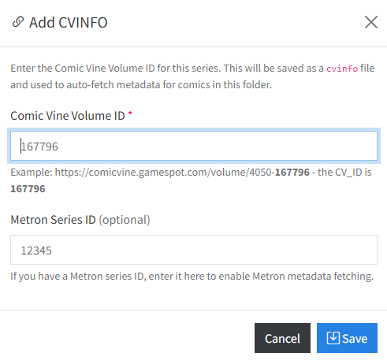

# ComicVine Metadata

If you have entered a [Commicvine API Key](../app-settings/download-settings.md#metadata-api-configuration) in settings, you'll see an additional icon in the File Manager. Clicking the <i class="bi bi-book fs-2 text-success"></i> icon will beging searching for metadata from ComicVine.

!!! info "Single Issue Metadata Only"
    The **ComicVine** feature only searches for metadata for a single issue. If you have multiple issues in a directory, you will need to use the [GCD Database Method](../gcd-settings/index.md) feature to process multiple issues. [ComicRackCE](https://github.com/maforget/ComicRackCE) should be your first choice for performing large metadata updates if you want to use ComicVine.

## CVINFO File and Creation

If you use Mylar3, it adds a `cvinfo` file when you add a series. This file contains the ComicVine ID of the series, which CLU can use to search for metadata from ComicVine. To enable this functionality for series created outside of Mylar3, you can create a `cvinfo` file in the same directory as the comic by clicking the <i class="bi bi-link-45deg text-pruple"></i>Add CVINFO</i> button.

{: .center-image}

This will open a modal window where you can add the ComicVine ID of the series as well as the Metron ID of the series. The Metron ID is optional and will only be used if you have enabled the [Metron Metadata](../metron.md) feature.

## Manually Search for Metadata

Clicking the <i class="bi bi-book fs-2 text-success"></i> will begin searching for metadata from ComicVine. If there are multiple matches, a modal will open, prompting you to select the correct match. If there is only one match, the metadata will be applied automatically.

## Additional ComicVine Settings

{: .center-image}

Additional settings can be found in the [Download Settings --> Metadata API Configuration](../app-settings/download-settings.md#metadata-api-configuration).

### Metadata Added on File Move

If enabled, when you move a file to a new location the metadata will be applied automatically if the following criteria are met:

- There is a valid `cvinfo` file in the same directory
- There is no `ComicInfo.xml` file

### File Renamed when Metadata is Added

If this feature is enabled, when a `ComicInfo.xml` file is generated by ComicVine, the file will be renamed to match your configured [Custom Rename Pattern](../app-settings/file-settings.md#custom-rename-pattern-settings).

### File Moved when Metadata is Added

If this feature is enabled, when a `ComicInfo.xml` file is generated by ComicVine, the file will be moved to match your configured [Custom Move Pattern](../app-settings/download-settings.md#custom-move-pattern).