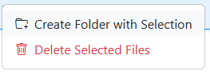

# Move

<figure><figcaption>
Files Manager
</figcaption></figure>

When the File Manager is loaded, it will display all files in your <mark style="color:blue;">`/data`</mark> directory in both the **Source** and **Destination** locations.

### Moving Files

Using the file manager, navigate to the file(s) that you wish to move. Simply click and drag it to the location you want to file to move.

The file manager supports dragging and dropping files/directories to/and from the **Source** and **Destination**. All examples will demonstrate **Source --> Destination,** but either direction will work.

{: .center-image}

### Moving Directories

Similar to files, navigate to the directory you wish to move. Click and drag it to the new location.

{: .center-image}

You'll see the directory automatically update in the new location

### Select Multiple

You can move multiple files or directories by select them, one at a time, by holding down `SHIFT` while clicking each directory or file.

{: .center-image}

### Create Folder from Files

Once you have multiple files selected, you can right-click and see a context menu of additional actions you can perform. To make organizing and moving multiple files quick, you can "Create Folder with Selection" using your selected files.

{: .center-image}

If all of the files share the same _{Series Name}_, the folder will be created with that name. 
If the files have differing _{Series Name}_, you'll be prompted to Enter Folder Name for those files.

{: .center-image}

Click "Create Folder" to finish up.
