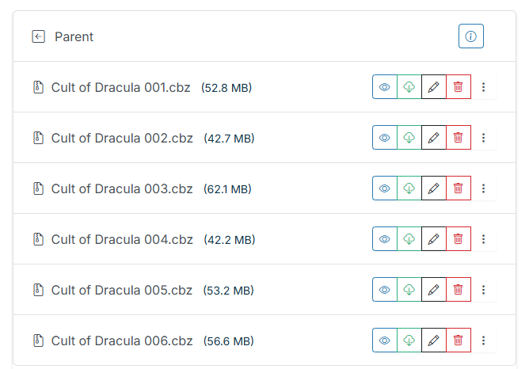

# Split File

!!! info "New in v6.0"
    Split File is new in **v6.0** and is **CBZ-only**.

Downloaded a "collected" CBZ that's really several issues bundled together — or a fan-made TPB you'd like to break into individual issues? The File Manager's per-file dropdown has a **Split File** action for CBZs that turns one archive into one clean CBZ per issue.

## When to use it

Use Split File when a single CBZ actually contains **multiple issues** and you'd rather store them individually — so they match, sort, and read like the rest of your collection.

## Walkthrough

1. In the File Manager, open the per-file **dropdown** for the CBZ and choose **Split File**.
2. CLU unpacks the archive and **auto-detects issue boundaries** from the page filenames (e.g. `Series 003 - 0001.jpg`).
3. You're shown an **editable, grouped page grid** — one group per detected issue.

{: .center-image}

In the grid you can:

- **Adjust boundaries** — move where one issue ends and the next begins.
- **Merge or add groups** — combine mis-split issues or introduce a boundary the auto-detection missed.
- **Rename each issue** before committing.

4. When the grouping looks right, **commit**. CLU writes one image-only CBZ per issue into a new series subfolder.

{: .center-image}

## What CLU writes (and what it doesn't touch)

!!! warning "Your original file is left untouched"
    Split File never modifies the source archive. It writes **new** files into a new series subfolder — one clean, **image-only** CBZ per issue. Keep or delete the original at your discretion.
