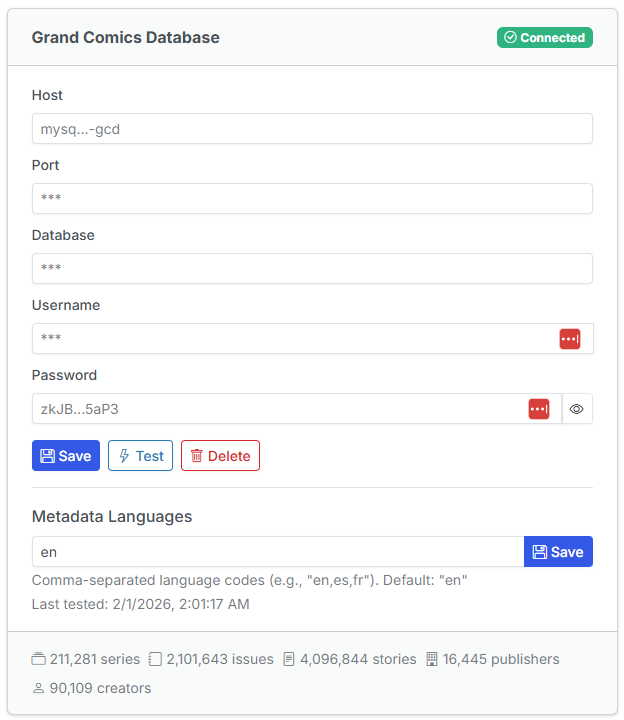

# Updated CLU Settings for GCD

Once your GCD database has completed the import, you have two options for connecting to your local GCD database:

1. **Metadata Providers** - You can enter you connection details in the [Metadata Providers](../app-settings/metadata.md) tab of the settings page.

This is the recommended approach as it allows you to use the Metadata Providers tab to manage all connections. Once you SAVE and TEST your connection, you will see a green checkmark <i class="bi bi-check-circle-fill text-success"></i> in the provider header and you will see counts from the relevant tables in the database.

{: .center-image}

You will still need to add the network to your `docker-compose.yml` file as shown below.

```yaml
networks:
  gcd-network:
    external: true            
```

2. **Docker Compose** - Update your CLU Docker Compose to use the same network in Docker and connect to your MySQL server.

```yaml
version: '3.9'
services:
    comic-utils:
    ..... Existing Settings in Docker Compose .....
        environment:
            ..... Existing Settings in Docker Compose .....
            
            # GCD Database Additions: Update the GCD_MYSQL_PASSWORD 
            # to match the MYSQL_PASSWORD you set in the previous step
            - GCD_MYSQL_HOST=mysql-gcd
            - GCD_MYSQL_PORT=3306
            - GCD_MYSQL_DATABASE=gcd_data
            - GCD_MYSQL_USER=clu
            - GCD_MYSQL_PASSWORD=strong-user-password
        networks:
            - gcd-network
networks:
  gcd-network:
    external: true            
```

Once you restart your CLU container, you should see something like this in the logs

```log
172.21.0.1 - - [07/Oct/2025 08:41:20] "GET /gcd-mysql-status HTTP/1.1" 200 -
```

and in the UI when browsing files, you should see a Cloud Download icon like this <i class="bi bi-cloud-download fs-2 text-primary"></i>

For additional details on usage, see the [File Management --> Get ComicInfo.xml](../file-management/comicinfo.md) section
