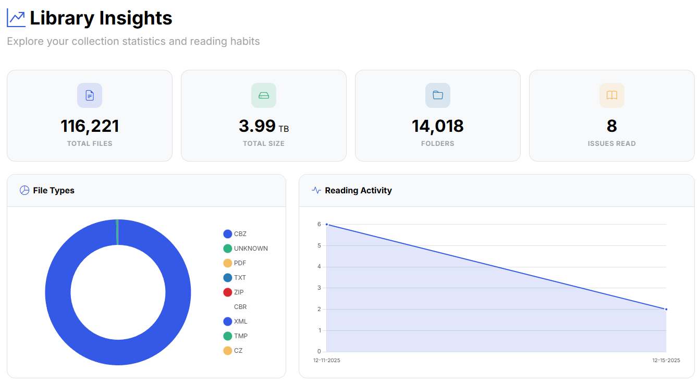
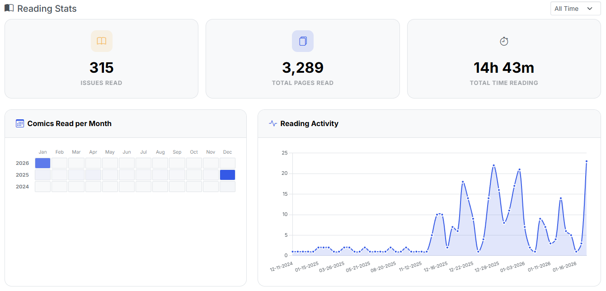
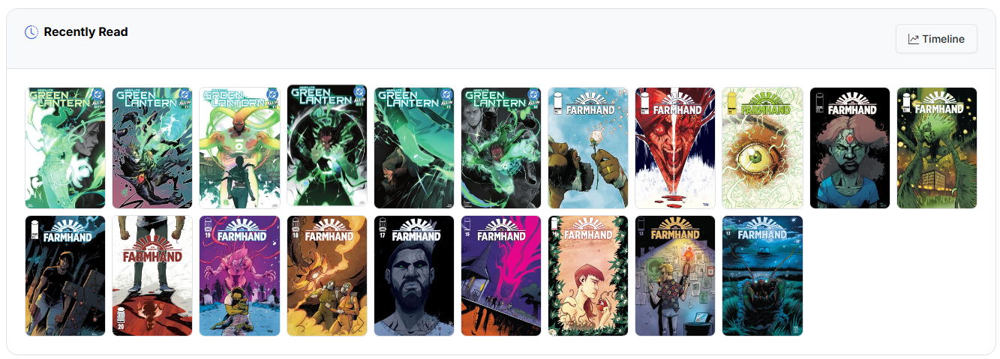

# Available Insights

{: .center-image}

The Library Insights page provides a quick overview of your collection, including the number of comics, popular publishers, total file size, and more. 

Here's a quick summary of the current available insights:

## Collection Stats

- **Total Files:** This is anything that is scanned, saved to the database, and displayed in the collection view.
- **Total Size:** This is the total size of all files in your collection.
- **Folders:** This is the number of folders in your collection.
- **File Type Distribution:** This is the number of files of each type in your collection. Clicking a file type will remove it from the chart.
- **Top Publishers:** This is a list of the top 10 publishers in your collection, based on the number of comics they have.

## Reading Stats

{: .center-image}

The below stats can be filtered by year, by clicking the dropdown menu in the right.

- **Issues Read:** This is the number of issues that you have read.
- **Total Pages Read:** This is the total number of pages that you have read.
- **Total Hours Read:** This is the total number of hours that you have read.
- **Reading Heatmap:** This is a heatmap of the number of issues you have read month over month for each year.
- **Reading Activity:** This is a daily graph of the number of issues you have read over the past 12 months.

## Reading Activity

{: .center-image}

- **Recently Read:** This is a list of the last 20 comics you have read.
    - You can click the <i class="bi bi-up-graph-arrow text-dark"></i> Timeline button to open the timeline view and see your full reading history.

### Reading Trends

{: .center-image}

- **Top Writers:** This is a list of your top 10 writers, based on the number of comics you have read.
- **Top Artists:** This is a list of your top 10 artists, based on the number of comics you have read.
- **Top Characters:** This is a list of your top 10 characters, based on the number of comics you have read.
- **Top Publishers:** This is a list of your top 10 publishers, based on the number of comics you have read.

Clicking on the name of a writer, artist, or character will open the timeline view and show you a list of all the comics in your collection matching that writer, artist, or character.

{: .center-image}

In the above example, we can see there are **852** comics by this writer with **748** published by DC Comics and **88** of them in the *Green Lantern* series.

### Top 20 Charts

{: .center-image}

- **Top 20 Series:** This is a list of the top 20 series in your collection, based on the number of issues they have.
- **Top 20 Largest Comics:** This is a list of the top 20 comics in your collection, based on the size of the files.