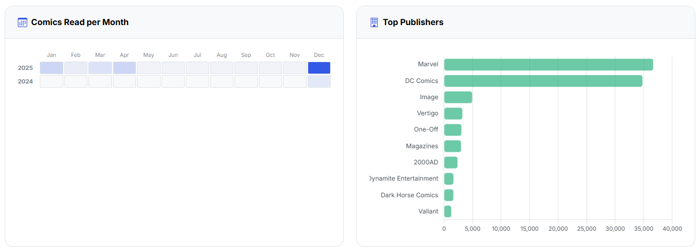
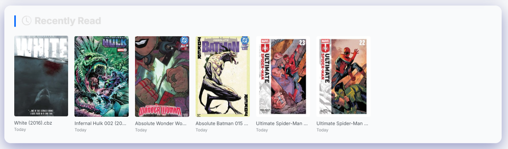

# Available Insights

{: .center-image}

The Library Insights page provides a quick overview of your collection, including the number of comics, popular publishers, total file size, and more. 

Here's a quick summary of the current available insights:

{: .center-image}

{: .center-image}

CLU will currently display the following insights based on your collection:

- **Total Files:** This is anything that is scanned, saved to the database, and displayed in the collection view.
- **Total Size:** This is the total size of all files in your collection.
- **Folders:** This is the number of folders in your collection.
- **Issues Read:** This is the number of issues that you have read.
- **File Type Distribution:** This is the number of files of each type in your collection. Clicking a file type will remove it from the chart.
- **Reading Activity:** This is a daily graph of the number of issues you have read over the past 12 months.
- **Reading Heatmap:** This is a heatmap of the number of issues you have read month over month for each year.
- **Top Publishers:** This is a list of the top 10 publishers in your collection, based on the number of comics they have.
- **Recently Read:** This is a list of the last 10 comics you have read.
- **Top 20 Series:** This is a list of the top 20 series in your collection, based on the number of issues they have.
- **Top 20 Largest Comics:** This is a list of the top 20 comics in your collection, based on the size of the files.

{: .center-image}