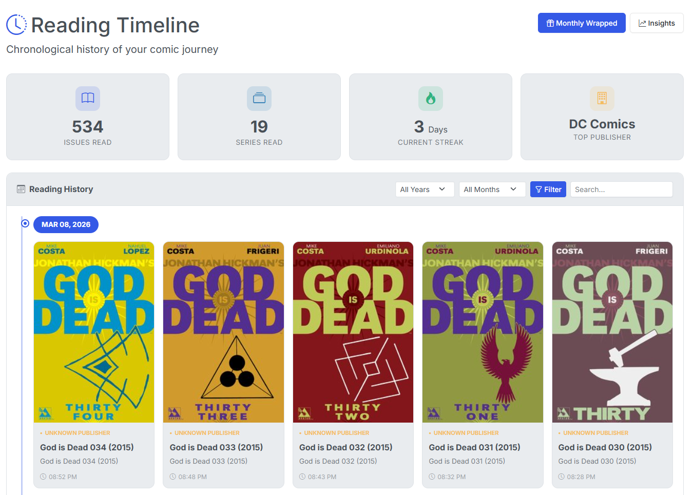
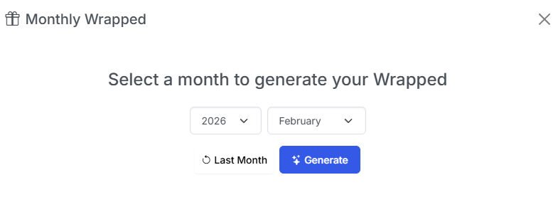
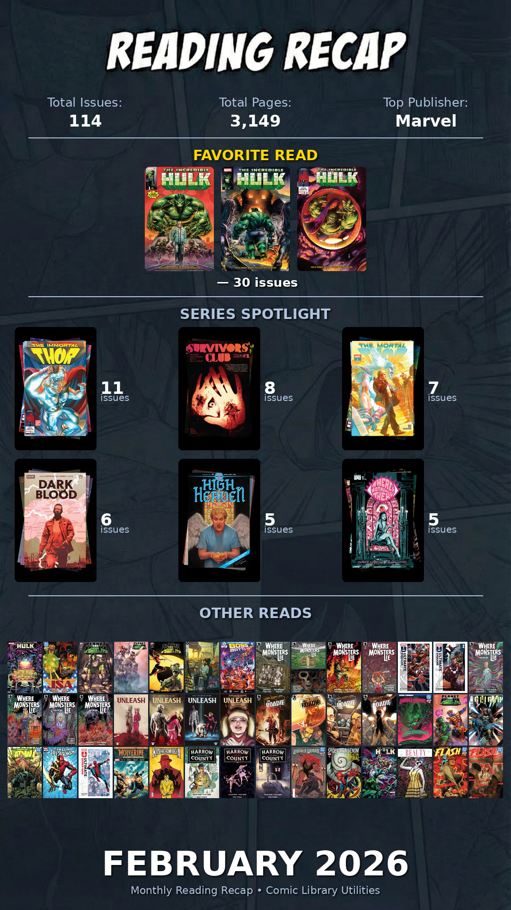

# Timeline

{: .center-image}

The Timeline view shows your full reading history over time. 

As you scroll, your history is lazy-loaded in the background allowing you to see your entire detailed reading history in one place. 

## Timeline Features

Multiple options are available on the Timeline view.

### Filter

Using the drop-downs and buttons at the time, you can filter your timeline to a specific *Year* and/or *Month*. You can also use the *Search* input to filter your timeline to see when exactly you read a specific issue or series. 

### Hide or Mark as Unread

{: .center-image .sixty}

You can now hide comics you have read from your timeline. Hidden comics will still count in your overall stats (issues read and pages read). Additional, you can also set an issue as Unread.

### Generate Montly "Wrapped" Slides

{: .center-image .half}

You can generate a visual monthy summary for any month of your reading history. Simply click the **Monthly Wrapped** button at the top and select the options (see image above). Click **Generate** and you'll be presented with 2 images sized for sharing on social media or other platforms.

{: .thirty} {:  .thirty}

